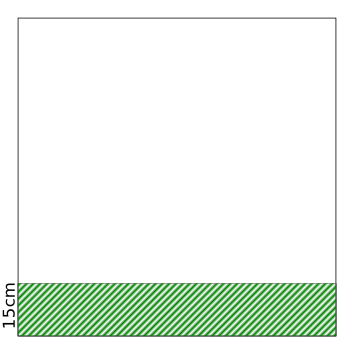
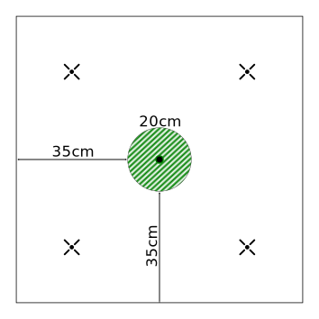

= Universalis - Missionen
Markus Lobedann <markus.lobedann@gmail.com>
:doctype: book
:description: Missionen für Universalis.
:revnumber: 0.7.0
:data-uri: {docdir}
:toc: left
:toclevels: 2
:toc-title: Inhaltsverzeichnis
:sectnums:
:sectnumlevels: 3
:sectlinks:
:sectanchors:
:section-refsig:
:figure-caption: Abbildung
:example-caption: Beispiel
:icons: font
ifdef::backend-html5[]
:stylesheet: style/html-theme.css
:xrefstyle: basic
endif::[]
ifdef::backend-pdf[]
:title-logo-image: image::../Grafiken/logo.svg[logo,width=400]
:pdf-fontsdir: Fonts
:pdf-theme: Regeln/style/pdf-theme.yml
//:media: prepress
:xrefstyle: basic
endif::[]

== Spielfeldgröße

Die im folgenden beschriebenen Missionen beziehen sich immer auf eine Spielfeldgröße von 90cm * 90cm.

[.text-center]
image:Grafiken/Abbildungen/spielfeld.svg[Spielfeld,width=300]

Die Aufstellungszone ist jeweile der grün schraffierte Bereich.

Sofern eine Mission weitere Zonen benötigt werden diese ebenfalls schraffiert, aber in anderen Farben dargestellt.

== Standard A

Dies ist die Standardmission, die immer gespielt werden kann.

=== Aufbau

Das Spielfeld kann beliebig aufgebaut werden.

=== Zonen

[.text-center]

=== Siegesbedingungen

Das Spiel ist gewonnen, sobald alle Modelle des Gegners eliminiert oder vom Spielfeld entfernt worden sind.

== Standard B

=== Zonen

[.text-center]
image:Grafiken/Missionen/02.svg[Mission 2,width=300]

=== Siegesbedingungen

Das Spiel ist gewonnen, sobald alle Modelle des Gegners eliminiert oder vom Spielfeld entfernt worden sind.

== #TODO

=== Zonen

[.text-center]

=== Siegesbedingungen

Das Spiel ist gewonnen, sobald sich am Ende einer Initiativephase mindestens 3 `[Objekte]` in der eigenen Aufstellungszone befinden.

== Extraktion

=== Zonen

[.text-center]
image:Grafiken/Missionen/04.svg[Mission 4,width=300]

=== Siegesbedingungen

Das Spiel ist gewonnen, sobald am Ende einer Initiativephase mindestens die Hälfte aller eigenen Modelle die Extraktionszone erreicht haben.

== #TODO

=== Zonen

[.text-center]
image:Grafiken/Missionen/05.svg[Mission 5,width=300]

== #TODO

=== Zonen

[.text-center]
image:Grafiken/Missionen/06.svg[Mission 6,width=300]