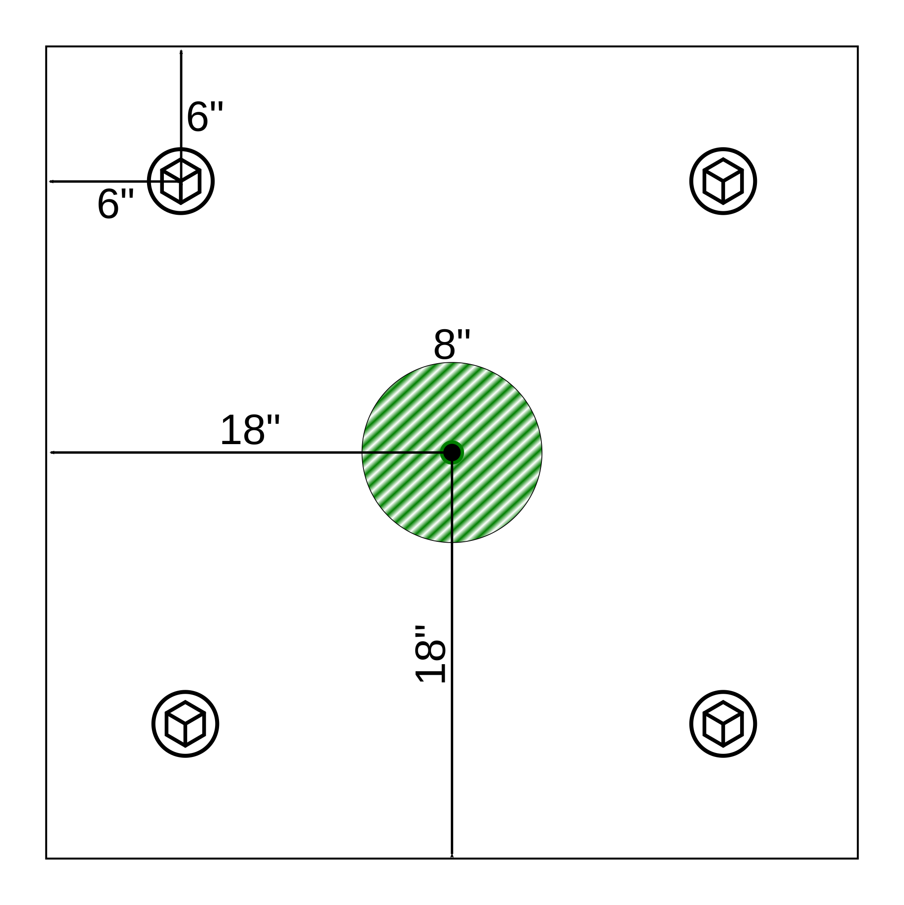
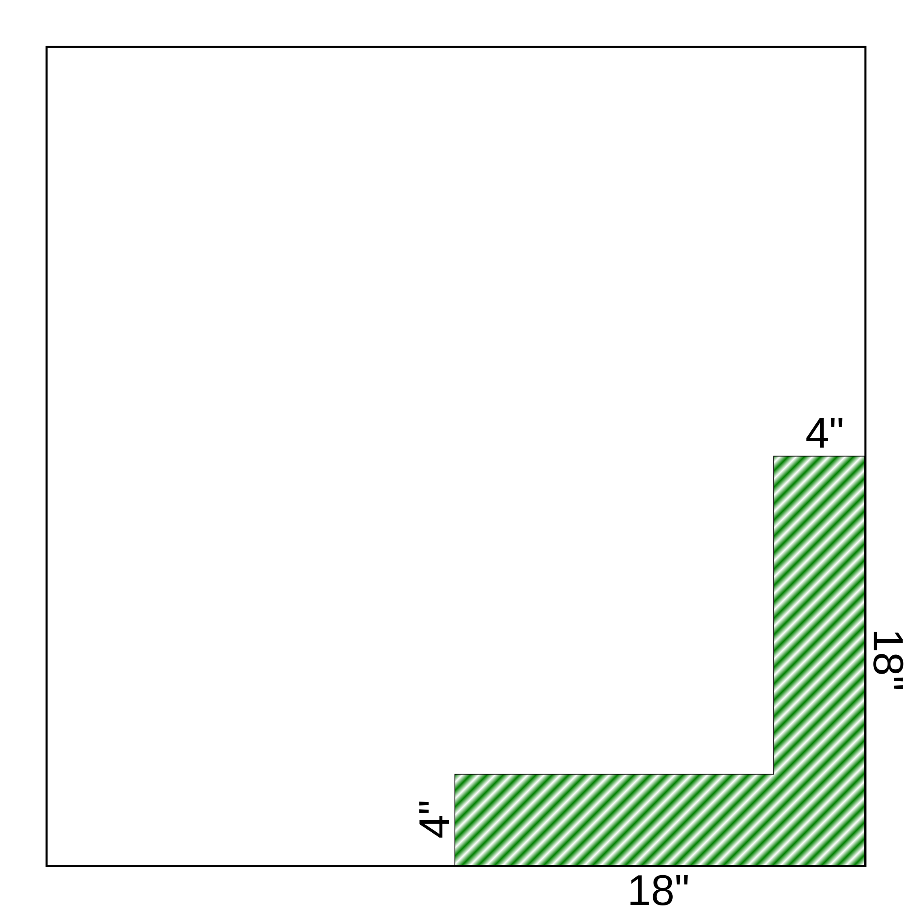
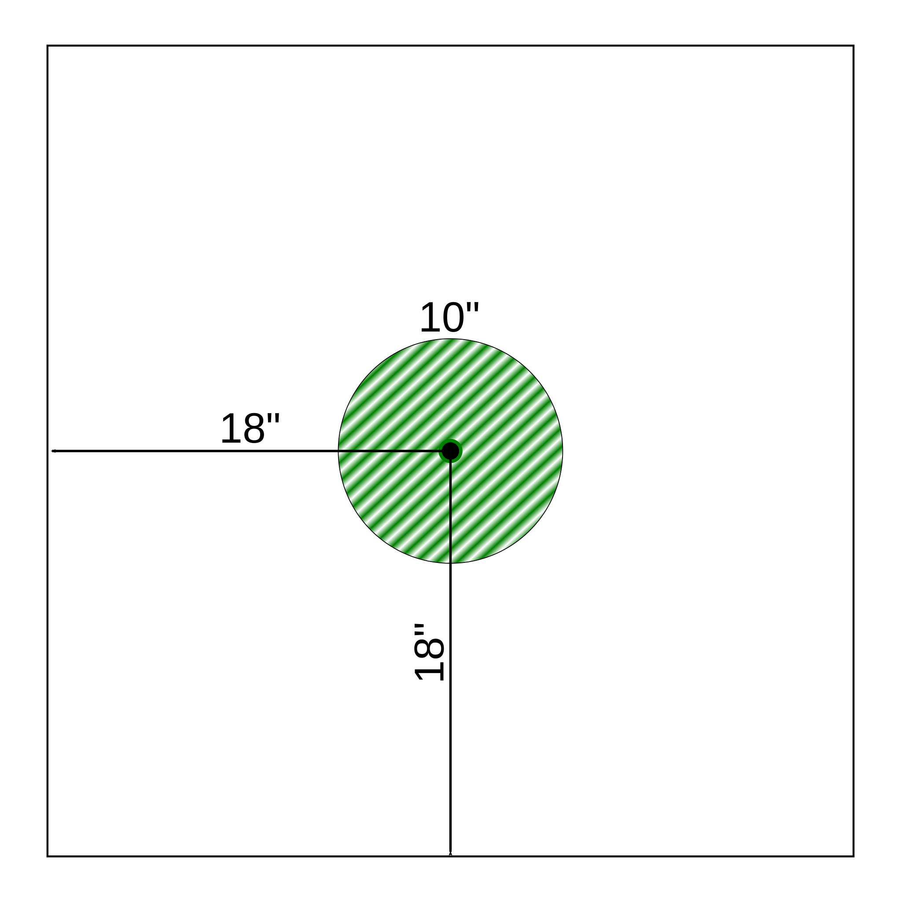
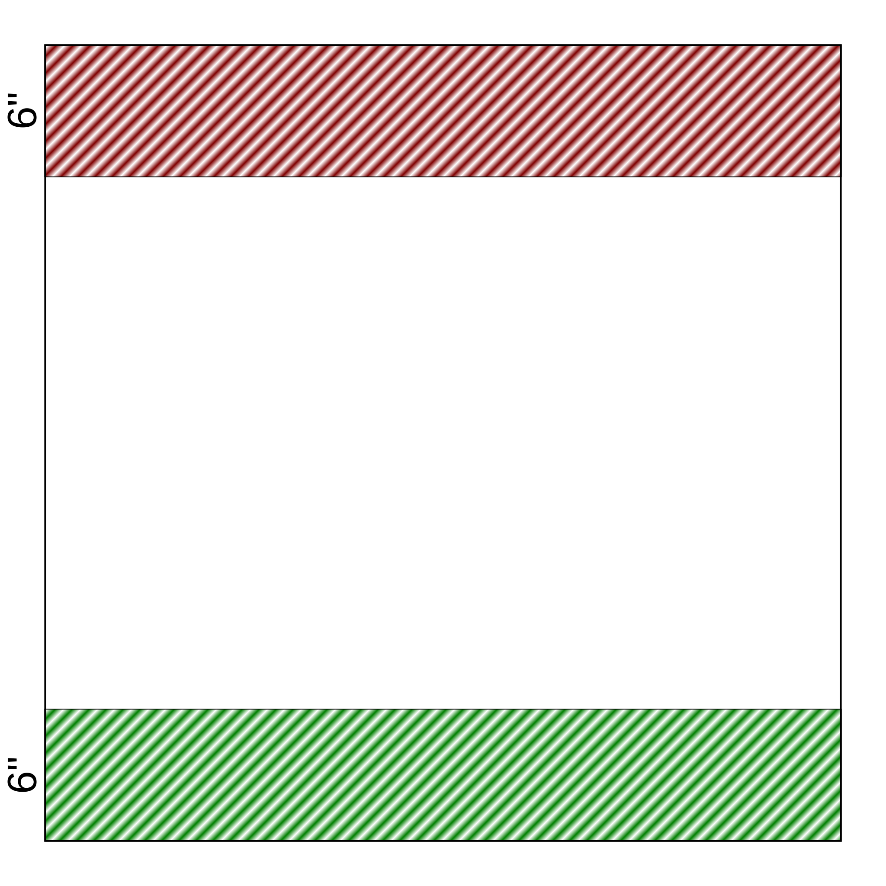
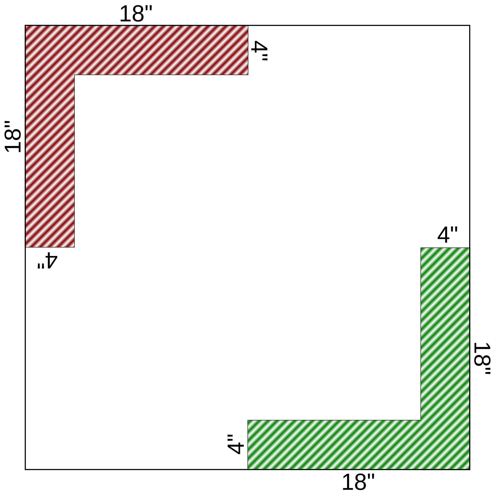
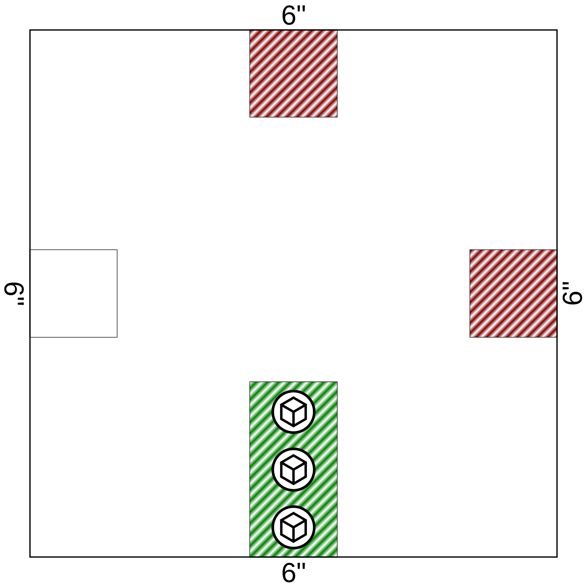
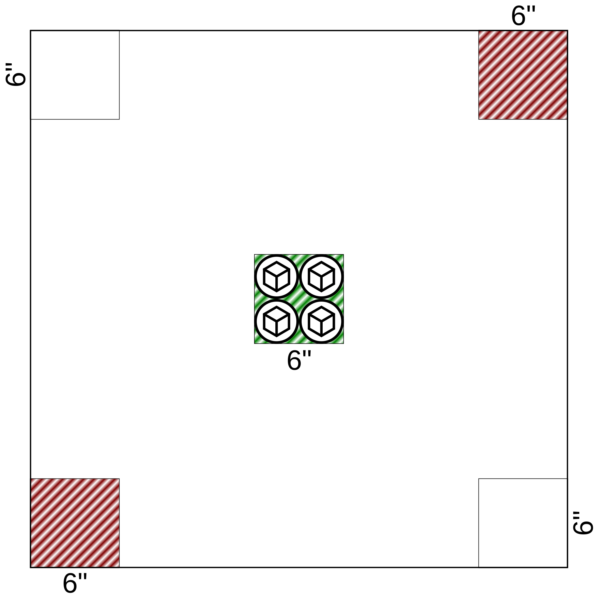

= Universalis - Missionen
include::_attributes.adoc[]
:description: Missionen für Universalis.

== Spielfeldgröße

Die im folgenden beschriebenen Missionen beziehen sich immer auf eine Spielfeldgröße von 36" * 36".

[.text-center]
image:Grafiken/Abbildungen/spielfeld.svg[Spielfeld,width=300]

Die Aufstellungszone ist jeweils der grün schraffierte Bereich.

Sofern eine Mission weitere Zonen benötigt werden diese ebenfalls schraffiert, aber in anderen Farben dargestellt.

== Bergung

Das Spiel ist gewonnen, sobald sich am Ende einer Initiativephase mindestens X - 1 `[Gegenstände]` in der eigenen Aufstellungszone befinden.

== Einnehmen

#TODO

== Eliminierung

Das Spiel ist gewonnen, sobald alle Modelle des Gegners eliminiert oder vom Spielfeld entfernt worden sind.

== Extraktion

Das Spiel ist gewonnen, sobald am Ende einer Initiativephase mindestens die Hälfte aller eigenen Modelle (aufgerundet) die Extraktionszone (in rot) erreicht haben.

== Transport

Das Spiel ist gewonnen, sobald sich am Ende einer Initiativephase mindestens X - 1 `[Gegenstände]` in den Zielzonen (in rot) befinden.

