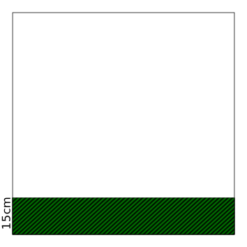
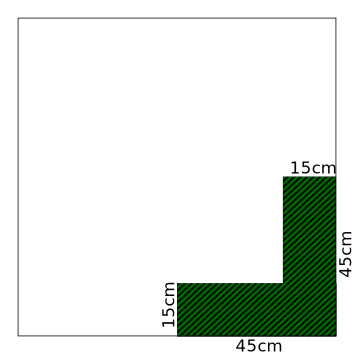
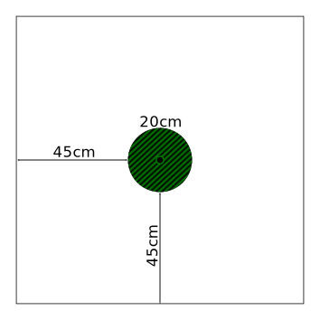
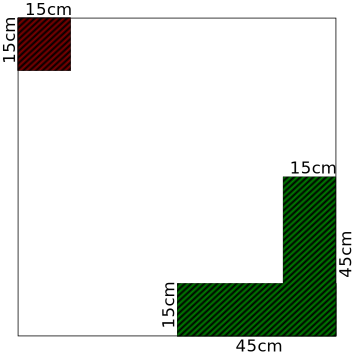
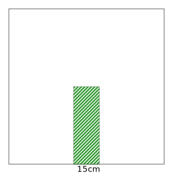
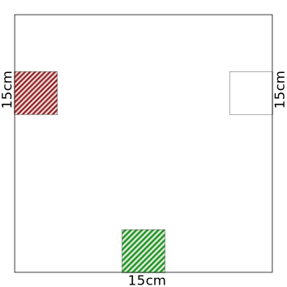

---
puppeteer:
    pdf:
        format: A4
        displayHeaderFooter: true
        landscape: false
        margin:
            top: 1cm
            right: 0cm
            bottom: 2cm
            left: 0cm
        headerTemplate: '   <section></section>'
        footerTemplate: '   
                            <section>
                                

                                    -  -
                                

                            </section>'
---

# Universalis - Missionen

{width="300pt"} {align="center"}

Version 0.1.0 {align="center"}

!!! info

    © 2020 Markus Lobedann
    
    (soweit nicht ausdrücklich anders gekennzeichnet)

## Inhaltsverzeichnis

[[toc]]

## Spielfeldgröße

Die im folgenden beschriebenen Missionen beziehen sich immer auf eine Spielfeldgröße von 90cm * 90cm.

{width="300pt"} {align="center"}

Die Aufstellungszone ist jeweile der grün schraffierte Bereich.

Sofern eine Mission weitere Zonen benötigt werden diese ebenfalls schraffiert, aber in anderen Farben dargestellt.

## 01 . Standard A

Dies ist die Standardmission, die immer gespielt werden kann.

### Aufbau

Das Spielfeld kann beliebig aufgebaut werden.

### Zonen

{width="300pt"} {align="center"}

### Siegesbedingungen

Das Spiel ist gewonnen, sobald alle Modelle des Gegners eliminiert oder vom Spielfeld entfernt worden sind.

## 02 . Standard B

### Zonen

{width="300pt"} {align="center"}

### Siegesbedingungen

Das Spiel ist gewonnen, sobald alle Modelle des Gegners eliminiert oder vom Spielfeld entfernt worden sind.

## 03 . #TODO

### Zonen

{width="300pt"} {align="center"}

### Siegesbedingungen

Das Spiel ist gewonnen, sobald sich am Ende einer Initiativephase mindestens 3 `[Objekte]` in der eigenen Aufstellungszone befinden.
## 04 . Extraktion

### Zonen

{width="300pt"} {align="center"}

### Siegesbedingungen

Das Spiel ist gewonnen, sobald am Ende einer Initiativephase mindestens die Hälfte aller eigenen Modelle die Extraktionszone erreicht haben.
## 05 . #TODO

### Zonen

{width="300pt"} {align="center"}

## 06 . #TODO

### Zonen

{width="300pt"} {align="center"}