---
puppeteer:
    pdf:
        format: A4
        displayHeaderFooter: true
        landscape: false
        margin:
            top: 1cm
            right: 1cm
            bottom: 1cm
            left: 1cm
---

# Realms - Regelbuch

Regelbuch Version 0.0.1

!!! info

    © 2020 Markus Lobedann
    
    (soweit nicht ausdrücklich anders gekennzeichnet)

## Inhaltsverzeichnis

[[toc]]

## Vorwort

Dies ist kein Turniersystem und der Spaß
steht im Vordergrund!

TODO

## Das Spiel

### Was braucht man

Ein Maßband mit Markierungen in cm.

{width="200pt""} {align="center"}

Pro Miniatur jeweils einen weißen und einen
roten W6 und mehrere beliebig farbige W12.

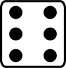{width="50pt"}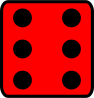{width="50pt"} {align="center"}

Des weiteren werden einfarbige Tokens
benötigt (es können auch anders farbige W6
sein).

### Fraktion

Die verschiedenen Länder der bekannten Erde haben sich, mehr oder weniger
freiwillig, zu grundverschiedenen Bündnissen zusammengeschlossen.

### Modelle

Jedes Modell verfügt über eine [Einheitenkarte](#einheitenkarte) und ist immer in einer [Einsatzgruppe](#einsatzgruppen) organisiert.

Modelle werden dabei in Infanterie, MIKe, Drohnen und Fahrzeuge unterschieden.

| Symbol | Name | Beschreibung | [Größe](#größe) |
|--|--|--|--|
| 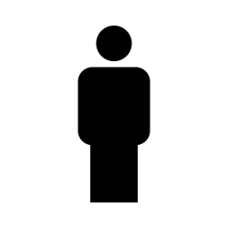{width="40pt"} | Infantrie | Sie umfasst alles von normalen Soldaten bis hin zu Panzeranzügen. | klein bis mittel |
| 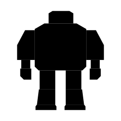{width="40pt"} | MIKe | Sie umfassen unter Anderem große servounterstützte Panzeranzüge mit meist schwerster Bewaffnung sowie große Kreaturen. | groß |
| 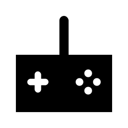{width="40pt"} | Drohne | TODO | klein bis mittel |
| 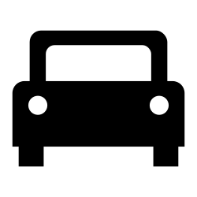{width="40pt"} | Fahrzeug | TODO | mittel bis groß |

### Einsatzgruppen

Eine Einsatzgruppe wird immer für genau eine Fraktion  ufgestellt und besteht aus 2 oder mehr Modellen.

Jeder Spieler verfügt über maximal 1 Einsatzgruppe, wobei jede  Einsatzgruppe über genau 1 Gruppenführer verfügen muss.

### Gruppenführer

Ein Modell wird zu einem Gruppenführer, sobald es die Eigenschaft „Gruppenführer“ erhält.

Der Gruppenführer einer Einsatzgruppe wird unter anderem dafür benötigt die Zugreihenfolge innerhalb einer Runde zu bestimmen (siehe Seite TODO).

Jede Fraktion hat ihre eigene Stellvertreterregelung.

### Einheitenkarte

Die Einheitenkarte ist ein zentraler Bestandteil des Spiels und beinhaltet alle spielrelevanten Werte eines Modells.
Auf der Rückseite beinhaltet sie außerdem eventuelle Sonderregeln der verwendeten Ausrüstung (siehe Seite TODO) und Eigenschaften (siehe Seite TODO).

TODO Bild einfügen

Eine detailliertere Beschreibung der Einheitenkarte ist auf Seite TODO zu finden.

### Aktionspunkte

Jedes Modell verfügt über 6 Aktionspunkte pro Runde, die in verschiedenen Phasen des Spiels für Aktionen und Reaktionen ausgegeben werden können.

Die Kosten in Aktionspunkten werden immer mit diesem Zeichen angegeben: ⊙

Es bietet sich an neben jedes Modell einen W6 zu legen der die aktuell noch verfügbaren Aktionspunkte anzeigt.

### Attribute

Attribute sind die Werte eines Modells, die sich auf seine körperlichen  Eigenschaften beziehen. Diese können sowohl angeboren als auch antrainiert sein.

Im Kritischen Zustand werden die Attribute um 1 verringert (siehe Seite TODO).

### Profile

Jedes Modell verfügt über ein Profil welches aus den folgenden Attributen besteht:

| Kürzel | Name | Beschreibung |
|--|--|--|
|AGI|Agilität|Steht für die Geschwindigkeit und das Reaktionsvermögen des Modells. Siehe z.B. Nahkampf (Seite TODO) und Reaktionen (Seite TODO).|
|BW|Bewegung|Gibt an, wie weit sich ein Modell bewegen kann. Siehe Bewegung (Seite TODO).|
|KO|Konstitution|Drückt nicht nur aus wir stark ein Modell, sondern auch wie widerstandsfähig es ist. Siehe z.B. Schock (Seite TODO) und Tragkraft (Seite TODO).|
|FK|Fernkampf|Stellt die Fernkampffähigkeit des Modells dar. Siehe Fernkampf (Seite TODO).|
|WN|Warnehmung|Beschreibt, wie gut das Modell seine Sinneswahrnehmungen verarbeiten kann. Siehe z.B. Wahrnehmungsbereich (Seite TODO), Tarnung (Seite TODO) und Bewegungstests (Seite TODO).|
|EH|Entschlossenheit|Die Fähigkeit eines Modells, physische oder mentale Konflikte zu bewältigen. Siehe z.B. Gefahrenbereich (Seite TODO).|

!!! example Beispiel normaler Mensch

    | AGI | BW | KO | FK | WN | EH |
    |:--:|:--:|:--:|:--:|:--:|:--:|
    | 4 | 4 | 3 | 2 | 3 | 3 |

### Trefferpunkte

Sie steht für die Menge an Schaden, die ein Modells einstecken kann, bevor es aus dem Spiel entfernt wird.

Die maximale Menge an Trefferpunkten, über die ein Modell verfügen kann, liegt bei 20.

### Größe

Modelle werden in 3 verschiedene Größen gegliedert:

| Symbol | Name | Beschreibung | Im Spiel |
|--|--|--|--|
| 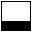 | klein | Alles kleiner als einschließlich 1m | 25mm Base und 3cm hoch. |
| 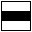 | mittel | Alles zwischen 1m und 3m. | 25mm Base und 6cm hoch |
| 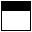 | groß | Alles höher als einschließlich 3m. | 40mm Base und 8cm hoch |

### Sichtfeld

Es gibt 4 verschiedene Sichtfelder mit 45°, 90°, 180° und 360°.

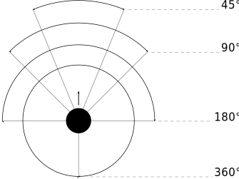 {align="center"}

"Übersicht der 4 verschiedenen Sichtfelder (der Pfeilstellt die Blickrichtung des Modells dar)"{align="center"}

### Tragkraft

Jedes Modell kann eine gewisse Menge an Ausrüstung tragen, ohne, dass davon Agilität und Bewegung negativ beeinflusst werden.

Diese Tragkraft errechnet sich für Infanterie über die Konstitution (KO) im Quadrat (in Kilogramm):

Tragkraft in kg = KO²{align="center"}

Bei MIKe wird die Konstitution (KO) vor der Quadrierung verdoppelt (in Kilogramm):

Tragkraft in kg = (KO*2)²{align="center"}

Bis zu diesem Wert erleidet das Modell keine negativen Auswirkung, wird er überschritten werden Agilität (AGI) und Bewegung (BW) jeweils um 1 verringert.
Wird er um das doppelte überschritten, werden beide Attribute um jeweils 2 verringert usw.

Auf der Einheitenkarte ist dies bei den Attributen bereits eingerechnet.

!!! example Beispiel

    Ein Modell hat eine KO von 5 und damit eine Tragkraft von 25kg.
    
    Ab einer Belastung von über 25kg werden die genannten Attribute um jeweils 1 verringert, über 50kg um jeweils 2, über 75kg um jeweils 3 usw

### Gefahrenbereich

Der Gefahrenbereich beschreibt den Umkreis um ein Modell, in dem es auf gegnerische Modelle reagieren muss.
Der Radius in Zentimetern berechnet sich indem die Entschlossenheit von 12 abgezogen wird:

Radius in cm = 12 - EH{align="center"}

Das gegnerische Modell, das sich innerhalb dieses Bereichs am nächsten zum eigenen Modell aufhält, wird „Direkter Kontrahent“ genannt. Sollten sich gegnerische Modelle im Basekontakt befinden sind sie, losgelöst von dem Radius des Gefahrenbereichs, automatisch direkte Kontrahenten.

Auf der Einheitenkarte wird der Gefahrenbereich mit diesem Symbol angegeben:

TODO Icon einfügen

### Warnehmungsbereich

Der Wahrnehmungsbereich umfasst alles im Sichtfeld des Modells bis zu einer Distanz die wie folgt berechnet wird:

Distanz = WN * 5cm{align="center"}

TODO Bild einfügen

Im Kritischen Zustand wird die Reichweite des Wahrnehmungsbereichs halbiert (aufgerundet, siehe Seite TODO).

Auf der Einheitenkarte wird der Wahrnehmungsreich mit diesem Symbol angegeben:

TODO Icon einfügen

### Entfernungen messen

Entfernungen zwischen Modellen werden immer von den Rändern der Bases gemessen.

TODO Bild einfügen

Entfernungen dürfen nie im Voraus gemessen werden, sondern immer nur wenn die entsprechende Aktion bereits festgelegt wurde.

Einzelne Regeln können davon abweichen und weisen im entsprechenden Fall eindeutig darauf hin.

## Aufbau der Einheitenkarte

## Würfelwürfe

Es werden nur W12 verwendet.

Vom Tisch gefallene Würfel zählen nicht, und müssen erneut gewürfelt werden.

### Attributs-Wurf

Attributs-Würfe werden in der Form [Attributskürzel]-Wurf angegeben. So wird für einen Attributs-Wurf auf Konstitution nur „KO-Wurf“ geschrieben.

Es wird immer der aktuelle Attributswert genommen der auch gegebenenfalls durch Effekte im Spiel modifiziert wurde.
Abhängig von verschiedenen Eigenschaften, Boni und bestimmten Regeln kann der zu erreichende Wert je nach Situation noch zusätzlich variieren.

Sollte ein zu erreichender Wert kleiner/gleich 0 sein, entfällt der Wurf und gilt als Misserfolg.

Der Wurf wird mit 1W12 durchgeführt. Sofern das Ergebnis unter/gleich dem Wert liegt is es ein Erfolg, ansonsten ein Misserfolg.

### Vergleichender Wurf

Bei einem vergleichendem Wurf wird für 2 konkurrierende Modelle jeweils 1W12 gewürfelt und jeweils ein Wert hinzuaddiert.

Abhängig von der Situation werden verschiedene Werte hinzuaddiert, durchaus auch unterschiedliche Werte je Modell.
Abhängig von verschiedenen Eigenschaften, Boni und bestimmten Regeln kann der zu addieren Wert je nach Situation noch zusätzlich variieren.

Die Differenz der gewürfelten Ergebnisse gibt in Abhängigkeit von der Situation an was passiert.

## Ablauf des Spiels

Das Spiel ist in mehrere Phasen unterteilt die nacheinander abgehandelt werden.

1. Missionsauswahl
2. Aufbau des Spielfelds
3. Aufstellen der Modelle
4. Runden
    - Initiativephasen
5. Bestimmung des Gewinners

Das Spiel ist in Runden und Initiative-Phasen unterteilt.

### Missionsauswahl

Die Spieler einigen sich auf eine zu spielende Mission (siehe Seite TODO).

Sie hat unter anderem Auswirkungen auf den Aufbau des Spielfeldes, das Aufstellen der Modelle und die Siegesbedingungen.

Das Spiel endet immer, wenn einer der Spieler aufgibt.

### Aufbau des Spielfeldes

Das Spielfeld wird entsprechend der ausgewählten Mission aufgebaut und die Aufstellungszonen markiert.

### Aufstellen der Modelle

Losgelöst von der gewählten Mission dürfen Modelle nie näher als 12cm an gegnerische Modelle aufgestellt werden.

#### Reihenfolge beim Aufstellen

TODO

### Runden

Innerhalb einer Runde hat jedes Modell seine Initiative-Phase. Die Runde ist erst dann beendet, wenn jedes Modell seine Initiative-Phase durchgeführt hat.

#### Rundenbeginn

Zu Beginn jeder Runde werden die AP jedes Modells wieder auf 6⊙ aufgefüllt.
Nicht verbrauchte AP aus der Vorrunde werden halbiert (abgerundet) und addiert (siehe Seite TODO).

Modelle mit Schock-Markern verlieren danach automatisch pro Marker 1 AP (siehe Seite TODO).

#### Reihenfolge innerhalb der Runde

TODO

#### Optional Expertenregeln (@Reihenfolge)

Nach dem Ermitteln der Reihenfolge innerhalb einer Runde kann jedes Modell seine AGI um 1 erhöhen oder senken, indem es 1AP dafür ausgibt.

Hier kann auch die Eigenschaft eines Gruppenführers zum Einsatz kommen. Die Modifizierungen sind kumulativ.

#### Rundenende

Am Ende einer Runde werden die nicht verbrauchten AP halbiert (abgerundet) und mit in die nächste Runde übernommen.

### Initiative-Phase

Eine Initiative-Phase ist der Zeitpunkt, an dem ein Modell mit seinen AP Aktionen ausführen kann.

Zusätzlich können andere Modelle, egal ob sie bereits ihre Initiative-Phase hatten oder nicht, unter bestimmten Voraussetzungen Reaktionen durchführen.

Zum Beginn der Initiativephase eines Modells, wird ein eventueller Marker für schnelle Bewegung entfernt (siehe Seite TODO).

#### Direkter Kontrahent im Gefahrenbereich

Wenn es im Gefahrenbereich eines Modells einen direkten Kontrahenten gibt stellt er eine potenzielle und direkte Bedrohung für Leib und Leben dar welche normalerweise ausgeschaltet werden muss.
Möchte das Modell diese Bedrohung ignorieren, muss es dafür einen EH-Test bestehen.
Misslingt dieser Test muss ein Angriff gegen den direkten Kontrahenten erfolgen.

### Optionale Reihenfolge

Innerhalb einer Runde wählen beide Spieler immer gleichzeitig jeweils ein beliebiges eigenes Modell aus, welches in dieser Runde noch keine Initiativephase hatte.

Für beide Modelle wird jeweils 1W12 gewürfelt und die AGI addiert.
Das Modell mit dem höheren Ergebnis ist zuerst dran, danach direkt das andere.

Sollte ein Spieler keine Modelle mehr haben, aktiviert der andere Spieler seine übrigen Modell in beliebiger Reihenfolge.

## Aktionen und Reaktionen

Aktionen und Reaktionen beschreiben die Tätigkeiten, die von Modellen ausgeführt werden können.

Der Einsatz einer Aktion oder Reaktion verbraucht Aktionspunkte.

Ein Modell kann in jeder Runde nur so viele Aktionen und Reaktionen ausführen, bis seine Aktionspunkte verbraucht sind.
Bei jeder Aktion und Reaktion sind die entsprechenden Kosten an Aktionspunkten angegeben.

Sie können von jedem Modell durchgeführt werden, vorausgesetzt es verfügt über die nötigen Voraussetzungen (bspw. „Hände“ um eine Waffe abzufeuern etc.).
Hier ist der gesunde Menschenverstand gefragt!

### Aktionen

Aktionen können immer von einem Modell ausgeführt werden, wenn es sich gerade in der eigenen Initiative-Phase befindet.
Bis auf wenige Ausnahmen können Aktionen beliebig aneinander gereiht und kombiniert werden.

### Reaktionen

Wenn eine Reaktion durchgeführt werden soll, kann dies nur als Antwort auf eine Aktion eines anderen Modells in dessen Initiative-Phase geschehen.
Sie sind teilweise an Bedingungen geknüpft.

Um eine Reaktion durchzuführen muss ein Modell über Aktionspunkte verfügen!
Dies ist unabhängig davon, ob das Modell in dieser Runde bereits eine Initiative-Phase hatte, oder diese noch stattfindet.
Um auf Aktionen zu reagieren, die nach der eigenen Initiative- Phase der aktuellen Runde stattfinden, müssen also Aktionspunkte aufbewahrt werden!

#### Aktionen durch Reaktionen unterbrechen

Damit auf eine Aktion reagiert werden kann, muss diese im Wahrnehmungsbereich (siehe Seite TODO) stattfinden.

Es kann versucht werden eine Aktion zu unterbrechen bevor sie durchgeführt wird (falls das Modell direkt sichtbar ist) oder z.B. während einer Bewegung (wenn das Modell gerade sichtbar wird).

Damit dieser Versuch erfolgreich ist, muss das reagierende Modell einen vergleichenden AGI-Erfolgswurf gegen das aktuelle Modell gewinnen.
Das Modell dessen Initiative-Phase gerade läuft erhält dabei einen Bonus von 1W12 auf seinen Basis-W12, das andere Modell würfelt nur mit seinem Basis-W12.
Bei einem Gleichstand gewinnt dieses Modell.

Der Gewinner führt als Erster seine Aktion/Reaktion durch, der Verlierer danach seine.

Wenn sich dadurch, bspw. durch einen Treffer, negative Auswirkungen ergeben kommen sie auch sofort zur Anwendung.
Aktion und Reaktion passieren also nicht gleichzeitig, sondern nacheinander.

### Übersicht Aktionen und Reaktionen

|Typ|Seite|
|--|--|
|Bewegen|TODO|
|Fernkampf|TODO|
|Nahkampf|TODO|
|Aufklären|TODO|
|Ausrüstung verwenden|TODO|
|TSE-Einsatz|TODO|

## Eigenschaften

Eigenschaften beschreiben alles Erlernte oder Angeborene das über einfache Attribute hinausgeht.

### Aufbau einer Eigenschaft

Eine Eigenschaft verfügt immer über einen Namen der grob umschreibt was diese Eigenschaft umfasst.

Weiterhin kann eine Eigenschaft über eine Stufe verfügen.

Was sie für Auswirkungen hat und wie die Stufe zu behandeln ist, muss dem Regeltext der Eigenschaft entnommen werden.

!!! example Beispiel

    Ein normaler Mensch erhält die Eigenschaft „Fernkampf II“.
    
    In ihr ist beschrieben, dass das Modell beim Fernkampf 2 Bonus-W12 erhält und somit den Erfolgswurf mit 3W12 durchführt.

## Bewegung

Durch das Ausgeben von Aktionspunkten für Bewegungsaktionen kann das Modell entsprechend bewegt werden.

Bei Reaktion kann auf jede Bewegungsaktion einzeln reagiert werden.

Daher können mehrere Bewegungsaktionen zu einer durchgehenden Aktion zusammengefasst werden, auf die dann auch nur einmal reagiert werden kann.

Der Zielpunkt einer einzelnen oder auch durchgehenden Bewegungsaktion muss noch vor der Bewegung festgelegt werden, damit der sich aus der Entfernung ergebende Modifikator für etwaige Reaktionen bestimmt werden kann.

Jede Bewegung bis auf die Angriffsbewegung darf im Voraus ausgemessen werden.

### Bewegungstest

Der Bewegungstest besteht aus einem WN-Wurf und muss in bestimmten Situationen durchgeführt werden.

### Aktionen: Bewegung

!!! danger Drehen - 0 ⊙

    Kostet keine AP, zählt aber dennoch als eine eigene Aktion.

!!! danger Normale Bewegung - 1-2 ⊙

    Das Modell bewegt sich entsprechend seiner BW in cm. Die AP-Kosten sind 1⊙ falls das Modell steht und 2⊙ falls es liegt.

!!! danger Hinlegen - 1 ⊙

    Das Modell gilt als liegend.

!!! danger Aufstehen - 1 ⊙

    Das Modell gilt als stehend.

!!! danger Angriffsbewegung - WK ⊙

    Die Angriffsbewegung funktioniert wie eine ganz normale Bewegung, ihre Kosten entsprechen aber der Waffenklasse der zu verwendenden Nahkampfwaffe.
    
    Die eigentliche Bewegung ist somit kostenlos.
    
    Wenn sie in einem Basekontakt mit einem gegnerischen Modell endet wird sie automatisch zu einem Nahkampf.

!!! danger Springen - 2 ⊙

    Das Modell springt entsprechend seiner BW in cm weit wenn es gestanden hat.
    
    Falls es unmittelbar vorher mindestens eine volle Bewegung gemacht hat, darf es die doppelte Reichweite springen.
    
    Ein Modell kann nicht springen, wenn es liegt.

!!! danger Interagieren - 1 ⊙

    Benutzen von Schaltern, Hebeln, nicht verschlossenen Türen etc.

### Reaktionen: Bewegung

!!! warning Beschuss Ausweichen - 1 ⊙

    !!! note ""

        Bedingung:
        
        Kann nur bei Beschuss auf das Modell ausgeführt werden, und nur bevor das schießende Modell seinen Fernkampfwurf durchführt.
        
        Nicht bei liegenden Modellen.
    
    Der Schütze erhält -1 auf seinen Fernkampfwurf.

!!! warning Hinwerfen - 2 ⊙

    !!! note ""

        Bedingung:

        Kann nur bei Beschuss auf das Modell ausgeführt werden, und nur bevor das schießende Modell seinen Fernkampfwurf durchführt.
        
        Nicht bei liegenden Modellen.
    
    Das Modell wirft sich zu Boden und gilt als liegend.

### Schnelle Bewegungen

Wenn sich ein Modell innerhalb seiner Initiativephase mehr als 20cm bewegt, gilt es als in schneller Bewegung.
Dabei wird die tatsächlich zurückgelegte Distanz gemessen.

Sie wird am Modell mit folgendem Marker dargestellt:

TODO Icon

Zum Beginn der Initiativephase eines Modells, wird der Marker entfernt.

Sie kommt unter anderem beim Fernkampf zur Anwendung (siehe Seite TODO).

### Liegende Modelle

Liegende Modelle gelten als „klein“ (siehe Seite TODO).

Das Sichtfeld liegender Modelle ist um eine Stufe verschlechtert (siehe Seite TODO).

### Passierbarkeit

Passierbarkeit ist eine Eigenschaft von Geländeräumen (siehe Seite TODO) und wird mit einer Stufe von 0 bis 2 angegeben.

Die Kosten jeder Bewegungsaktion innerhalb eines Geländeraumes werden um die entsprechende Stufe erhöht.

Auf Wunsch kann ein Bewegungstest abgelegt werden der bei Gelingen die Kosten um 1⊙ verringert.
Bei durchgehenden Bewegungsaktionen ist nur ein Bewegungstest notwendig und nicht für jede einzelne Bewegungsaktion.

### Bewegungsarten

|Icon|Name|Bedeutung|
|--|--|--|
|TODO|Antigrav| TODO Ignoriert Passierbarkeit. maximale Höhe? Träge Bewegung/Drehung? |
|TODO|Beine|TODO|
|TODO|Flug|TODO Führt in jeder Runde als erste Aktion immer eine volle Bewegung in Blickrichtung aus.|
|TODO|Kette|TODO Bewegungstests für Passierbarkeit dürfen wiederholt werden.|
|TODO|Rad|TODO Schneller auf Straßen|
|TODO|Stationär|TODO Ist halt stationär|

## Gelände

TODO

Geländearten

Boni und Mali

### Geländekategorien

Gilt für das gesamte Spielfeld

TODO

#### Urban / Industrie

TODO

Alle Modelle haben an jedem Ort mindestens Deckung Stufe I.

#### Ländlich

TODO

#### Wildnis

TODO

Jede Waffe verliert 1 Reichweitenband bis zu einem Minimum von 1.

#### Arktisch

TODO

Auf Hitze basierende Waffen verlieren 1 Punkt ihrer Stärke und 1 Reichweitenband bis zu einem Minimum von 1.

Der Sichtfeld aller Modelle ist um eine Stufe verschlechtert.

#### Tundra

TODO

WN wird bei Tests um 1 erhöht.
Nicht der Wahrnehmungsbereich.

#### Mond

TODO

Projektilwaffen erhalten ein weiteres Reichweitenband.

#### Innenraum (OHK) NOCH UMBENENNEN

TODO

Alle Modelle haben an jedem Ort mindestens Deckung Stufe I.

#### Küste

TODO

#### Raumkampf (Schwerelosigkeit)

TODO

Nicht rückstoßgedämpfte Waffen machen Probleme.

Projektilwaffen erhalten ein weiteres Reichweitenband.

Waffen mit ballistischer Flugbahn habe Probleme.

#### Wüste

TODO
WN wird bei Tests um 1 erhöht. Nicht der
Wahrnehmungsbereich.
Jede landgestüzte Bewegung ist erschwert.

### Geländeräume

Räumlich begrenzte Abschnitte in einer Geländekategorie welche Sonderregeln unterliegen.

#### Sumpf

Passierbarkeit 2

#### Krater

Passierbarkeit 2

Bietet immer Deckung I gegen Beschuss von außerhalb.

#### Wald

Passierbarkeit 1

#### Dichter Wald

Passierbarkeit 2

Bietet immer Deckung I.

Bietet immer Deckung II gegen Beschuss von außerhalb.

Wahrnehmungsbereich wird halbiert.

#### Dickicht

Passierbarkeit 1

WN wird bei Tests um 1 verringert.

#### Gebäude

Passierbarkeit 1

Alle Modelle haben an jedem Ort mindestens Deckung Stufe I.

#### Ruine

Passierbarkeit 2

Alle Modelle haben an jedem Ort mindestens Deckung Stufe I.

Bewegungstest muss durchgeführt werden!

Bei Misslingen fällt das Modell und gilt als liegend.
Bei liegender Fortbewegung gibt es keine Nachteile.

## Schaden & Verteidigung

Verschiedene Spielmechaniken erzeugen Schaden.
Dies kann ein Modell sein das ein anderes Modell beschießt oder im Nahkampf angreift oder auch Effekte die im Spiel auftreten.

Um Schaden abzuwehren gibt es verschiedene Möglichkeiten wie bspw. Rüstung, Schilde oder Felder.

### Schadensprofil

Ein Schadensprofil wird immer durch genau einen Schadenstyp (z.B. Kinetik), die Stärke, den Schaden und eventuellen Effekten angegeben.

TODO Bild

### Verteidigungsprofil

Verteidigung wird immer durch ein oder mehrere Verteidigungstypen (z.B. Stich), den Schutz und eventuellen Effekten angegeben.

TODO Bild

### Schadens- / Verteidigungstypen

Schadens- und Verteidigungstypen haben eine minimale Stufe von 1 und eine maximal Stufe von 3.
Jede Stufe wird durch ein „+“ rechts vom eigentlichen Symbol für den Typen dargestellt.
Schadenssymbole werden dabei immer in rot, und Verteidigungssymbole immer in grün dargestellt.

!!! example Beispiel

    |Typ|Stufe 1|Stufe 2|Stufe 3|
    |--|--|--|--|
    |Schaden kinetisch|TODO|TODO|TODO|
    |Verteidigung Schnitt|TODO|TODO|TODO|

### Schadens- / Verteidigungseffekte

Ein Schadens- oder Verteidigungsprofil kann über keine oder mehrere Effekte verfügen.

Beim Schadenswurf und Verteidigungswurf werden alle zutreffenden Effekte des Schadensprofils und Verteidigungsprofils angewendet.
Ein im Verteidigungsprofil enthaltener Schadenseffekt neutralisiert diesen und er kommt nicht zur Anwendung.

!!! example Beispiel

    Ein Modell wird mit einer Pistole mit dem Effekt „Explosiv“ beschossen.
    Der Angreifer dürfte nun normalerweise seine Würfel einmal neu würfeln.
    Ist aber in der Rüstung des Verteidigers ebenso der Effekt „Explosiv“ gelistet, kommt dieser Effekt nicht zu Geltung.

### Symbolerläuterung

Diese Symbole sind auf der Einheitenkarte zu finden.

|Icon|Name|Bedeutung|
|--|--|--|
|TODO|Schaden|Es stellt den effektiven Verlust an Trefferpunkten am Modell dar.|
|TODO|Stärke|Es stellt die effektive Wirkungshöhe der Waffe dar.|
|TODO|Schutz|Es stellt die effektive Wirkungshöhe der Rüstung dar.|

### Schaden

Beide Spieler führen einen vergleichenden Wurf durch.
Der Angreifer addiert die Stärke seiner Waffe, dies wird auch Schadenswurf genannt.
Der Verteider addiert den Schutz seiner Rüstung, dies wird auch Verteidigungswurf genannt.

Hierbei müssen auch alle Effekte angewendet werden.

!!! todo

    Der Spieler der den Schaden austeilt addiert die Stufe seines Schadenstyps.

    Der Spieler der sich gegen den Schaden verteidigt prüft ob der Schadenstyp in seinem Verteidigungsprofil vorhanden ist und addiert dessen Stufe.
    Ohne entsprechenden Verteidigungstyp bekommt er keinen Bonus.

Nun wird die folgende Tabelle konsultiert:

|Höheres Ergebnis|Auswirkungen|
|--|--|
|Verteidiger|Nichts passiert.|
|Gleichstand|Der Verteidiger erleidet einen Schock.|
|Angreifer|Der Schaden des Schadensprofils wird angewendet. TODO Spielt die Differenz eine Rolle?|

### Schadensanwendung

Wenn der Schaden zur Anwendung kommt, wird er von den aktuellen Trefferpunkten des Verteidigers abgezogen.

Falls seine Trefferpunkte auf genau 0 sinken gilt er als ausgeschaltet und wird an Ort und Stelle auf die Seite gelegt, verbleibt somit jedoch im Spiel und kann wiederbelebt bzw. repariert werden.
Solange er über genau 0 Trefferpunkte verfügt, kann er weder Aktionen noch Reaktionen ausführen.

Sinkt sie unter 0 wird er aus dem Spiel entfernt, da eine Wiederherstellung nicht mehr möglich ist.

Falls der Verteidiger überlebt und jetzt noch mindestens die Hälfte (abgerundet) seiner maximalen Trefferpunkte besitzt erleidet er einen **Schock**.
Wenn er weniger als die Hälfte seiner maximalen Trefferpunkte besitzt verfällt er in einen **kritischen Zustand**.

Auf der Einheitenkarte ist dies daran zu erkennen, dass das erste orange Kästchen der Trefferpunkte markiert ist (siehe Seite TODO).

### Schock

Wenn ein Modell einen Schock erleidet muss es einen KO-Wurf ablegen.
Misslingt dieser verliert es sofort 1 AP.
Wenn es über keine AP mehr verfügt erhält es stattdessen einen Schock-Marker.

Ein Modell mit Schock-Markern verliert zum Beginn einer Runde automatisch 1 AP pro Marker woraufhin diese Marker entfernt werden.
Sollten noch Schock-Marker übrig sein obwohl alle AP verbraucht sind, verbleiben die übrigen Marker bis zur nächsten Runde um dann abgezogen zu werden.

### Kritischer Zustand

Er wird automatisch angewendet, es wird kein Test dafür abgelegt.

Ein Modell kann nur einmal in den kritischen Zustand verfallen.
Würde dies ein weiteres mal passieren, wird dies wie normaler Schock behandelt.

Bei kritischem Zustand verliert das Modell sofort 2 AP, erhält einen Malus von -1 auf alle seine Attribute und halbiert den Wahrnehmungsbereich (aufgerundet).

Wenn es über keine AP mehr verfügt erhält es stattdessen einen Schock-Marker.

### Schadenstypen

|Icon|Name|Erläuterung|
|--|--|--|
|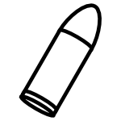{width=40pt}|Kinetik|TODO|
|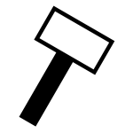{width=40pt}|Schlag|TODO|
|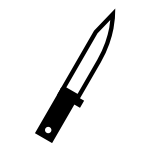{width=40pt}|Schnitt|TODO|
|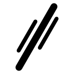{width=40pt}|Strahl|TODO|

### Übersicht der Schadens- und Verteidigungseffekte

|Icon|Name|Auswirkungen|
|--|--|--|
|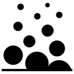{width=40pt}|Desintegrator|Der Schutz der Rüstung wird für den aktuellen Schadenswurf halbiert (aufgerundet). Wird durch jedes Feld aufgehalten.|
|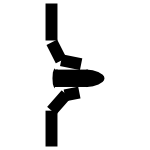{width=40pt}|Durchschlag|TODO Wenn der Angreifer doppelt so viele Erfolge hat wie der Verteidiger, durchschlägt der Schuss das Ziel (in gerade Linie) und kann ein Weiteres treffen. Dieser Effekt wird so oft angewendet, bis ein Ziel nicht durchschlagen wird.|
|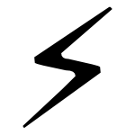{width=40pt}|Elektro|Wenn die Waffe keinen Schaden verursacht erleidet das Modell dennoch einen Schock. Wird durch jedes Feld aufgehalten. TODO Wortwahl|
|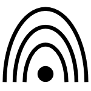{width=40pt}|EMP|TODO|
|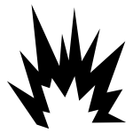{width=40pt}|Explosiv|Der Angreifer darf beim Schadenswurf einmal neu würfeln. Das neue Wurfergebnis muss verwendet werden.|
|{width=40pt}|Hitze|TODO Beim Schadenswurf kann jeder Erfolg genau einmal erneut gewürfelt werden. Am Ende wird die Gesamtanzahl aller Erfolge gezählt.|
|{width=40pt}|Kälte|TODO|
|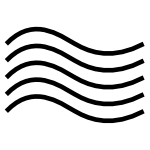{width=40pt}|Mikrowelle|Das getroffene Modell erleidet, zusätzlich zu allen anderen Auswirkungen des Treffers, einen Schock, auch wenn der Schadenswurf nicht erfolgreich war. Schilde halten diesen Effekt nicht auf.|
|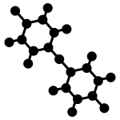{width=40pt}|Monomolekular|Wenn es zum Verlust von Trefferpunkten kommt muss der Verteidiger einen KO-Wurf ablegen. Wenn dieser misslingt wird der Verlust verdoppelt.|
|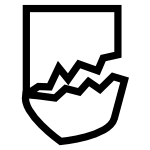{width=40pt}|Panzerbrechend|TODO Die Anzahl der W12 für den Verteidigungswurf wird um 1 verringert (bis zu einem Minimum von 1).|
|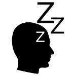{width=40pt}|Paralyse|Anstatt Trefferpunkte zu verlieren, erhält das getroffene Modell eine Anzahl an Schocks in Höhe des Schadens.|
|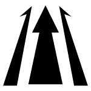{width=40pt}|Rail|TODO Beim Schadenswurf zählt jeder Erfolg doppelt, nicht jedoch für eine eventuelle Erhöhung des Substanzverlustes.|
|TODO|Schrapnell|TODO Bonus-W12 auf den Verteidigungswurf (die durch Deckung oder Tarnung zustande kommen) werden nicht angewendet.|
|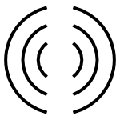{width=40pt}|Vibro|Der Angreifer darf den Verteidiger zwingen neu zu würfeln, wobei das neue Wurfergebnis verwemdet werden muss.|

### Schadenseffekte

|Icon|Name|Auswirkungen|
|--|--|--|
|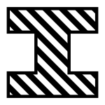{width=40pt}|Strukturschädigend|Waffen ohne diesen Effekt fügen Modellen mit dem Effekt „Strukturverstärkung“ nur den halbierten (abgerundeten) Schaden zu.|

### Verteidigungseffekte

|Icon|Name|Auswirkungen|
|--|--|--|
|{width=40pt}|Strukturverstärkt|Modelle mit diesem Effekt erhalten von Waffen ohne den Effekt „Strukturschädigend“ immer nur den halbierten (abgerundeten) Schaden.|
|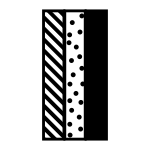{width=40pt}|Kompositpanzerung|Der Verteidiger darf einmal neu würfeln, wobei das neue Wurfergebnis genommen werden muss.|

## Waffen

Waffen verfügen über ein Schadensprofil.

### Fernkampfwaffen

Eine Schusswaffe verfügt zusätzlich über eine Reichweite in Form eines Reichweitenbandes (siehe Seite 25) und einer Angabe für eventuelles Autofeuer (siehe Seite TODO).

### Nahkampfwaffen

Sie verfügen über kein Reichweitenband, da sie nur in direktem Basekontakt eingesetzt werden können.

### Waffenklassen

Durch Waffenklassen wird unterschieden wie groß und damit unhandlich eine Waffe bzw. wie komplex sie zu bedienen ist.
Je größer/komplexer desto höher die WK.

Waffenklassen werden mit „WK“ abgekürzt.
WK I steht somit für Waffen der Klasse 1.

### Einmalnutzung

TODO

### Beispiele

### WK I

TODO

Pistolen

Maschinenpistolen

Messer

#### WK II

TODO

Gewehre

Schwerter

#### WK III

TODO

Maschinengewehr

Vorschlaghammer

Axt

#### WK IV

TODO

Panzerfaust

Kettensäge

### WK V

TODO

Panzerkanone

Lafettengeschütz

Alles was sich definitiv nicht mehr von einem Menschen tragen lässt

## Verteidigung

### Rüstung

Rüstungen verfügen über ein Verteidigungsprofil.

### Schilde

Unter Schilden versteht man alle Arten von „Platten“ die zur Verteidigung getragen werden.

Schilde geben dem Träger +1W12 beim Verteidigungswurf im Nahkampf und gegen jeden Beschuss der das Modell aus einem 180° Bereich von vorne trifft.

!!! TODO Stattdessen Verteidigungswurf wiederholen?

!!! TODO Modell hat nur noch eine Hand frei?

## Fernkampf

TODO
Kleiner Einleitungstext was Fernkampf ist
blah blah yadda yadda

### Fernkampfwurf

Dies ist ein normaler FK-Wurf. Bei Erfolg wurde das Ziel getroffen.

Wenn das Ziel eine MIKe ist, muss mit 1W12 die getroffene Strukturzone ausgewürfelt werden (siehe Seite TODO).

### Aktionen: Fernkampf

!!! danger Normaler Schuss - WK+1 ⊙

    Das Modell führt einen normalen Fernkampfwurf aus.

!!! danger Gezielter Schuss - WK+2 ⊙

    Das Modell erhält +1 für seinen Fernkampfwurf.
    Außerdem werden für diesen Schuss die Reichweitenbänder verdoppelt.
    
    Er ist nicht in Kombination mit Autofeuer einsetzbar.

!!! danger Schnellchuss - WK ⊙

    Das Modell erhält -2 bei seinem Fernkampfwurf.

!!! danger Feuerbereitschaft - 1 ⊙

    !!! note ""

        Kann sinnvoll nur als letzte Aktion innerhalb einer Initiativephase durchgeführt werden.
        Jede weitere Aktion beendet die Feuerbereitschaft automatisch.

    Das Modell befindet sich maximal bis zu seiner nächsten Initiativephase in Feuerbereitschaft.

### Reaktionen: Fernkampf

!!! warning Reaktionsfeuer - WK+1 ⊙

    !!! note ""

        Bedingung:
        
        Nur mit Schusswaffen der WK I und II.

        Kann zu jedem beliebigen Zeitpunkt innerhalb einer gegnerischen Initiative-Phase durchgeführt werden.
        
        Der Beschuss darf nur auf das Modell dessen Initiativephase gerade gilt gerichtet sein.

        Das Modell muss sich in Feuerbereitschaft befinden.
    
    Das Modell führt einen normalen Fernkampfwurf aus.
    
    Der Schütze erhält einen zusätzlichen Malus von -1 auf seinen Fernkampfwurf.
    
    Wenn ein Ziel aus Deckung auftaucht oder sich in den Wahrnehmungsbereich hinein bewegt erhält der Schütze einen weiteren Malus von -1 auf seinen Fernkampfwurf.

    Das Modell verliert danach automatisch seine Feuerbereitschaft.

### Auswahl eines Ziels

Damit ein Ziel beschossen werden kann, muss es sich im Sichtfeld des Modells befinden und mindestens eine Extremität vollständig sichtbar sein.
Befreundete Modelle behindern dabei nicht die Sichtlinie.

Sollte sich im Gefahrenbereich kein direkter Kontrahent befinden, welcher bekämpft werden muss, kann das Ziel frei gewählt werden (siehe Seite TODO).

### Reichweite

Die Reichweite einer Waffe ist in Reichweitenbändern in der Form X/Y angegeben.
X gibt dabei an, wie groß die Reichweitenbänder sind, Y wie oft diese anwendbar sind.

Auf der Einheitenkarte wird dies unter folgendem Symbol ausgewiesen:

TODO Icon

Pro vollständig ausgenutztem Reichweitenband erhält ein schießendes Modell einen Malus von -1 auf seinen Fernkampfwurf.

Eine Waffe kann nicht weiter als ihr maximales Reichweitenband schießen.

!!! example Beispiel

    Eine Pistole verfügt über den Wert 20/3.
    Sie hat also 3 Reichweitenbänder, und kommt damit auf eine maximale Reichweite von 60cm
    
    Der Fernkampfwurf für ein Ziel in einer Entfernung von 16cm erhält keinen Malus, bei 42cm würde sich ein Malus von -2 ergeben da sich das Ziel im 3. Reichweitenband befindet.

### Deckung

Ein Gelände-Objekt kann als Deckung verwendet werden wenn es das Modell mindestens zur Hälfte verdeckt.

Es wird dabei zwischen 2 verschiedenen Stufen von Deckungen unterschieden:

#### Stufe I Deckung

Besteht aus Holz, Plastik, Blech oder auch einer Ziegelmauer.
Letztendlich alles was nicht zur direkten Abwehr von Beschuss geeignet ist.

Dazu zählen auch befreundete größere Modelle.

Das schießende Modell erhält einen Malus von -1 auf seinen Fernkampfwurf.

#### Stufe II Deckung

Besteht aus Sandsackbarrieren, Beton oder Stahl und ist zu direkten Abwehr von Beschuss geeignet.

Das schießende Modell erhält einen Malus von -2 auf seinen Fernkampfwurf.

Wenn das beschossene Modell die Deckung berührt, erhält es einen Bonus von +2 auf seinen Verteidigungswurf.

### Beschuss von getarnten Modellen

Es können nur aufgeklärte getarnte Modelle beschossen werden (siehe Seite TODO).

#### Aktive Tarnung des Ziels

Bei Beschuss erhält der Schütze einen Malus von -1 auf seinen Fernkampfwurf.

### Fernkampf-Modifikatoren

#### Größe des Ziels

|Typ|Modifikator|
|--|--|
|kleines Ziel|-1|
|großes Ziel|+1|

#### Schwerfällige Waffen

Sie erhalten bei Beschuss von Infanterie (mittlere/kleine Ziele und liegende Modelle) einen Malus von -2 auf den Fernkampfwurf.

#### Liegender Schütze

Liegende Schützen erhalten +1 auf den Fernkampfwurf.

#### Schnelle Bewegungen des Ziels

Auf Ziele die sich in schneller Bewegung befinden, gibt es einen Malus von -1 auf den Fernkampfwurf (siehe Seite 16).

### Autofeuer

Waffen verfügen über den Wert „Autofeuer“ (AF) der im Bereich 0-4 liegt.
Jeder Punkt AF wird als 1 zusätzlicher Schuss behandelt.

Auf der Einheitenkarte wird dies mit dem folgendem Symbol ausgewiesen, wobei jede Patrone für eine Stufe Autofeuer steht.

TODO Icon

Schüsse können dementsprechend auf 1 bis 5 Ziele aufgeteilt werden, wobei sich jedes Ziel bis zu maximal 3cm vom letzten Ziel befinden darf.
Für jedes Ziel nach dem Ersten gibt es einen Malus von -1 auf den Fernkampfwurf.

Falls mehrere Schüsse einem Ziel zugeteilt werden, gibt jeder Schuss nach dem Ersten einen Bonus von +1 auf den Fernkampfwurf und +1 beim Schadenswurf.
Es wird also nur 1 Schuss, dafür aber mit den beschriebenen Boni ausgewürfelt.

!!! example Beispiel

    Eine Maschinenpistole hat AF 3 und wird von einem Modell mit FK 5 abgefeuert.

    Entweder
    - Es feuert alle 4 Schuss auf ein Modell ab und erhält dadurch einen Bonus von +3 auf seine FK für den Fernkampfwurf und +3 auf den anschließenden Schadenswurf.
    
    oder
    - Es feuert jeweils 2 Schuss auf 2 verschiedene Ziele ab und erhält dadurch für beide Ziele einen Bonus von +1 auf seine FK (wobei sich für das zweite Ziel der Bonus durch den Zielwechsel aufhebt).
    Der Bonus von +1 für den Schadenswurf gilt jedoch für beide Ziele.

### Flächenwaffen

Flächenwaffen erzeugen an ihrem Trefferpunkt eine Flächenwirkung die im jeweiligen Waffenprofil in cm angegeben ist und eine kreisrunde Fläche mit diesem Radius in cm beschreibt.

Auf der Einheitenkarte wird dies mit dem folgendem Symbol ausgewiesen, wobei die Zahl den Radius angibt.

TODO Icon

Wenn bei einer Flächenwaffe der Fernkampfwurf misslingt, wird der W12 mit dem kleinsten Wert genommen und mit dem zu erreichenden Wert verglichen.
Die Differenz * 3cm gibt an, wie weit der Trefferpunkt in zufälliger Richtung vom eigentlichen Zielort entfernt platziert wird.
Die maximale Entfernung ist dabei die Hälfte (abgerundet) der geschossenen Distanz.

Sollte das schießende Modell den neuen Ort nicht einsehen können, muss von ihm aus eine gerade Linie dorthin gezogen werden.

Der Trefferpunkt ist nun dort, wo diese Linie das erste Geländeteil oder das erste Modell kreuzt.

Wenn die Trefferschablone die Base eines Modells vollständig bedeckt, oder sich vollständig innerhalb der Fläche der Base befindet, wird das entsprechende Modell normal getroffen.
Ist nur eine teilweise Überlappung vorhanden, wird der Verlust der Trefferpunktet halbiert (aufgerundet).

Wenn das getroffene Modell Deckung der Stufe II berührt, kommt diese voll zur Geltung.

## Nahkampf

TODO Kleiner Einleitungstext was Nahkampf ist
blah blah yadda yadda

Um einen Nahkampf auszuführen, muss die Base des Modells die Base des anzugreifenden Modells berühren.

### Nahkampfwurf

Beide Spieler führen einen vergleichenden Wurf durch wobei jeweils die AGI addiert wird.

Sollte eines der Modelle über eine AGI von 0 verfügen gewinnt automatisch das Andere.

Nun wird die folgende Tabelle konsultiert:

|Höheres Ergebnis|Auswirkungen|
|--|--|
|Verteidiger|Angriff abgewehrt, nichts passiert.|
|Gleichstand|TODO|
|Angreifer|Der Angreifer landet einen Treffer. TODO Spielt die Differenz eine Rolle?|

Wenn das getroffene Modell eine MIKe ist, muss mit 1W12 die getroffenen Strukturzone ausgewürfelt werden (siehe Seite TODO).

### Erlaubte Waffen

Im Nahkampf dürfen nur Waffen mit der Reichweite NK (=Nahkampf) oder WK1 verwendet werden.

### Aktionen: Nahkampf

!!! danger Nahkampf - WK ⊙

    Das Modell führt mit einem anderen Modell einen Nahkampf durch und gilt als der Angreifer.

!!! danger Abwehrhaltung - 2 ⊙

    !!! note ""

        Kann sinnvoll nur als letzte Aktion innerhalb einer Initiativephase durchgeführt werden.
        Jede weitere Aktion beendet die Abwehrhaltung automatisch.

    Das Modell befindet sich maximal bis zu seiner nächsten Initiativephase in Abwehrhaltung.

    Wenn es in einen Nahkampf verwickelt wird bekommt der Angreifer keinen eventuellen Bonus für eine Angriffsbewegung. Das Modell verliert danach automatisch seine Abwehrhaltung.

### Reaktionen: Nahkampf

!!! warning Riposte - WK ⊙

    !!! note ""

        Bedingung:
        
        Kann nur unmittelbar nach einem Nahkampf durch ein anderes Modell durchgeführt werden und muss gegen dieses gerichtet sein.

        Nur wenn der Angriff erfolgreich abgewehrt wurde.
    
    Das Modell führt mit einem anderen Modell einen Nahkampf durch und gilt als der Angreifer.

### Bonus für den Angreifer

Wenn der Angreifer den Angriff durch eine Angriffsbewegung (siehe Seite TODO) einleitet, erhält er Bonus von +1 auf den Nahkampfwurf.

Sollte der Angriff von außerhalb des Sichtfeldes (siehe Seite TODO) des angegriffenen Modells geschehen, erhält der Angreifer einen weiteren Bonus von +1.

### Multiple Gegner

Für jedes befreundete Modell, welches die Base des gegnerischen Modells berührt, gibt es einen Bonus von +1 auf den Nahkampfwurf.

### Größenunterschiede

Sollte eines der beteiligten Modelle größer als sein Gegenüber sein, erhält es einen Bonus von +1 auf seinen Nahkampfwurf.

### Nahkampf mit getarnten Modellen

Es können nur aufgeklärte getarnte Modelle angegriffen werden (siehe Seite TODO).

Wenn ein getarntes Modell den Angriff einleitet wird es automatisch aufgeklärt und erhält für die erste Runde einen Bonus von +1 auf seinen Nahkampfwurf.

#### Aktive Tarnung des Nahkampfgegners

Im Nahkampf erhält der Gegner zusätzlich einen Malus von -1 auf seinen Nahkampfwurf.

### Waffenloser Nahkampf

Infanterie und MIKe können auch ohne eine Nahkampfwaffe im Nahkampf kämpfen und Schaden austeilen.

Der Schadenstyp ist dabei immer Schlag (Stufe 1 bei Infanterie und Stufe 2 bei MIKe) und die Stärke entspricht der Konstitution.

Der Substanzverlust liegt bei KO geteilt durch 3 (gerundet).

Bei Infanterie wird dies als Waffe der Klasse I behandelt, bei MIKe als Klasse II.

!!! example Beispiel

    Für einen Infanteristen mit einer KO von 6.

    TODO Bild einfügen

## Tarnung

TODO Gesamtes Kapitel auf neue Systematik umstellen

Tarnung wird in passive und aktive Tarnung unterschieden, je nachdem was damit möglich ist.

TODO Icons

Passive Tarnung Aktive Tarnung Getarnte Modelle beginnen das Spiel automatisch als getarnt, sofern alle Voraussetzungen erfüllt sind.

Jede Tarnung verfügt über eine Stufe, welche die Effektivität der Tarnung widerspiegelt.

### Voraussetzungen für Tarnung

#### Passive Tarnung:

Ein Model mit passivem Tarnsystem kann seine Tarnung nur aktivieren, wenn es sich in Basekontakt mit einem Geländeraum oder einem Geländeteil (welches mindestens über die gleichen Ausmaße wie das Modell verfügt) befindet.
Ist dies möglich, so befindet sich das Modell im PTM (Passiv-Tarn-Modus).

#### Aktive Tarnung

Aktiv getarnte Modelle können ihre Tarnung überall aktivieren, losgelöst davon, ob sie sich in einem Geländeteil befinden oder nicht.

### Vorteile

Getarnte Modelle können weder beschossen noch im Nahkampf angegriffen werden.

Damit das möglich ist, müssen sie zuerst aufgeklärt werden.

Wenn ein getarntes Modell von einer Flächenwaffe getroffen wurde, werden bei dem Verteidigungswurf alle Würfel verdoppelt.

#### Aktive Tarnung

TODO

Aktiv getarnte Modelle erhalten immer einen Bonus von +1W12 auf ihren Verteidigungswurf, egal ob sie aufgeklärt sind oder nicht.

### Aktion/Reaktion

Um ein getarntes Modell aufzuklären muss die Aktion/Reaktion „Aufklären“ ausgeführt werden.

!!! danger Aufklären - 1 ⊙

    Aufklären bezieht sich immer auf ein konkretes getarntes Modell.

Pro Initiativephase darf pro getarntem Modell nur einmal für Aufklärung getestet werden.

Um ein getarntes Modell aufzuklären muss es sich im Wahrnehmungsbereich befinden.
Dazu muss ein Aufklärungstest durchgeführt werden, welcher um die Stufe der Tarnung erschwert ist.
Dies ist ein normaler Erfolgswurf auf AFG der mit dem Basis-W12 durchgeführt wird.
Bei mindestens 1 Erfolg ist das getarnte Modell aufgeklärt.

Pro zusätzlich eingesetztem AP kann der AFG-Test um 1 erleichtert werden.

### Reaktion

!!! warning Aufklärungsunterstützung - 2 ⊙

    Aufklärungsunterstützung bezieht sich immer auf ein konkretes eigenes Modell, welches versucht aufzuklären.

Für das Modell, welches bei der Aufklärung unterstützen möchte, muss sich das aufzuklärende Modell ebenso in seinem Wahrnehmungsbereich befinden.

Das unterstützte Modell erhält +1W12 auf seinen Aufklärungstest.

### Fernkampf

Wenn ein getarntes Modell eine Fernkampfwaffe abfeuert, wird es automatisch aufgeklärt.

### Nahkampf

Wenn ein getarntes Modell den Angriff einleitet wird es automatisch aufgeklärt und erhält für die erste Runde einen Bonus von +1 auf seinen Nahkampfwurf. Siehe auch Seite 28.

#### Aktiv

Im Nahkampf erhält der Gegner zusätzlich einen Malus von -1 auf seinen Nahkampfwurf.

### Aufgeklärte Modelle

Ein aufgeklärtes Modell gilt solange als aufgeklärt bis es eine volle Bewegungsaktion durchgeführt hat.
Danach wird seine Tarnung automatisch wiederhergestellt, wenn die Voraussetzungen dafür erfüllt sind.

#### Passiv:

Ist dadurch sichtbar und kann normal beschossen oder im Nahkampf angegriffen werden.

#### Aktiv:

Das Modell wird nicht sichtbar, kann aber dennoch beschossen oder im Nahkampf angegriffen werden.

## Ausrüstung

Jedes Modell kann über weitere Ausrüstung verfügen.

TODO

TODO Kann Regeln haben

### Aktion

!!! danger Ausrüstung verwenden - X ⊙

    Das Modell verwendet einen Ausrüstungsgegenstand.
    
    Die dafür nötigen AP-Kosten sind beim Ausrüstungsgegenstand angegeben.

### Attributsverbesserungen

#### Permanent

TODO

#### Temporär

TODO

### AP-Kosten

TODO

### Einmalnutzung

TODO

TODO Bild einfügen

## MIKe

„MIKe“ steht für „**M**echanisierte **I**nfanterie **K**ampf**e**inheit“.

Es sind moderne Hybridwaffensysteme mit der Beweglichkeit eines servounterstützten Panzeranzugs und dem Schutz, sowie Feuerkraft, eines Panzers.
In der Regel haben MIKe eine Größe von 4 bis 6 Meter und fangen bei einem Gewicht von 1,5 Tonnen an.

Große Kreaturen werden regeltechnisch wie MIKe behandelt.

### Geländeausnutzung

Durch ihre enorme Beweglichkeit profitieren sie ganz normal von Deckung, da sie sich genau wie Infanterie an diese anschmiegen können.

Aufgrund ihrer Größe können MIKe allerdings keine normal großen Türen benutzen und Gebäude normal betreten, sowie Fahrzeuge wie Infanterie benutzen.

### Strukturzonen

MIKe werden in die Strukturzonen Rumpf, linker Arm, rechter Arm und Beine unterteilt.

Welche Strukturzone im Fernkampf und Nahkampf getroffen wird, muss mit 1W12 festgestellt werden.
Es können auch Strukturzonen getroffen werden, die nicht direkt sichtbar sind da.

TODO Bild einfügen

Jede Strukturzone verfügt über eine eigene Anzahl an Trefferpunkten und Auswirkungen wenn diese in den kritischen Zustand oder auf 0 sinken.

Trefferpunkte werden nur für den Rumpf festgelegt.
Für Beine und Arme berechnet sich der Wert automatisch mit 2/3 des Rumpfes (aufgerundet).

#### Kritischer Zustand

|Zone|Auswirkung|
|---|---|
|Rumpf|Wie bei Infanterie.|
|Arme|Im Fernkampf -1 auf den Fernkampfwurf für die Waffe im entsprechenden Arm. Im Nahkampf -1 auf den Nahkampfwurf für jeden Arm im kritischen Zustand.|
|Beine|Halbierte BW. Wird vor dem eventuellen kritischen Zustand des Rumpfes angewendet.|

#### Verlust aller Trefferpunkte

|Zone|Auswirkung|
|---|---|
|Rumpf|Bei einem misslungenen KO-Wurf detoniert er (siehe weiter unten), ansonsten sinkt er in sich zusammen und gilt als zerstört und irreparabel.|
|Arme|Der Arm wird zerstört und die eingebaute Waffe kann nicht mehr verwendet werden. Außerdem wird die AGI um 1 verringert.|
|Beine|TODO|

### Detonation

Sobald eine MIKe detoniert entsteht automatisch an diesem Ort eine Explosion die eine Fläche mit einem Radius in Höhe der KO umfasst.

Der Schadenstyp ist dabei immer Schlag in Stufe 2 und die Stärke entspricht der Konstitution.

Der Schaden liegt bei KO geteilt durch 2 (gerundet).

Zusätzlich wirkt der Schadenseffekt „Explosiv“.

!!! example Beispiel

    Für eine MIKe mit einer KO von 6.

    TODO Bild einfügen

## Drohnen
