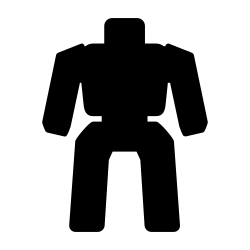
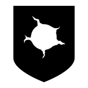
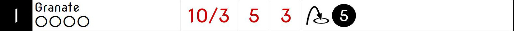

---
puppeteer:
    pdf:
        format: A4
        displayHeaderFooter: true
        landscape: false
        margin:
            top: 1cm
            right: 0cm
            bottom: 2cm
            left: 0cm
        headerTemplate: '   <section></section>'
        footerTemplate: '   
                            <section>
                                

                                    -  -
                                

                            </section>'
---

# Universalis - Regelbuch

{width="400pt"} {align="center"}

Version 0.1.0 {align="center"}

## Inhaltsverzeichnis

[[toc]]

## Vorwort

Dies ist kein Turniersystem und der Spaß steht im Vordergrund.

TODO

* Alle Modelle erlaubt.
* WYSIWYG ist zwar toll, aber es geht ja nicht immer alles.

## Was braucht man

* Ein Tisch mit einer Fläche von mindestens 90cm * 90cm.

* Ausreichend [Geländeteile](#geländeteil) um die Fläche gut zu füllen.

* Ein Maßband mit Markierungen in Zentimetern.

{width="200pt"} {align="center"}

* Für jeden Spieler mindestens 2 [Modelle](#modelle) und dazugehörige [Einheitenkarten](#einheitenkarte).

* Mindestens einen W12 und pro Modell jeweils mindestens einen weißen und einen roten W6.
Mehr Würfel schaden nie.

{width="50pt"} {width="50pt"} {width="50pt"} {align="center"}

* Des weiteren werden Marker für die folgenden Status benötigt:

    |Symbol|Bedeutung|
    |:--:|--|
    |{width="40pt"}|[Brennen](#brennen)|
    |{width="40pt"}|[Feuerbereitschaft](#aktionen:-fernkampf)|
    |{width="40pt"}|[Gift](#Vergiftung)|
    |{width="40pt"}|[Liegen](#liegende-modelle)|
    |{width="40pt"}|[Schnelle Bewegung](#schnelle-bewegungen)|
    |{width="40pt"}|[Schock](#schock)|
    |{width="40pt"}|[Tarnung](#tarnung)|
    |{width="40pt"}|[Verteidigungshaltung](#aktionen:-nahkampf)|

    Die einzelnen Status werden in ihren entsprechenden Abschnitten im Verlauf der Regeln erläutert.

## Das Spiel

### Fraktionen

Jeder Spieler entscheidet sich für eine Fraktion, mit deren Einheiten er eine Gruppe aufbauen möchte.

### Gruppen

Eine Gruppe wird immer für genau eine Fraktion aufgestellt und besteht aus 2 oder mehr [Modellen](#modelle).

Jeder Spieler verfügt über genau 1 Gruppe die genau 1 Gruppenführer beinhalten muss.

### Gruppenführer

Genau ein Modell jeder Gruppe muss der Gruppenführer sein.

Der Gruppenführer einer Gruppe wird unter anderem dafür benötigt die Aufstellungsreihenfolge und [Reihenfolge innerhalb einer Runde](#reihenfolge-innerhalb-der-runde) zu bestimmen.

Jede Fraktion hat dazu ihre eigene Regelung wer der Gruppenführer ist und wie ein Stellvertreter bestimmt wird.

### Einheitenkarte

Die Einheitenkarte ist ein zentraler Bestandteil des Spiels und beinhaltet alle spielrelevanten Werte eines Modells.
Auf der Rückseite beinhaltet sie außerdem eventuelle Sonderregeln der verwendeten [Ausrüstung](#ausrüstung) und [Eigenschaften](#eigenschaften).

Es bietet sich an die Einheitenkarten in Klarsichthüllen unterzubringen.
So ist gewährleistet, dass sie nicht kaputt gehen und während des Spiels können Notizen mit einem abwischbaren Stift darauf vorgenommen werden.

### Aufbau der Einheitenkarte

 {align="center"}

|                                                |                                                                     |
| ---------------------------------------------- | ------------------------------------------------------------------- |
| 1. [Fraktion](#fraktion)                       | 11. [Bewegungsart](#bewegungsart)                                   |
| 2. [Trefferpunkte](#trefferpunkte)             | 12. Gesamtgewicht                                                   |
| 3. Name des Modells                            | 13. [Schadenstypen](#schadens--/-rüstungstypen)                     |
| 4. [Attribute](#attribute)                     | 14. [Rüstungstypen](#schadens--/-rüstungstypen)                     |
| 5. [Wahrnehmungsbereich](#wahrnehmungsbereich) | 15. [Schadenseffekte](#übersicht-der-schadens--und-rüstungseffekte) |
| 6. [Gefahrenbereich](#gefahrenbereich)         | 16. [Rüstungseffekte](#übersicht-der-schadens--und-rüstungseffekte) |
| 7. Outfit, also Ausstattungsvariante           | 17. [Eigenschaften](#eigenschaften)                                 |
| 8. Punkte                                      | 18. [Waffen](#waffen)                                               |
| 9. [Typ des Modells](#modelle)                 | 19. [Rüstung](#rüstung)                                             |
| 10. [Größenprofil](#größenprofil)              | 20. [Ausrüstung](#ausrüstung)                                       |

## Modelle

Alle im Spiel vorhandenen Einheiten die auch über eine [Einheitenkarte](#einheitenkarte) verfügen benötigen ein Modell, welches sie auf dem Spielfeld repräsentiert.

### Profile

Im Profil sind alle Werte eines Modells beschrieben, die sich auf seine körperlichen Eigenschaften beziehen.
Diese können sowohl angeboren als auch antrainiert sein.

Dazu gehören:

* [Typ](#typ)
* [Attribute](#attribute)
* [Geschwindigkeit](#geschwindigkeit)
* [Trefferpunkte](#trefferpunkte)
* [Größenprofil](#größenprofil)
* [Sichtfeld](#sichtfeld)

### Typ

Modelle werden in die Typen Infanterie, Mech, Koloss und Fahrzeuge unterschieden.
Einzelne Typen unterliegen dabei durchaus speziellen Regeln.

| Symbol | Name | Beschreibung | [Größenprofil](#größenprofil) |
|--|--|--|--|
| {width="40pt"} | Infanterie | Sie umfasst alles von normalen Soldaten bis hin zu Panzeranzügen. | klein bis groß |
| {width="40pt"} | [Mech](#mechs-&-kolosse) | Sie umfassen unter Anderem große servounterstützte Panzeranzüge mit meist schwerster Bewaffnung. | groß bis riesig |
| {width="40pt"} | [Koloss](#mechs-&-kolosse) | Große biologische Kreaturen werden als Kolosse bezeichnet. | groß bis riesig |
| {width="40pt"} | Fahrzeug | TODO Beinhaltet alles was von einem Modell welches sich darin befindet gesteuert wird. | mittel bis riesig |
| {width="40pt"} | [Drohne](#drohnen) | Umschreibt alle Modelle die durch ein anderes Modell ferngesteuert werden. | klein bis mittel |

### Attribute

Jedes Modell verfügt über einen festen Satz an Attributen.

| Kürzel | Name | Beschreibung |
|:--:|--|--|
|AGI|Agilität|Steht für das Reaktionsvermögen des Modells. Siehe z.B. [Reaktionen](#reaktionen).|
|NK|Nahkampf|Stellt die Nahkampffähigkeit des Modells dar. Siehe [Nahkampf](#nahkampf).|
|FK|Fernkampf|Stellt die Fernkampffähigkeit des Modells dar. Siehe [Fernkampf](#fernkampf).|
|KO|Konstitution|Drückt nicht nur aus wie stark ein Modell, sondern auch wie widerstandsfähig es ist. Siehe z.B. [Schock](#schock) und [Tragkraft](#tragkraft).|
|WN|Wahrnehmung|Beschreibt, wie gut das Modell seine Sinneswahrnehmungen verarbeiten kann. Siehe z.B. [Wahrnehmungsbereich](#wahrnehmungsbereich), [Tarnung](#tarnung) und [Bewegungstests](#bewegungstest).|
|EH|Entschlossenheit|Die Fähigkeit eines Modells, physische oder mentale Konflikte zu bewältigen. Siehe z.B. [Gefahrenbereich](#gefahrenbereich).|

!!! example Beispiel normaler Mensch

    | AGI | NK | FK | KO | WN | EH |
    |:---:|:--:|:--:|:--:|:--:|:--:|
    |  4  |  2 |  2 |  3 |  3 |  3 |

### Geschwindigkeit

Gibt an, wie weit sich ein Modell mit einer Aktion in Zentimetern bewegen kann.
Sie wird in der Regel mit GK abgekürzt.

Die folgenden Bewegungsarten stehen dabei zur Verfügung:

|Beine|Flug|Kette|Schweben|Rad|Stationär|
|:--:|:--:|:--:|:--:|:--:|:--:|
|{width="40pt"}|{width="40pt"}|{width="40pt"}|{width="40pt"}|{width="40pt"}|{width="40pt"}|{table-layout="fixed"}

Siehe auch [Bewegung](#bewegung).

### Trefferpunkte

Sie steht für die Menge an [Schaden](#schadensanwendung), die ein Modells einstecken kann, bevor es aus dem Spiel entfernt wird.

Die maximale Menge an Trefferpunkten, über die ein Modell verfügen kann, liegt bei 20.

### Größenprofil

Modelle werden in 4 verschiedene Größenprofile gegliedert:

| Symbol | Name | Beschreibung | Base | Höhe |
|--|--|--|--|--|
| {width=40pt} | klein | Alles kleiner als einschließlich 1m | 25mm | 2,5cm |
| {width=40pt} | mittel | Alles zwischen 1m und 2,5m. | 25mm | 4cm |
| {width=40pt} | groß | Alles zwischen 2,5m und 3,5m. | 40mm | 6cm |
| {width=40pt} | riesig | Alles höher als einschließlich 3,5m. | 50mm | 8cm |

Jedes Modell wird hierbei wie ein kleiner Zylinder mit der Breite der Base und der angegebenen Höhe betrachtet.
Das Größenprofil eines Modells ist somit also abstrakt und entspricht nicht dem tatsächlichen Modell.

{height="150pt"}{.img_border} {align="center"}

*Der graue Zylinder veranschaulicht das Größenprofil* {align="center"}

Dies bringt den Vorteil, dass es nun egal ist welche Modelle verwendet werden da überstehende Waffen, Gliedmassen etc. für bspw. [Sichtlinien](#sichtlinie) keine Rolle mehr spielen.

### Sichtfeld

Es gibt 4 verschiedene Sichtfelder mit 45°, 90°, 180° und 360°.

{.img_border} {align="center"}

*Übersicht der 4 verschiedenen Sichtfelder (der Pfeil stellt die Blickrichtung des Modells dar)* {align="center"}

## Grundregeln

### Aktionspunkte

Modelle verfügen über Aktionspunkte, die in verschiedenen Phasen des Spiels für Aktionen und Reaktionen ausgegeben werden können.

Sie werden in der Regel als "AP" abgekürzt.

Die Kosten in Aktionspunkten werden immer mit dem Zeichen ⊙ angegeben.

Neben jedes Modell muss ein weißer W6 gelegt werden der die aktuell noch verfügbaren Aktionspunkte anzeigt.
Er wird gegen einen roten W6 ausgetauscht wenn das Modell in einen [kritischen Zustand](#kritischer-zustand) verfällt.

Alle Modelle haben pro Runde 6 AP. Die einzige Ausnahme sind Drohnen mit nur 2 AP.

**Ein Modell kann nie über mehr als 12 Aktionspunkte verfügen, egal durch welche Spielmechanik oder Ausrüstung hervorgerufen.**

### Sichtlinie

Eine Sichtlinie zu einem Modell ist immer dann gegeben, wenn es sich im Sichtfeld befindet und zusätzlich ein Teil seines [Größenprofils](#größenprofil) sichtbar ist.

Dies bedeutet, dass es möglich sein muss eine gerade Linie zu ziehen die sein Größenprofil *trifft*.

{width="300pt"}{.img_border} {align="center"}

*Die Linie trifft nicht das Modell selbst, aber sein Größenprofil.* {align="center"}

*Es kann somit eine Sichtlinie zu ihm gezogen werden* {align="center"}

Befreundete Modelle behindern nicht die Sichtlinie.

### Tragkraft

Jedes Modell kann eine gewisse Menge an Ausrüstung tragen, ohne, dass davon AGI und GK negativ beeinflusst werden.

Für verschiedene Modelltypen wird die in Kilogramm angegebene Tragkraft dabei unterschiedlich berechnet.

| Typ               | Tragkraft in kg |
| ----------------- | :-------------: |
| Infanterie        |      `KO²`      |
| Mechs und Kolosse |  `( KO * 2 )²`  |

Bis zu diesem Wert erleidet das Modell keine negativen Auswirkungen.
Wird er jedoch überschritten werden AGI und GK jeweils um 1 verringert.
Wird er um das doppelte überschritten, werden beide um jeweils 2 verringert usw.

Auf der Einheitenkarte ist dies bei den Attributen bereits eingerechnet.

!!! example Beispiel

    Ein Modell hat eine KO von 5 und damit eine Tragkraft von 25kg.
    
    Ab einer Belastung von über 25kg werden die genannten Attribute um jeweils 1 verringert, über 50kg um jeweils 2, über 75kg um jeweils 3 usw.

### Gefahrenbereich

Der Gefahrenbereich beschreibt den Umkreis um ein Modell, in dem es auf gegnerische Modelle reagieren **muss**.
Der Radius in Zentimetern berechnet sich indem die Entschlossenheit von 12 abgezogen wird:

    Radius in cm = 12 - EH

Auf der Einheitenkarte wird der Gefahrenbereich mit diesem Symbol angegeben:

{width="40pt"} {align="center"}

#### Direkte Bedrohung

Ein gegnerische Modell, das sich innerhalb des Gefahrenbereichs am nächsten zum eigenen Modell aufhält, wird „direkte Bedrohung" genannt.
Sollten sich gegnerische Modelle im Basekontakt befinden sind sie, losgelöst von dem Radius des Gefahrenbereichs, automatisch direkte Bedrohungen.

Sie können nicht einfach ignoriert und müssen stattdessen angegriffen werden.

Möchte das Modell eine direkte Bedrohung ignorieren, muss es dafür einen EH-Test bestehen.
Misslingt dieser Test muss ein Angriff gegen die direkte Bedrohung erfolgen.

### Wahrnehmungsbereich

Der Wahrnehmungsbereich umfasst alles im Sichtfeld des Modells bis zu einer Distanz die wie folgt berechnet wird:

    Distanz = WN * 5cm

Zusätzlich gelten alle Modelle im Basekontakt als im Wahrnehmungsbereich.

{.img_border} {align="center"}

*Beispiel mit einem Sichtfeld von 90°* {align="center"}

Im [Kritischen Zustand](#kritischer-zustand) wird die Reichweite des Wahrnehmungsbereichs halbiert (aufgerundet).

Auf der Einheitenkarte wird der Wahrnehmungsreich mit diesem Symbol angegeben:

{width="40pt"} {align="center"}

### Entfernungen messen

Entfernungen zwischen Modellen werden immer von den Rändern der Bases gemessen.

{width=400}{.img_border} {align="center"}

*Entfernung zwischen 2 Modellen* {align="center"}

Entfernungen zwischen Modellen dürfen immer gemessen werden.

### Würfelwürfe

Es werden nur W12 verwendet.

Vom Tisch gefallene Würfel zählen nicht, und müssen erneut gewürfelt werden.

#### Attributs-Wurf

Attributs-Würfe werden in der Form [Attributskürzel]-Wurf angegeben.
So wird bspw. für einen Attributs-Wurf auf Konstitution nur „KO-Wurf“ geschrieben.

Es wird immer der aktuelle Attributswert genommen der auch gegebenenfalls durch Effekte im Spiel modifiziert wurde.
Abhängig von verschiedenen Eigenschaften, Boni und bestimmten Regeln kann der zu erreichende Wert je nach Situation noch zusätzlich variieren.

Sollte ein zu erreichender Wert kleiner/gleich 0 sein, entfällt der Wurf und gilt als Misserfolg.

Der Wurf wird mit 1W12 durchgeführt.
Sofern das Ergebnis unter/gleich dem Wert liegt is es ein Erfolg, ansonsten ein Misserfolg.

#### Vergleichender Wurf

Bei einem vergleichendem Wurf wird für 2 konkurrierende Modelle jeweils 1W12 gewürfelt und jeweils ein Wert hinzuaddiert.

Abhängig von der Situation werden verschiedene Werte hinzuaddiert, durchaus auch unterschiedliche Werte je Modell.
Abhängig von verschiedenen Eigenschaften, Boni und bestimmten Regeln kann der zu addierende Wert je nach Situation noch zusätzlich variieren.

Das Modell mit dem höheren Ergebnis gewinnt den Wurf.

## Ablauf des Spiels

Das Spiel ist in mehrere Phasen unterteilt die nacheinander abgehandelt werden.

1. [Aufbau des Spielfeldes](#aufbau-des-spielfeldes)
2. [Missionsauswahl](#missionsauswahl)
3. [Aufstellen der Modelle](#aufstellen-der-modelle)
4. [Runden](#runden)
    * [Initiativephasen](#initiativephasen)
    * [Rundenende](#rundenende)

### Aufbau des Spielfeldes

Beide Spieler bauen gemeinsam das Spielfeld mit [Geländeteilen](#geländeteil) auf bis sie damit einverstanden sind.

Die Fläche des Spielfeldes muss exakt 90cm * 90cm betragen.

### Missionsauswahl

Jeder Spieler wählt geheim und unabhängig vom anderen Spieler eine Mission aus.
Danach teilen sie sich gegenseitig ihre jeweilige Mission mit.

Als nächstes werden alle Missionsspezifischen Änderungen am Spielfeld vorgenommen.
Etwaige Probleme bei kollidierenden Missionsanforderungen sollten gemeinschaftlich gelöst werden.

### Aufstellen der Modelle

Beide Spieler führen einen vergleichenden Wurf auf die EH des jeweiligen Gruppenführers durch.

Der Gewinner des Wurfs markiert zuerst entsprechend seiner Mission seine Aufstellungszone, danach ist der Verlierer damit dran.
Als nächstes stellt der Gewinner alle seine Modelle auf, danach der Verlierer.

Losgelöst von der gewählten Mission dürfen Modelle nie näher als 12cm an gegnerische Modelle aufgestellt werden.

### Runden

Innerhalb einer Runde hat jedes Modell eine Initiativephase.
Die Runde ist erst dann beendet, wenn jedes Modell seine Initiativephase durchgeführt hat.

#### Rundenbeginn

Zu Beginn jeder Runde werden die AP jedes Modells wieder aufgefüllt.
Die nicht verbrauchten und bereits halbierten AP aus der Vorrunde werden addiert.

Modelle mit [Schock-Markern](#schock) verlieren danach automatisch pro Marker 1 AP.

#### Reihenfolge innerhalb der Runde

Innerhalb einer Runde wählen beide Spieler immer gleichzeitig jeweils ein beliebiges eigenes Modell aus, welches in dieser Runde noch keine Initiativephase hatte.

Beide Modelle führen einen vergleichenden Wurf auf AGI durch.
Der Gewinner hat zuerst seine Initiativephase, danach direkt der Verlierer.

Sollte ein Spieler keine Modelle mehr haben, aktiviert der andere Spieler seine übrigen Modelle in beliebiger Reihenfolge.

### Initiativephasen

Eine Initiativephase ist der Zeitpunkt, an dem ein Modell mit seinen AP Aktionen ausführen kann.

Zusätzlich können andere Modelle, egal ob sie bereits ihre Initiativephase hatten oder nicht, unter bestimmten Voraussetzungen Reaktionen durchführen.

Zum Beginn der Initiativephase eines Modells müssen folgende Punkte beachtet werden:

* eventuelle Marker für [schnelle Bewegung](#schnelle-bewegungen), [Verteidigungshaltung](#aktionen:-nahkampf) oder [Feuerbereitschaft](#aktionen:-fernkampf) werden entfernt
* eventuelle [Vergiftung](#vergiftung) kommt zur Anwendung
* eventuelles [Brennen](#brennen) kommt zur Anwendung

### Rundenende

Wenn einer der Spieler aufgeben möchte wäre nun der Zeitpunkt dafür.
Das Spiel endet dann automatisch sofort und der Spieler der aufgegeben hat hat verloren.

Für jede Mission werden die Siegesbedingungen überprüft und das Spiel gegebenenfalls beendet.

Sollte es weitergehen werden die nicht verbrauchten AP jedes Modells halbiert (abgerundet) und mit in die nächste Runde übernommen.
Hier bietet es sich an einen W6 in der korrekten Farbe (siehe [Kritischer Zustand](#kritischer-zustand)) mit der übernommenen Menge an AP an das jeweilige Modell zu dem bereits vorhandenen dazu zu legen.
Ein Modell kann dabei nie über mehr als 12 Aktionspunkte verfügen.
Siehe dazu auch [Aktionspunkte](#aktionspunkte).

## Aktionen und Reaktionen

Aktionen und Reaktionen beschreiben die Tätigkeiten, die von Modellen ausgeführt werden können.

Ein Modell kann in jeder Runde nur so viele Aktionen und Reaktionen ausführen, bis seine Aktionspunkte verbraucht sind.
Bei jeder Aktion und Reaktion sind die entsprechenden Kosten an Aktionspunkten angegeben.

### Typen

Es wird hierbei zwischen *normalen* und *komplexen* Aktionen und Reaktionen unterschieden.

*Normale* können von jedem Modell durchgeführt werden, vorausgesetzt es verfügt über die nötigen Voraussetzungen (bspw. „Hände“ um eine Waffe abzufeuern etc.).
Hier ist der gesunde Menschenverstand gefragt.

*Komplexe* müssen erlernt werden und können bspw. durch Ausrüstung oder Eigenschaften ermöglicht werden.

### Aktionen

Aktionen können immer von einem Modell ausgeführt werden, wenn es sich gerade in der eigenen Initiativephase befindet.
Bis auf wenige Ausnahmen können Aktionen beliebig aneinander gereiht und kombiniert werden.

### Reaktionen

Wenn eine Reaktion durchgeführt werden soll, kann dies nur als Antwort auf eine Aktion eines anderen Modells in dessen Initiativephase geschehen.
Sie sind teilweise an Bedingungen geknüpft.

Um eine Reaktion durchzuführen muss ein Modell über Aktionspunkte verfügen.
Dies ist unabhängig davon, ob das Modell in dieser Runde bereits eine Initiativephase hatte, oder diese noch stattfindet.
Um auf Aktionen zu reagieren, die nach der Initiativephase der aktuellen Runde stattfinden, müssen also Aktionspunkte aufbewahrt werden.

#### Aktionen durch Reaktionen unterbrechen

Damit auf eine Aktion reagiert werden kann, muss diese im [Wahrnehmungsbereich](#wahrnehmungsbereich) stattfinden.

Es kann versucht werden eine Aktion zu unterbrechen bevor sie durchgeführt wird (falls das Modell direkt sichtbar ist) oder z.B. während einer Bewegung (wenn das Modell gerade sichtbar wird).

Damit dieser Versuch erfolgreich ist, muss das reagierende Modell einen vergleichenden Wurf auf AGI gegen das aktuelle Modell gewinnen.
Bei einem Gleichstand gewinnt das Modell dessen Initiativephase gerade läuft.

Der Gewinner führt als Erster seine Aktion/Reaktion durch, der Verlierer danach seine.

Wenn sich dadurch, bspw. durch einen Treffer, negative Auswirkungen ergeben kommen sie auch sofort zur Anwendung.
Aktion und Reaktion passieren also nicht gleichzeitig, sondern nacheinander.

### Übersicht Aktionen und Reaktionen

|Typ|
|--|
|[Bewegen](#aktionen:-bewegung)|
|[Fernkampf](#aktionen:-fernkampf)|
|[Nahkampf](#aktionen:-nahkampf)|
|[Aufklären](#aktionen:-tarnung)|
|[Ausrüstung](#ausrüstung)|

## Eigenschaften

Eigenschaften beschreiben alles Erlernte oder Angeborene das über einfache Attribute hinausgeht.

### Aufbau einer Eigenschaft

Eine Eigenschaft verfügt immer über einen Namen der grob umschreibt was diese Eigenschaft umfasst.

Weiterhin kann eine Eigenschaft über eine Stufe verfügen.

Was sie für Auswirkungen hat und wie die Stufe zu behandeln ist, muss dem Regeltext der Eigenschaft entnommen werden.

!!! example Beispiel

    Ein normaler Mensch erhält die Eigenschaft „Bewährter Fernkämpfer II“.
    
    In ihr ist beschrieben, dass das Modell den FK-Wurf bis zu 2 mal wiederholen darf.

## Bewegung

Durch das Ausgeben von Aktionspunkten für Bewegungsaktionen kann ein Modell entsprechend bewegt werden.

Bei Reaktionen kann auf jede Bewegungsaktion einzeln reagiert werden.
Mehrere aufeinander folgende Bewegungsaktionen können jedoch zu einer durchgehenden Aktion zusammengefasst werden, auf die dann auch nur einmal reagiert werden kann.

Der Zielpunkt einer einzelnen oder auch durchgehenden Bewegungsaktion muss noch vor der Bewegung festgelegt werden, damit der sich aus der Entfernung ergebende Modifikator für etwaige Reaktionen bestimmt werden kann.

### Bewegungsart

Jedes Modell hat eine Bewegungsart welche vorgibt, wie es sich grundsätzlich bewegen kann.

|Symbol|Name|Bedeutung|
|:--:|--|--|
|{width="40pt"}|Beine|Standard Bewegungsart für Infanterie. Bietet weder spezielle Vorteile noch Nachteile.|
|{width="40pt"}|Flug|In jeder Runde muss als erste Aktion immer eine volle Bewegung in Blickrichtung ausgeführt werden. TODO Beschränkung bei Drehungen?|
|{width="40pt"}|Kette|Bewegungstests für [Passierbarkeit](#passierbarkeit) dürfen einmal wiederholt werden.|
|{width="40pt"}|Rad|Auf dem Geländetyp Straße wird die Bewegung um 2cm erhöht.|
|{width="40pt"}|Schweben| TODO Ignoriert [Passierbarkeit](#passierbarkeit). maximale Höhe? Träge Bewegung/Drehung? |
|{width="40pt"}|Stationär|Kann nicht bewegt werden.|

### Bewegungstest

Der Bewegungstest besteht aus einem WN-Wurf und muss in bestimmten Situationen durchgeführt werden.

### Aktionen: Bewegung

!!! danger Drehen - 0 ⊙

    Kostet keine AP, zählt aber dennoch als eine eigene Aktion.

!!! danger Normale Bewegung - 1-2 ⊙

    Das Modell bewegt sich entsprechend seiner GK in cm.
    Die AP-Kosten sind 1⊙ falls das Modell steht und 2⊙ falls es liegt.

!!! danger Hinlegen - 1 ⊙

    Das Modell gilt als liegend.

!!! danger Aufstehen - 1 ⊙

    Das Modell gilt als stehend.

!!! danger Angriffsbewegung - WK ⊙

    Die Angriffsbewegung funktioniert wie eine ganz normale Bewegung, ihre Kosten entsprechen aber der Waffenklasse der zu verwendenden Nahkampfwaffe.
    
    Die eigentliche Bewegung ist somit kostenlos.
    
    Wenn sie in einem Basekontakt mit einem gegnerischen Modell endet wird sie automatisch zu einem [Angriff](#aktionen:-nahkampf).

!!! danger Springen - 2 ⊙

    Das Modell springt entsprechend seiner GK in cm weit wenn es gestanden hat.
    
    Falls es unmittelbar vorher mindestens eine volle Bewegung gemacht hat, darf es die doppelte Reichweite springen.
    
    Ein Modell kann nicht springen, wenn es liegt.

!!! danger Interagieren - 1 ⊙

    Benutzen von Schaltern, Hebeln, nicht verschlossenen Türen etc.

### Reaktionen: Bewegung

!!! warning Hinwerfen - 2 ⊙

    !!! note ""

        Bedingung:

        Kann nur von dem beschossenen Modell ausgeführt werden, und nur bevor der Schütze seinen FK-Wurf durchführt.
        
        Nicht bei liegenden Modellen.
    
    Das Modell wirft sich zu Boden und gilt als liegend.

!!! warning Komplex: Beschuss Ausweichen - 1 ⊙

    !!! note ""

        Bedingung:
        
        Kann nur von dem beschossenen Modell ausgeführt werden, und nur bevor der Schütze seinen FK-Wurf durchführt.
        
        Nicht bei liegenden Modellen.
    
    Der Schütze erhält -1 auf seinen FK-Wurf.

### Herunterfallen

Ein Modell welches fällt kann unter Umständen Schaden erleiden.

Bis zu einer Fallhöhe in Höhe seines [Größenprofils](#größenprofil) passiert nichts.
Bis zur doppelten Höhe seines Größenprofils kann Schaden durch einen erfolgreichen Bewegungstest vermieden werden.
Darüber hinaus erleidet er automatisch einen Treffer.

Der Treffer hat eine Stärke in Höhe der KO des gefallenen Modells.

|Fallhöhe|Schadenstyp|Schaden|
|:--:|:--:|:--:|
| **bis einschliesslich** doppeltem Größenprofil | Schlag I | 2 |
| **größer als** doppeltes Größenprofil | Schlag II | 4 |

### Vertikale Bewegung

Ohne spezielle Ausrüstung können sich Modelle vertikal nur an Leitern bewegen.
Die Distanz wird ganz normal wie jede andere Bewegung gemessen.

### Klettern

Jedes Modell kann ohne spezielle Ausrüstung auf oder herunter von Hindernissen bis zu seinem doppelten [Größenprofil](#größenprofil) klettern.

Die vertikale Distanz wird dafür doppelt berechnet.

### Schnelle Bewegungen

Wenn sich ein Modell innerhalb seiner Initiativephase mehr als 20cm bewegt, gilt es als in schneller Bewegung.
Dabei wird die tatsächlich zurückgelegte Distanz gemessen.

Sie wird am Modell mit dem Schnell-Marker dargestellt:

{width="40pt"} {align="center"}

Zum Beginn der nächsten Initiativephase eines Modells wird der Marker wieder entfernt.

Sie kommt unter anderem beim [Fernkampf](#schnelle-bewegungen-des-ziels) zur Anwendung.

### Liegende Modelle

Liegende Modelle gelten als ein [Größenprofil](#größenprofil) kleiner als sie sind.
Kleine Modelle werden dadurch nicht noch kleiner.

Dies wird am Modell mit dem Liegend-Marker dargestellt:

{width="40pt"} {align="center"}

Das [Sichtfeld](#sichtfeld) liegender Modelle ist um eine Stufe verschlechtert.

## Gelände

TODO

Geländearten

Boni und Mali

### Geländeteil

Alle Objekte auf dem Spielfeld die kein Modell sind werden als Geländeteil bezeichnet.

Ein Geländeteil kann dabei für sich allein stehen, oder fällt unter einen der weiter unten genannten [Geländetypen](#geländetyp).

### Deckung

Jedes Geländeteil kann als Deckung verwendet werden wenn es das [Größenprofil](#größenprofil) eines Modell mindestens zur Hälfte verdeckt.

Es wird dabei zwischen 2 verschiedenen Stufen von Deckungen unterschieden:

#### Stufe I Deckung

Besteht aus Holz, Plastik, Blech oder auch einer Ziegelmauer.
Letztendlich alles was nicht zur direkten Abwehr von Beschuss geeignet ist.

Dazu zählen auch befreundete Modelle die mindestens eine Stufe größer sind.

#### Stufe II Deckung

Besteht aus Sandsackbarrieren, Beton oder Stahl und ist zur direkten Abwehr von Beschuss geeignet.

Wenn ein Modell diese Deckung berührt, erhält es einen Bonus von +2 auf seine Rüstungswürfe bei Fernkampf.

### Passierbarkeit

Passierbarkeit ist eine Eigenschaft von Gelände und wird mit einer Stufe angegeben.

Die Stufe wird dabei von der GK eines Modells abgezogen, wenn sich in einem Bereich mit einer Passierbarkeit größer als 0 befindet.
Wenn die GK eines Modells dadurch auf 0 sinkt kann es sich in dem entsprechenden Bereich nicht bewegen.
Dadurch werden auch Bewegungen in einen solchen Bereich hinein unmöglich.

Auf Wunsch kann ein Bewegungstest abgelegt werden der bei Gelingen die Verringerung der GK um 1 vermindert.
Bei durchgehenden Bewegungsaktionen ist nur ein Bewegungstest notwendig und nicht für jede einzelne Bewegungsaktion.

### Geländetyp

Man versteht darunter räumlich begrenzte Abschnitte auf dem Spielfeld welche Sonderregeln unterliegen.

So brauchen bspw. keine einzelnen Bäume (die umkippen könnten) als Wald aufgestellt werden.
Stattdessen wird eine Fläche als Wald deklariert und die angegebenen Sonderregeln gelten dort automatisch.

Das ist unabhängig davon, ob ein Modell sich "in" oder "auf" einem Geländetyp befindet.
Befindet sich ein Modell "darüber" (weil es bspw. fliegt) ist es nicht davon betroffen.

Die angegebene Deckung gilt in der Regel auch wenn sich ein Modell "hinter" einem Geländetyp befindet.

!!! summary Dickicht

    | Passierbarkeit | Deckung |
    | :------------: | :-----: |
    |       1        | Stufe I |

!!! summary Gebäude

    Alle intakten Gebäude fallen unter diesen Geländetyp.

    | Passierbarkeit | Deckung |
    | :------------: | :-----: |
    |       0        | Stufe I |

!!! summary Krater

    | Passierbarkeit | Deckung |
    | :------------: | :-----: |
    |       2        | Stufe I |

    Die Deckung wikt nur gegen Beschuss außerhalb.

!!! summary Ruine

    Alle teilweise zerstörten Gebäude fallen unter diesen Geländetyp.
    
    | Passierbarkeit | Deckung |
    | :------------: | :-----: |
    |       1        | Stufe I |

!!! summary Straße

    | Passierbarkeit | Deckung |
    | :------------: | :-----: |
    |       0        |    -    |

!!! summary Sumpf

    | Passierbarkeit | Deckung |
    | :------------: | :-----: |
    |       3        |    -    |

!!! summary Unpassierbar

    Hier kann sich nichts am Boden darüber bewegen.

!!! summary Wald

    | Passierbarkeit | Deckung  |
    | :------------: | :------: |
    |       2        | Stufe II |

    Der Wahrnehmungsbereich aller Modelle wird halbiert.

!!! summary Wasser

    | Passierbarkeit | Deckung |
    | :------------: | :-----: |
    |       2        |    -    |

### Umgebungsbedingungen

Umgebungsbedingungen sollen die Umgebung darstellen in der das Gefecht stattfindet, ohne unter Anderem die Anzahl an Geländeteilen unnötig zu erhöhen.

So könnte natürlich das gesamte Spielfeld mit viel Wald zugestellt werden.
Dies benötigt einerseits viele Geländeteile und erschwert andererseits das Spielgeschehen da permanent geschaut werden muss, ob sich ein Modell in einem Geländetyp befindet.

Sie gelten immer für das gesamte Spielfeld und wirken zusätzlich zu Geländetypen.

!!! summary Arktisch

    TODO

    Auf Hitze basierende Waffen verlieren 1 Punkt ihrer Stärke und 1 Reichweitenband bis zu einem Minimum von 1.

    Der Sichtfeld aller Modelle ist um eine Stufe verschlechtert.

!!! summary Gebäude

    Das gesamte Spielfeld ist der Innenraum eines Gebäudes.

    | Passierbarkeit | Deckung |
    | :------------: | :-----: |
    |       0        | Stufe I |

!!! summary Ländlich

    TODO

!!! summary Mond

    Projektilwaffen erhalten ein weiteres Reichweitenband.

!!! summary Schwerelosigkeit

    | Passierbarkeit | Deckung |
    | :------------: | :-----: |
    |       2        |    -    |

    Projektilwaffen erhalten ein weiteres Reichweitenband.

!!! summary Urban

    | Passierbarkeit | Deckung |
    | :------------: | :-----: |
    |       0        | Stufe I |

    Der Zwischenraum zwischen Gebäuden wird regeltechnisch als vom Geländetyp Straße angesehen.

!!! summary Wildnis

    TODO

    Jede Waffe verliert 1 Reichweitenband bis zu einem Minimum von 1.

!!! summary Wüste

    TODO

    WN wird bei Tests um 1 erhöht. Nicht der Wahrnehmungsbereich.

    Jede landgestüzte Bewegung ist erschwert.

## Schadens- & Rüstungsprofile

Verschiedene Spielmechaniken erzeugen Schaden.
Dies kann ein Modell sein das ein anderes Modell beschießt oder im Nahkampf angreift oder auch Effekte die im Spiel auftreten.

Um Schaden abzuwehren gibt es verschiedene Möglichkeiten wie bspw. Rüstung, Schilde oder Felder.

### Schadensprofil

Ein Schadensprofil wird immer durch genau einen Schadenstyp (z.B. Kinetik), die Stärke, den Schaden und eventuellen Effekten angegeben.

{width="500pt"}

### Rüstungsprofil

Rüstungen werden immer durch ein oder mehrere Rüstungstypen (z.B. Stich), den Schutz und eventuellen Effekten angegeben.

{width="500pt"}

### Schadens- / Rüstungstypen

Schadens- und Rüstungstypen beschreiben, welche Art von Schaden verursacht wird bzw. abgewehrt werden kann.

Es gibt die folgenden Typen:

|Symbol|Name|Bedeutung|
|--|--|--|
|{width=40pt}|Kinetik|Alles das irgendwie als Projektil bezeichnet werden kann.|
|{width=40pt}|Schlag|Jede stumpfe Gewalteinwirkung.|
|{width=40pt}|Schnitt|Jedwede Art von Schneiden.|
|{width=40pt}|Strahl|Alle immateriellen Arten von Schaden.|

### Stufen der Schadens- / Rüstungstypen

Schadens- und Rüstungstypen haben eine minimale Stufe von 1 und eine maximale Stufe von 3.
Jede Stufe wird durch ein „+“ rechts vom eigentlichen Symbol für den Typen dargestellt.
Symbole für Schadenstypen werden dabei immer in rot, und Rüstungstypen immer in grün dargestellt.

!!! example Beispiel

    |Typ|Stufe 1|Stufe 2|Stufe 3|
    |--|:--:|:--:|:--:|
    |Schaden kinetisch|{width=40pt}|{width=40pt}|{width=40pt}|
    |Rüstung schnitt|{width=40pt}|{width=40pt}|{width=40pt}|

### Stärke / Schaden / Schutz

Sie werden mit den folgenden Symbolen ausgewiesen:

|Symbol|Name|Bedeutung|
|:--:|--|--|
|{width="40pt"}|Stärke|erhöht die Chance beim [Verletzungswurf](#verletzungs--und-rüstungswurf)|
|{width="40pt"}|Schaden|zugefügter Verlust an Trefferpunkten|
|{width="40pt"}|Schutz|erhöht die Chance beim [Rüstungswurf](#verletzungs--und-rüstungswurf)|

### Schadens- / Rüstungseffekte

Ein Schadens- oder Rüstungsprofil kann über Effekte verfügen.

Beim Verletzungswurf und Rüstungswurf werden alle zutreffenden Effekte des Schadensprofils und Rüstungsprofils angewendet.
Ein im Rüstungsprofil enthaltener Effekt neutralisiert dabei einen eventuell im Schadensprofil vorkommenden Effekt, so dass dieser nicht zur Anwendung kommt.

!!! example Beispiel

    Ein Modell wird mit einer Pistole mit dem Effekt „Explosiv“ beschossen.
    Der Angreifer dürfte nun normalerweise seine Würfel einmal neu würfeln.
    Ist aber in der Rüstung des Verteidigers ebenso der Effekt „Explosiv“ gelistet, kommt dieser Effekt nicht zu Geltung.

### Übersicht der Schadens- und Rüstungseffekte

|Symbol|Name|Auswirkungen|
|--|--|--|
|{width=40pt}|Brennen|Wenn das Modell überlebt erhält es einen Brandmarker. Siehe [brennen](#brennen).|
|{width=40pt}|Desintegrator|Der Schutz der Rüstung wird nach erfolgreichem Rüstungswurf permanent um 2 gesenkt.|
|{width=40pt}|Explosiv|TODO Der Verletzungswurf darf einmal neu gewürfelt werden. Das neue Wurfergebnis muss verwendet werden.|
|{width=40pt}|Gift|Wenn das Modell überlebt erhält es zusätzlich Giftmarker in Höhe der halben Differenz (aufgerundet) beim Verletzungs- und Rüstungswurf. Siehe [Vergiftung](#vergiftung)|
|{width=40pt}|Monomolekular|Wenn es zum Verlust von Trefferpunkten kommt muss der Verteidiger einen KO-Wurf ablegen. Wenn dieser misslingt wird der Verlust verdoppelt.|
|{width=40pt}|Panzerbrechend|Der Schutz der Rüstung wird für den Rüstungswurf halbiert (aufgerundet).|
|{width=40pt}|Stasis|TODO|
|{width=40pt}|Trauma|Anstatt Trefferpunkte zu verlieren, erleidet das getroffene Modell eine Anzahl an Schocks in Höhe des Schadens.|
|{width=40pt}|Schrapnell|Boni auf den Rüstungswurf die durch [Deckung](#deckung) oder [Tarnung](#tarnung) zustande kommen werden nicht angewendet.|
|{width=40pt}|Vibro|TODO Der Angreifer darf den Verteidiger zwingen eine beliebige Anzahl an Würfeln neu zu werfen, wobei das neue Wurfergebnis verwendet werden muss.|

### Übersicht der reinen Schadenseffekte

|Symbol|Name|Auswirkungen|
|--|--|--|
|{width=40pt}|Strukturschädigend|Waffen ohne diesen Effekt fügen Modellen mit dem Effekt „Strukturverstärkt“ nur den halbierten (abgerundeten) Schaden zu.|

### Übersicht der reinen Rüstungseffekte

|Symbol|Name|Auswirkungen|
|--|--|--|
|{width=40pt}|Kompositpanzerung|Der Verteidiger darf eine beliebige Anzahl an Würfeln neu werfen, wobei das neue Wurfergebnis genommen werden muss.|
|{width=40pt}|Robust|TODO Der Rüstungswurf darf einmal neu gewürfelt werden. Das neue Wurfergebnis muss verwendet werden.|
|TODO|Schockabsorbierend|TODO|
|{width=40pt}|Strukturverstärkt|Modelle mit diesem Effekt erhalten von Waffen ohne den Effekt „Strukturschädigend“ immer nur den halbierten (abgerundeten) Schaden.|

### Verletzungs- und Rüstungswurf

Beide Spieler führen einen vergleichenden Wurf durch.
Der Angreifer addiert die Stärke seiner Waffe, dies wird *Verletzungswurf* genannt.
Der Verteider addiert den Schutz seiner Rüstung, dies wird *Rüstungswurf* genannt.
Sofern er über keine Rüstung verfügt addiert er stattdessen seine KO.

Hierbei müssen auch alle Effekte angewendet werden.

!!! todo

    Der Spieler der den Schaden austeilt addiert die Stufe seines Schadenstyps.

    Der Spieler der sich gegen den Schaden verteidigt prüft ob der Schadenstyp in seinem Rüstungsprofil vorhanden ist und addiert dessen Stufe.
    Ohne entsprechenden Rüstungstyp bekommt er keinen Bonus.

Nun wird die folgende Tabelle konsultiert:

| Höheres Ergebnis | Auswirkungen                           |
| ---------------- | -------------------------------------- |
| Verteidiger      | Nichts passiert.                       |
| Gleichstand      | Der Verteidiger erleidet einen Schock. |
| Angreifer        | Der Schaden kommt zur Anwendung.       |

### Schadensanwendung

Wenn der Schaden zur Anwendung kommt, wird er von den aktuellen Trefferpunkten des Verteidigers abgezogen.

Falls seine Trefferpunkte auf genau 0 sinken gilt er als ausgeschaltet und wird an Ort und Stelle auf die Seite gelegt, verbleibt somit jedoch im Spiel und kann wiederbelebt bzw. repariert werden.
Solange er über genau 0 Trefferpunkte verfügt, kann er weder Aktionen noch Reaktionen ausführen.

Sinkt sie unter 0 wird er aus dem Spiel entfernt, da eine Wiederherstellung nicht mehr möglich ist.

Falls der Verteidiger überlebt erleidet er einen [Schock](#schock).
Wenn er ausserdem weniger als die Hälfte seiner maximalen Trefferpunkte besitzt verfällt er nun in einen [kritischen Zustand](#kritischer-zustand).

### Schock

Wenn ein Modell einen Schock erleidet muss es einen KO-Wurf ablegen.
Misslingt dieser verliert es sofort 1 AP.
Wenn es über keine AP mehr verfügt erhält es stattdessen 1 Schock-Marker:

{width="40pt"} {align="center"}

Ein Modell mit Schock-Markern verliert zum Beginn einer Runde automatisch 1 AP pro Marker woraufhin diese Marker entfernt werden.
Sollten noch Schock-Marker übrig sein obwohl alle AP verbraucht sind, verbleiben die übrigen Marker bis zur nächsten Runde um dann abgezogen zu werden.

### Kritischer Zustand

Der kritische Zustand wird automatisch angewendet, sobald ein Modell weniger als die Hälfte seiner maximalen Trefferpunkte besitzt.

Auf der [Einheitenkarte](#einheitenkarte) ist dies daran zu erkennen, dass das erste orange Kästchen der Trefferpunkte markiert ist.

Das Modell erhält für den Rest des Spiels einen Malus von -1 auf alle seine Attributswürfe.

Der weiße W6 für die Anzeige der Aktionspunkte wird nun für das Modell gegen einen roten W6 ausgetauscht.

Ein Modell kann nur einmal in den kritischen Zustand verfallen.
Würde dies ein weiteres mal passieren, wird dies wie normaler Schock behandelt.

### Vergiftung

Modelle mit Giftmarkern zählen als *vergiftet*:

{width="40pt"} {align="center"}

Zum Beginn jeder ihrer Initiativephasen entfernen sie 1 Giftmarker und verlieren automatisch 1 TP.

### Brennen

Modelle mit einem Brandmarker gelten als *brennend*:

{width="40pt"} {align="center"}

Sie können keine Aktionen und Reaktionen ausführen.

Zum Beginn jeder ihrer Initiativephasen testen sie mit 1W12 auf der folgenden Tabelle:

|Ergebnis|Auswirkung|
|:--:|--|
|1-6|Das Modell erleidet einen automatischen Treffer. Falls es ihn überlebt bewegt es sich für 3 AP in jeweils eine zufällige Richtung.|
|7-8|Das Modell erleidet einen automatischen Treffer. Falls es ihn überlebt bewegt es sich für *alle* AP in jeweils eine zufällige Richtung.|
|9-11|Der Brandmarker wird vom Modell entfernt und es verliert 2 AP. Sollte es nicht über genügend AP verfügen bekommt es stattdessen Schockmarker.
|12|Der Brandmarker wird entfernt.|

!!! TODO

    Andere Modelle können helfen!

## Waffen

Waffen verfügen über ein [Schadensprofil](#schadensprofil).

### Fernkampfwaffen

Eine Schusswaffe verfügt zusätzlich über eine Reichweite in Form eines [Reichweitenbandes](#reichweite) und einer Angabe für eventuelles [Autofeuer](#autofeuer).

### Nahkampfwaffen

Sie verfügen über kein Reichweitenband, da sie nur in direktem Basekontakt eingesetzt werden können.

### Wurfwaffen

Ihre Reichweite wird berechnet, wobei die KO des Modells das Reichweitenband angibt.
Die Anzahl an Bändern ist dabei immer 4.

!!! example Beispiel

    Für einen Menschen mit KO von 5:

    {width="500pt"}

### Waffenklassen

Durch Waffenklassen wird unterschieden wie groß und damit unhandlich eine Waffe bzw. wie komplex sie zu bedienen ist.
Je größer/komplexer desto höher die Waffenklasse.

Waffenklassen werden mit „WK“ abgekürzt.
WK I steht somit für Waffen der Klasse 1.

### Additive Stärke

Manche Waffen verfügen nicht über einen eigenen Stärkewert, sondern sind additiv.
Dies bedeutet, dass ihr Wert auf die KO des Modells aufaddiert wird.

### Schwerfällige Waffen

Manche Waffen sind schwerfällig und können dadurch im [Fernkampf](#schwerfällige-waffen-im-fernkampf) und [Nahkampf](#schwerfällige-waffen-im-nahkampf) nur mit Einschränkungen verwendet werden.

Auf der Einheitenkarte wird dies mit einem Kreis um die Waffenklasse ausgewiesen:

{width=40pt} {align=center}

### Einmalnutzung von Waffen

Bestimmte Waffen wie bspw. Speere, Granaten oder spezielle Munitionstypen können nur in einer begrenzten Anzahl eingesetzt werden.

Auf der Einheitenkarte ist dies mit kreisförmigen Markern unmittelbar beim Namen der Waffe vermerkt.
Die Anzahl an leeren Markern zeigt an, wie oft die Waffe noch verwendet werden kann.

Bei jeder Verwendung **muss** ein Marker gestrichen werden.

!!! example Beispiel

    Für eine Schockgranate die 2x verwendet werden kann.

    {width="500pt"}

### Beispiele für Waffenklassen

| Klasse | Nahkampf        | Fernkampf            |
| :----: | --------------- | -------------------- |
|   I    | Knüppel         | Maschinenpistole     |
|   ^^   | Messer          | Pistole              |
|   ^^   | Schlagring      | Schleuder            |
|   ^^   |                 | Wurfstern            |
|   II   | Morgenstern     | Armbrust             |
|   ^^   | Schwert         | Bogen                |
|   ^^   | Speer           | Gewehr               |
|   ^^   |                 | Speer                |
|  III   | Axt             | Granatwerfer         |
|   ^^   | Hellebarde      | Maschinengewehr      |
|   ^^   | Vorschlaghammer |                      |
|   ^^   | Zweihänder      |                      |
|   IV   | Kettensäge      | Panzerfaust          |
|   ^^   |                 | Scharfschützengewehr |
|   V    | kleiner Baum    | Arbalest             |
|   ^^   |                 | Lafettengeschütz     |
|   ^^   |                 | Panzerkanone         |

## Rüstung

TODO

Rüstungen verfügen über ein [Rüstungsprofil](#rüstungsprofil).

### Additiver Schutz

Manche Rüstungen verfügen nicht über einen eigenen Schutzwert, sondern sind additiv.
Dies bedeutet, dass ihr Wert auf die KO des Modells aufaddiert wird.

### Selbsttragend

Das Gewicht von selbsttragenden Rüstungen wird für die [Tragkraft](#tragkraft) eines Modells ignoriert.

### Schilde

Unter Schilden versteht man alle Arten von „Platten“ die zur Verteidigung getragen werden.

Schilde geben dem Träger +1W12 beim Rüstungswurf im Nahkampf und gegen jeden Beschuss der das Modell aus einem 180° Bereich von vorne trifft.

!!! TODO Stattdessen Rüstungswurf wiederholen?

!!! TODO Modell hat nur noch eine Hand frei?

## Fernkampf

TODO
Kleiner Einleitungstext was Fernkampf ist
blah blah yadda yadda

### Durchführung des Fernkampfs

TODO alle Schritte erklären

Um einen Fernkampf durchzuführen muss ein FK-Wurf für das Modell gemacht werden.
Bei Erfolg wurde das Ziel getroffen.

Gegebenenfalls kommen dabei diverse [Modifikatoren](#modifikatoren-im-fernkampf) zur Anwendung.

### Aktionen: Fernkampf

!!! danger Normaler Schuss - WK+1 ⊙

    Das Modell führt einen Fernkampf durch.

!!! danger Feuerbereitschaft - 2 ⊙

    !!! note ""

        Kann sinnvoll nur als letzte Aktion innerhalb einer Initiativephase durchgeführt werden.
        Jede weitere Aktion beendet die Feuerbereitschaft automatisch.

        Nur mit Schusswaffen der WK I, II und III.

    Das Modell wählt eine seiner Schusswaffen und befindet sich damit maximal bis zum Beginn seiner nächsten Initiativephase in Feuerbereitschaft.
    Es verliert sie dann automatisch.

    Sie wird am Modell mit dem Feuerbereitschafts-Marker dargestellt:

    {width="40pt"} {align="center"}

    Wenn das Modell beschossen wird muss es einen EH-Test ablegen.
    Misslingt dieser verliert es die Feuerbereitschaft.
    Es muss dafür nicht getroffen werden.

!!! danger Komplex: Gezielter Schuss - WK+2 ⊙

    Das Modell führt einen Fernkampf durch und erhält +1 auf seinen FK-Wurf.
    Die Reichweitenbänder werden hierbei verdoppelt.
    
    Er ist nicht in Kombination mit Autofeuer einsetzbar.

!!! danger Komplex: Schnellschuss - WK ⊙

    Das Modell führt einen Fernkampf durch und erhält -2 auf seinen FK-Wurf.

### Reaktionen: Fernkampf

!!! warning Reaktionsfeuer - WK ⊙

    !!! note ""

        Bedingungen:

        Das Modell muss sich in Feuerbereitschaft befinden.
        
        Kann zu jedem beliebigen Zeitpunkt innerhalb einer gegnerischen Initiativephase durchgeführt werden.
        
        Der Beschuss darf nur auf das Modell dessen Initiativephase gerade gilt gerichtet sein.
    
    Das Modell führt einen Fernkampf mit der bei der Einnahme der Feuerbereitschaft gewählten Schusswaffe durch.
    
    Der Schütze erhält einen zusätzlichen Malus von -1 auf seinen FK-Wurf.
    
    Wenn sich das Ziel in den Wahrnehmungsbereich hinein oder hinaus bewegt erhält der Schütze einen weiteren Malus von -1 auf seinen FK-Wurf.

    Das Modell verliert danach automatisch seine Feuerbereitschaft.

### Erlaubte Waffen

Im Fernkampf dürfen nur Waffen mit einem [Reichweitenband](#reichweite), nicht aber mit der Reichweite NK (=Nahkampf) verwendet werden.

### Trefferzonen im Fernkampf

Wenn das Ziel über [Trefferzonen](#trefferzonen) verfügt muss die getroffene Trefferzone ausgewürfelt werden.

### Auswahl eines Ziels

Damit ein Ziel beschossen werden kann muss eine [Sichtlinie](#sichtlinie) zu ihm gezogen werden können.

Sollte sich im Gefahrenbereich keine [direkte Bedrohung](#direkte-bedrohung) befinden, welche bekämpft werden muss, kann das Ziel frei gewählt werden.

### Reichweite

Die Reichweite einer Waffe ist in Reichweitenbändern in der Form X/Y angegeben.
X gibt dabei an, wie groß die Reichweitenbänder sind, Y wie oft diese anwendbar sind.

Auf der Einheitenkarte wird dies unter folgendem Symbol ausgewiesen:

{width="40pt"} {align="center"}

Pro vollständig ausgenutztem Reichweitenband erhält ein schießendes Modell einen Malus von -1 auf seinen FK-Wurf.

Eine Waffe kann nicht weiter als ihr maximales Reichweitenband schießen.

!!! example Beispiel

    Eine Pistole verfügt über den Wert 20/3.
    Sie hat also 3 Reichweitenbänder, und kommt damit auf eine maximale Reichweite von 60cm
    
    Der FK-Wurf für ein Ziel in einer Entfernung von 16cm erhält keinen Malus, bei 42cm würde sich ein Malus von -2 ergeben da sich das Ziel im 3. Reichweitenband befindet.

### Beschuss von getarnten Modellen

Es können nur [aufgeklärte](#aufklärung) getarnte Modelle beschossen werden.

### Indirekter Fernkampf

Bei indirektem Fernkampf kann ein Punkt oder Modell auf dem Spielfeld beschossen werden der durch das Modell nicht einsehbar ist.
Er muss sich aber im [Sichtfeld](#sichtfeld) befinden.

Der Trefferwurf für indirekten Fernkampf erhält immer einen Malus von -4.
Sofern der beschossene Punkt durch ein befreundetes Modell einsehbar ist wird nur ein Malus von -2 angewendet.

Dadurch getroffene Modelle werden immer so behandelt als ob sie sich in Deckung Stufe II befinden.

Waffen welche für indirekten Fernkampf eingesetzt werden können besitzen das folgende Symbol.

{width="40pt"} {align="center"}

### Modifikatoren im Fernkampf

* #### Größe des Ziels

  |      Typ       | Modifikator |
  | :------------: | :---------: |
  |  kleines Ziel  |     -1      |
  | mittleres Ziel |     ±0      |
  |  großes Ziel   |     +1      |
  | riesiges Ziel  |     +2      |

* #### Deckung des Ziels

  | Stufe | Modifikator |
  | :---: | :---------: |
  |   I   |     -1      |
  |  II   |     -2      |

* #### Schwerfällige Waffen im Fernkampf

  Sie erhalten bei Beschuss von kleinen und mittleren Zielen einen Malus von -3 auf den FK-Wurf.

* #### Liegender Schütze

  Liegende Schützen erhalten +1 auf den FK-Wurf.

* #### Schnelle Bewegungen des Ziels

  Auf Ziele, welche sich in [schneller Bewegung](#schnelle-bewegungen) befinden, gibt es einen Malus von -1 auf den FK-Wurf.

### Autofeuer

Waffen können über den Wert „Autofeuer“ (AF) verfügen der im Bereich 1-4 liegt.
Jeder Punkt AF wird hierdurch als 1 zusätzlicher Schuss behandelt.

Auf der Einheitenkarte wird dies mit dem folgendem Symbol ausgewiesen, wobei jede Patrone für eine Stufe Autofeuer steht.

{height="40pt"} {align="center"}

Schüsse können dementsprechend auf 1 bis 5 Ziele aufgeteilt werden, wobei sich jedes Ziel bis zu maximal 3cm vom letzten Ziel befinden darf.
Jeder Wechsel des Ziels führt zu einem kumulativen Malus von -1 auf den FK-Wurf.

Falls mehrere Schüsse einem Ziel zugeteilt werden, gibt jeder Schuss nach dem Ersten einen Bonus von +1 auf den FK-Wurf und +1 beim Verletzungswurf.
Es wird also nur 1 Schuss, dafür aber mit den beschriebenen Boni ausgewürfelt.

!!! example Beispiel

    Eine Maschinenpistole hat AF 3 und wird von einem Modell mit FK 5 abgefeuert.

    Entweder
    - Es feuert alle 4 Schuss auf ein Modell ab und erhält dadurch einen Bonus von +3 auf seinen FK-Wurf und +3 auf den anschließenden Verletzungswurf.
    
    oder
    - Es feuert jeweils 2 Schuss auf 2 verschiedene Ziele ab und erhält dadurch für beide Ziele einen Bonus von +1 auf seinen FK-Wurf (wobei sich für das zweite Ziel der Bonus durch den Zielwechsel aufhebt).
    Der Bonus von +1 für den Verletzungswurf gilt jedoch für beide Ziele.

### Flächenwaffen

Flächenwaffen erzeugen an ihrem Trefferpunkt eine Flächenwirkung die im jeweiligen Waffenprofil in cm angegeben ist und eine kreisrunde Fläche mit diesem Radius in cm beschreibt.

Auf der Einheitenkarte wird dies mit dem folgendem Symbol ausgewiesen, wobei die Zahl den Radius angibt.

{width="40pt"} {align="center"}

Wenn bei einer Flächenwaffe der FK-Wurf misslingt, wird der gewürfelte Wert mit dem zu erreichenden verglichen.
Die Differenz * 3cm gibt an, wie weit der Trefferpunkt in zufälliger Richtung vom eigentlichen Zielort entfernt platziert wird.
Die maximale Entfernung ist dabei die Hälfte (abgerundet) der geschossenen Distanz.

Sollte der Schütze den neuen Ort nicht einsehen können, muss von ihm aus eine gerade Linie dorthin gezogen werden.
Der Trefferpunkt ist nun dort, wo diese Linie das erste Geländeteil oder das erste Modell kreuzt.

Wenn die Trefferschablone die Base eines Modells vollständig bedeckt, oder sich vollständig innerhalb der Fläche der Base befindet, wird das entsprechende Modell normal getroffen.
Ist nur eine teilweise Überlappung vorhanden wird der Schaden halbiert (aufgerundet).

Wenn das getroffene Modell Deckung der Stufe II berührt, kommt diese voll zur Geltung.

## Nahkampf

TODO Kleiner Einleitungstext was Nahkampf ist
blah blah yadda yadda

### Durchführung des Nahkampfes

Um einen Nahkampf auszuführen, muss die Base des angreifenden Modells die Base des anzugreifenden Modells berühren.

Nun wird für beide Modelle ein vergleichender Wurf auf NK durchgeführt und wiefolgt vorgegangen:

1. Wenn das angreifende Modell gewinnt landet es einen Treffer mit der zuvor ausgewählten Nahkampfwaffe.
2. Wenn das angegriffene Modell gewinnt verteidigt es sich erfolgreich und nichts passiert.
3. Bei Gleichstand entscheidet ein vergleichender Wurf auf AGI dessen Ergebnis auch gegen diese Liste abgeglichen wird.

Sollte eines der Modelle über NK von 0 verfügen verliert es automatisch den vergleichenden Wurf.

Gegebenenfalls kommen dabei diverse [Modifikatoren](#modifikatoren-im-nahkampf) zur Anwendung.

### Aktionen: Nahkampf

!!! danger Angriff - WK ⊙

    Das Modell führt mit einem anderen Modell einen Nahkampf durch und gilt als der Angreifer.

!!! danger Komplex: Brachialer Angriff - WK+1 ⊙

    Das Modell führt mit einem anderen Modell einen Nahkampf durch und gilt als der Angreifer.
    Es erhält +2 auf seinen NK-Wurf.
    
    Sollte es den Nahkampf verlieren kann der Gegner die Aktion "Riposte" durchführen, auch wenn er sie eigentlich nicht beherrscht.

!!! danger Komplex: Verteidigungshaltung - 2 ⊙

    !!! note ""

        Kann sinnvoll nur als letzte Aktion innerhalb einer Initiativephase durchgeführt werden.
        Jede weitere Aktion beendet die Verteidigungshaltung automatisch.

    Das Modell befindet sich maximal bis zum Beginn seiner nächsten Initiativephase in Verteidigungshaltung.
    Es verliert sie dann automatisch.

    Sie wird am Modell mit dem Verteidigungshaltungs-Marker dargestellt:

    {width="40pt"} {align="center"}

    Wenn es in einen Nahkampf verwickelt wird bekommt der Angreifer keinen eventuellen Bonus für eine Angriffsbewegung.
    Das Modell verliert danach automatisch seine Verteidigungshaltung.

    Wenn das Modell beschossen wird muss es einen EH-Test ablegen.
    Misslingt dieser verliert es die Verteidigungshaltung.
    Es muss dafür nicht getroffen werden.

### Reaktionen: Nahkampf

!!! warning TODO - WK-1 ⊙

    !!! note ""

        Bedingungen:

        Kann durchgeführt werden, wenn das Modell in Basekontakt sich weg bewegt.
    
    TODO ein freier Schlag?

!!! warning Komplex: Riposte - WK ⊙

    !!! note ""

        Bedingungen:
        
        Kann nur unmittelbar nach einem Nahkampf durch den Verteidiger durchgeführt werden.

        Nur wenn der Angriff erfolgreich abgewehrt wurde.
    
    Das Modell führt mit einem anderen Modell einen Nahkampf durch und gilt als der Angreifer.
    Es erhält +2 auf seinen NK-Wurf.

!!! warning Komplex: Entwaffnen - WK ⊙

    !!! todo

### Im Nahkampf erlaubte Waffen

Im Nahkampf dürfen nur Waffen mit der Reichweite NK (=Nahkampf) verwendet werden.

### Trefferzonen im Nahkampf

Wenn der Verteidiger über [Trefferzonen](#trefferzonen) verfügt muss die getroffene Trefferzone ausgewürfelt werden.

### Modifikatoren im Nahkampf

* #### Bonus für den Angreifer

  Wenn der Angreifer den Angriff durch eine [Angriffsbewegung](#aktionen:-bewegung) einleitet, erhält er einen Bonus von +2 auf seinen NK-Wurf.
  Dies gilt nur wenn der Verteidiger sich nicht in Verteidigungshaltung befindet.

  Sollte der Angriff von außerhalb des [Sichtfeldes](#sichtfeld) des angegriffenen Modells geschehen, erhält der Angreifer einen weiteren Bonus von +1.

* #### Multiple Gegner

  Für jedes befreundete Modell welches die Base des gegnerischen Modells berührt, gibt es einen Bonus von +1 auf den eigenen NK-Wurf.

* #### Schwerfällige Waffen im Nahkampf

  Wenn ein Modell eine oder mehrere schwerfällige Waffen trägt, erleidet es im Nahkampf einen Malus von -3.

* #### Größenunterschiede

  Sollte eines der beteiligten Modelle größer als sein Gegenüber sein, erhält es einen Bonus von +1 auf seinen NK-Wurf für jede Stufe des Unterschieds.
  Siehe auch [Größenprofil](#größenprofil).

### Nahkampf mit getarnten Modellen

Es können nur [aufgeklärte](#aufklärung) Modelle angegriffen werden.

### Waffenloser Nahkampf

Infanterie, Mechs und Kolosse können auch ohne eine Nahkampfwaffe im Nahkampf kämpfen und Schaden austeilen.

Der Schadenstyp ist dabei immer Schlag und die Stärke entspricht der Konstitution.
Der Schaden berechnet sich durch die KO geteilt durch 3 (aufgerundet).
Die Stufe des Schadenstyps und die Waffenklasse sind abhängig von der größe des Modells.

| Größe des Modells | Stufe des Schadenstyp | Waffenklasse |
| :---------------: | :-------------------: | :----------: |
| klein bis mittel  |           1           |      I       |
|       groß        |           2           |      II      |
|      riesig       |           3           |     III      |

!!! example Beispiel

    Für einen Infanteristen mit einer KO von 5.

    {width="500pt"}

## Tarnung

Tarnung wird in passive und aktive Tarnung unterschieden, je nachdem was damit möglich ist.
Weiterhin verfügt sie immer über eine Stufe um die Effektivität der Tarnung auszudrücken.

Sie wird am Modell mit dem Tarnungs-Marker dargestellt:

{width="40pt"} {align="center"}

Getarnte Modelle beginnen das Spiel automatisch als getarnt sofern alle Voraussetzungen erfüllt sind.

### Voraussetzungen für Tarnung

|Typ|Voraussetzung|
|:--:|--|
|passiv|Die Tarnung kann nur aktiviert werden, wenn sich das Modell in Basekontakt mit einem [Geländeteil](#geländeteil) (welches mindestens über die gleichen Ausmaße wie das [Größenprofil](#größenprofil) des Modell verfügt) befindet.|
|aktiv|Aktiv getarnte Modelle können ihre Tarnung überall aktivieren, losgelöst davon, ob sie sich an einem [Geländeteil](#geländeteil) befinden oder nicht.|

### Vorteile von Tarnung

Getarnte Modelle können weder beschossen noch im Nahkampf angegriffen werden.
Damit das möglich ist, müssen sie zuerst aufgeklärt werden.

Sie können nicht durch Flächenwaffen getroffen werden.

Wenn ein getarntes Modell einen Angriff einleitet erhält es für die erste Runde einen Bonus von +1 auf seinen NK-Wurf.

#### Besondere Vorteile von aktiver Tarnung

Aktiv getarnte Modelle erhalten immer einen Bonus von +1 auf ihren Rüstungswurf, egal ob sie aufgeklärt sind oder nicht.

Im Nahkampf erhalten sie einen zusätzlichen Bonus von +1 auf ihren NK-Wurf.

### Aufklärung

Ein aufgeklärtes Modell gilt solange als aufgeklärt bis es eine volle Bewegungsaktion durchgeführt hat.
Danach wird seine Tarnung automatisch wiederhergestellt sofern die Voraussetzungen dafür erfüllt sind.

Es kann normal beschossen oder im Nahkampf angegriffen werden.

Wenn ein getarntes Modell einen Angriff einleitet oder eine Fernkampfwaffe abfeuert wird es automatisch aufgeklärt.

Um ein getarntes Modell gezielt aufzuklären muss die Aktion „Aufklären“ ausgeführt werden.

### Aktionen: Tarnung

!!! danger Aufklären - 1 ⊙

    Aufklären bezieht sich immer auf ein konkretes getarntes Modell.

    Pro Initiativephase darf mit jedem Modell pro getarntem Modell nur einmal für Aufklärung getestet werden.

    Um ein getarntes Modell aufzuklären muss es sich im Wahrnehmungsbereich befinden und ein erfolgreicher WN-Wurf abgelegt werden, welcher um die Stufe der Tarnung erschwert ist.
    Bei Erfolg wurde das getarnte Modell aufgeklärt.

    Pro zusätzlich eingesetztem AP kann der Aufklärungstest um 1 erleichtert werden.

### Reaktionen: Tarnung

!!! warning Komplex: Aufklärungsunterstützung - 2 ⊙

    Aufklärungsunterstützung bezieht sich immer auf ein konkretes eigenes Modell, welches versucht aufzuklären.

    Für das Modell, welches bei der Aufklärung unterstützen soll, muss sich das aufzuklärende Modell ebenso in seinem Wahrnehmungsbereich befinden.

    Das unterstützte Modell erhält +1 auf seinen WN-Wurf.

## Ausrüstung

Jedes Modell kann über Ausrüstung verfügen die nicht in die Kategorien Waffe oder Rüstung passt.

### Aktionen: Ausrüstung

!!! danger Ausrüstung verwenden - X ⊙

    Das Modell verwendet einen Ausrüstungsgegenstand.
    
    Die dafür nötigen AP-Kosten sind beim Ausrüstungsgegenstand angegeben.

### Regeln

Jede Ausrüstung kann Regeln beinhalten.
Wenn dem so ist werden sie auf der Rückseite der Einheitenkarte ausgegeben.

### Attributsverbesserungen

#### Permanent

Manche Ausrüstung bringt permanente Attributsverbesserungen mit sich.
Diese werden auf der Einheitenkarte direkt in die Attribute mit eingerechnet.

#### Temporär

Temporäre Attributsverbesserungen sind auf der Einheitenkarte nicht in den Attributen mit eingerechnet.
Sie kommen nur zur Anwendung wenn die Ausrüstung aktiv angewendet ist.

### AP-Kosten

Bei manchen Ausrüstungsgegenständen ist angegeben, dass zur Verwendung AP ausgegeben werden müssen.
Um sie zu benutzen muss die Aktion "Ausrüstung verwenden" ausgeführt werden.

Sofern keine AP angegeben sind ist auch keine Aktion für die Verwendung notwendig.

### Einmalnutzung von Ausrüstung

Bestimmte Ausrüstung kann nur in einer begrenzten Anzahl eingesetzt werden.

Auf der Einheitenkarte ist dies mit kreisförmigen Markern unmittelbar beim Namen der Ausrüstung vermerkt.
Die Anzahl an leeren Markern zeigt an, wie oft die Ausrüstung noch verwendet werden kann.

Bei jeder Verwendung **muss** ein Marker gestrichen werden.

!!! example Beispiel

    Für ein medizinisches Spray das 3x verwendet werden kann.

    {width="500pt"}

## Mechs & Kolosse

### Mech

Es sind moderne Hybridwaffensysteme mit der Beweglichkeit eines servounterstützten Panzeranzugs und dem Schutz, sowie Feuerkraft, eines Panzers.
In der Regel haben Mechs eine Größe von 4 bis 6 Meter und fangen bei einem Gewicht von 1,5 Tonnen an.

#### Mechs im Fernkampf

Im Fernkampf kostet sie jede Aktion 1⊙ weniger wenn sie eine Waffe der Klasse 4 oder 5 einsetzen.

### Koloss

Kolosse sind das Equivalent von Mechs im Bereich der Lebewesen.
Große und starke Kreaturen die Schaden austeilen und einstecken können als wären sie ein Panzer.

#### Kolosse im Nahkampf

Im Nahkampf kostet sie jede Aktion 1⊙ weniger wenn sie eine Waffe der Klasse 4 oder 5 einsetzen.

### Geländeausnutzung

Durch ihre enorme Beweglichkeit profitieren Mechs & Kolosse ganz normal von Deckung, da sie sich genau wie Infanterie an diese anschmiegen können.

Aufgrund ihrer Größe können sie allerdings keine normal großen Türen benutzen und Gebäude normal betreten, sowie Fahrzeuge wie Infanterie benutzen.

### Trefferzonen

Mechs & Kolosse werden in die Trefferzonen Rumpf, linker Arm, rechter Arm und Beine unterteilt.

Welche Trefferzone im Fernkampf und Nahkampf getroffen wird, muss mit 1W12 festgestellt werden.
Es können auch Trefferzonenen getroffen werden, die nicht direkt sichtbar sind.

{.img_border} {align="center"}

*Trefferzonen Mechs & Kolosse* {align="center"}

Jede Trefferzone verfügt über eine eigene Anzahl an Trefferpunkten und Auswirkungen wenn diese in den kritischen Zustand oder auf 0 sinken.

Trefferpunkte werden nur für den Rumpf festgelegt.
Für Beine und Arme berechnet sich der Wert jeweils automatisch mit 2/3 des Rumpfes (aufgerundet).

#### Kritischer Zustand bei Mechs & Kolossen

* **Rumpf**

    Wie bei Infanterie.
    Siehe [Kritischer Zustand](#kritischer-zustand).

* **Arme**

    Sowohl im Fernkampf als auch Nahkampf -1 auf den jeweiligen Wurf für jeden Arm im kritischen Zustand.

* **Beine**

    Muss für jede Bewegung einen erfolgreichen KO-Wurf ablegen.

#### Verlust aller Trefferpunkte

* **Rumpf**

    Sinkt in sich zusammen und gilt als ausgeschalten.
    Wird jedoch nicht vom Spielfeld entfernt und gilt nun als Geländeteil.

    Für Mechs muss nun ein KO-Wurf durchgeführt werden.
    Falls er misslingt [detoniert](#detonation) er.

* **Arme**

    Der Arm wird zerstört und die Waffe kann nicht mehr verwendet werden.
    Außerdem werden AGI und NK um 1 verringert.

* **Beine**

    |W12|Auswirkung|
    |--|--|
    |1-6|Bleibt auf der Stelle stehen und kann sich noch drehen.|
    |7-11|Bleibt auf der Stelle stehen und kann sich **nicht** mehr drehen.|
    |12|Fällt um und gilt als ausgeschalten. Wird jedoch nicht vom Spielfeld entfernt und gilt nun als Geländeteil.|

### Detonation

Sobald eine Mech detoniert entsteht automatisch an diesem Ort eine Explosion welche eine Fläche mit einem Radius in Höhe der KO umfasst.

Der Schadenstyp ist dabei immer Schlag in Stufe 2 und die Stärke entspricht der Konstitution.
Der Schaden liegt bei KO geteilt durch 2 (abgerundet).
Zusätzlich wirkt der Schadenseffekt „Explosiv“.

Nach der Detonation wird das Modell vom Spielfeld entfernt.

!!! example Beispiel

    Für einen Mech mit einer KO von 6.

    {width="500pt"}

## Drohnen

Unter Drohnen wird alles verstanden das in irgendeiner Weise ferngesteuert ist.
Sie haben keinen eigenen Willen und die Steuerung erfolgt ausschließlich durch den [Kontroller](#kontroller).

Das unterscheidet sie von z.B. Robotern die auch aus eigener Initiative handeln können und somit nicht als Drohnen funktionieren.

### Kontroller

Unter Kontroller versteht man alle Modelle denen eine Drohne zugeordnet ist.
Drohnen können und müssen immer genau einem Kontroller zugeordnet sein.
Dies geschieht vor dem Spiel und kann währenddessen nicht geändert werden.

Seine ihm zugeordneten Drohnen werden gleichzeitig mit ihm in seiner Initiativephase aktiv.

Seine Eigenschaften werden nur auf ihn selber angewendet, es seih denn eine Eigenschaft sagt explizit etwas anderes aus.

Einem Kontroller kann pro 3 Punkte EH jeweils eine Drohne zugeordnet werden.

!!! example Beispiele

    Ein Modell verfügt über eine EH von 5.
    Ihm kann also nur 1 Drohne zugeordnet werden.

    Mit einer EH von 6 könnten ihm 2 Drohnen zugeordnet werden.

### Drohnen ohne Kontroller

Drohnen deren Kontroller nicht mehr auf dem Spielfeld präsent oder ausgeschaltet ist versuchen das Spielfeld so schnell es geht zu verlassen.

Da sie über keine eigene AGI verfügen werden sie innerhalb einer Runde immer zuletzt aktiviert.

Während jeder Aktivierung benutzen sie alle ihre AP um sich zur nächst gelegenen Spielfeldkante zu bewegen und das Spielfeld letzten Endes zu verlassen.

Da sie dabei einem sehr rudimentärem Programm folgen ignorieren sie Bedrohungen, nutzen aber das Gelände entsprechend ihrer [Bewegungsart](#bewegungsart) korrekt aus.
Das heist, sie springen bei ihrer Flucht nicht sinnlos von Gebäuden etc.

Sobald der zugeordnete Kontroller wieder am Spielgeschehen teilnimmt funktionieren sie wieder wie gewohnt

### AP von Drohnen

Jede Drohne verfügt über 2 AP.
Für sie können weitere AP verwendet werden indem die AP des zugeordneten Kontrolllers ausgegeben werden.

### Attribute von Drohnen

Drohnen verfügen nicht über die Attribute AGI, NK, FK und EH.
Jeder Wurf auf eines dieser Attribute verwendet immer die Attribute des zugeordneten Kontrollers.

### Gefahrenbereich von Drohnen

Da sie über keine EH verfügen haben sie auch keinen eigenen [Gefahrenbereich](#gefahrenbereich).
Daraus ergibt sich, dass eine [direkte Bedrohung](#direkte-bedrohung) für sie nicht existiert.
Sie müssen aber wenn möglich aktiv werden um gegen eine direkte Bedrohung ihres Kontrollers aktiv zu werden.

### Schocks bei Drohnen

[Schocks](#schock) funktionieren grundsätzlich wie bei allen anderen Modellen.

Die einzige Besonderheit besteht darin, dass der Kontroller zum Beginn einer Runde seine eigenen AP ausgeben kann um eventuelle Schock-Marker von seinen ihm zugeordneten Drohnen zu entfernen.

### Zerstörung einer Drohne

Sobald eine Drohne als ausgeschalten gilt kann es zu einer Rückkopplung auf den Kontroller kommen die ihm Schaden zufügt.

Der Kontroller muss einen EH-Test ablegen.
Misslingt dieser verliert er automatisch 1 Trefferpunkt.

### Drohnen TODO

!!! TODO

    AGI, NK, FK und EH als "Bonus" auf die Werte des Kontrollers benutzen?

## Thaumaturgie

!!! TODO

    PSI und Magie ist alles Thaumaturgie
