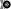
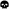
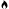
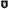
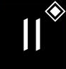
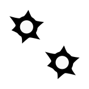

---
puppeteer:
    pdf:
        format: A4
        displayHeaderFooter: true
        landscape: false
        margin:
            top: 1cm
            right: 0cm
            bottom: 2cm
            left: 0cm
        headerTemplate: '   <section></section>'
        footerTemplate: '   
                            <section>
                                

                                    -  -
                                

                            </section>'
---

# Universalis - Regelbuch

{width="300pt"} {align="center"}

Version 0.1.0 {align="center"}

## Inhaltsverzeichnis

[[toc]]

## Vorwort

Dies ist kein Turniersystem und der Spaß steht im Vordergrund.

TODO

* Alle Modelle erlaubt.
* WYSIWYG ist zwar toll, aber es geht ja nicht immer alles.
* Modelle realistisch ausrüsten und nicht mit mehreren Nahkampf- und Schusswaffen

## Was braucht man

* Ein Tisch mit einer Fläche von mindestens 90cm * 90cm.

{width="300pt"} {align="center"}

* Ausreichend [Geländeteile](#geländeteile) um die Fläche gut zu füllen.

* Ein Maßband mit Markierungen in Zentimetern.

{width="200pt"} {align="center"}

* Für jeden Spieler mindestens 2 [Modelle](#modelle) und dazugehörige [Einheitenkarten](#einheitenkarte).

* Mindestens einen W12 und pro Modell jeweils mindestens einen weißen und einen roten W6.
Mehr Würfel schaden nie.

{width="50pt"} {width="50pt"} {width="50pt"} {align="center"}

* Des weiteren werden Marker für die folgenden Zustände benötigt:

    |Symbol|Bedeutung|
    |:--:|--|
    |{width="40pt"}|[Brennen](#brennen)|
    |{width="40pt"}|[Feuerbereitschaft](#aktionen:-fernkampf)|
    |{width="40pt"}|[Panik](#panik)|
    |{width="40pt"}|[Gift](#Vergiftung)|
    |{width="40pt"}|[Nachladen](#nachladen)|
    |{width="40pt"}|[Schnelle Bewegung](#schnelle-bewegungen)|
    |{width="40pt"}|[Schock](#schock)|
    |{width="40pt"}|[Tarnung](#tarnung)|
    |{width="40pt"}|[Verteidigung](#aktionen:-nahkampf)|

    Die einzelnen Zustände werden in ihren entsprechenden Abschnitten im Verlauf der Regeln erläutert.

## Das Spiel

### Fraktionen

Jeder Spieler entscheidet sich für eine Fraktion, mit deren Einheiten er eine Gruppe aufbauen möchte.

### Gruppen

Eine Gruppe wird immer für genau eine Fraktion aufgestellt und besteht aus 2 oder mehr [Modellen](#modelle).

Jeder Spieler verfügt über genau 1 Gruppe die genau 1 Gruppenführer beinhalten muss.

### Gruppenführer

Genau ein Modell jeder Gruppe muss der Gruppenführer sein.

Er wird unter anderem dafür benötigt die [Aufstellungsreihenfolge](#aufstellen-der-modelle) zu bestimmen.

Jede Fraktion hat ihre eigene Regelung wer der Gruppenführer ist und wie gegebenenfalls ein Stellvertreter bestimmt wird.

### Einheitenkarte

Die Einheitenkarte ist ein zentraler Bestandteil des Spiels und beinhaltet alle spielrelevanten Werte eines Modells.
Auf der Rückseite beinhaltet sie außerdem eventuelle Sonderregeln der verwendeten [Waffen](#waffen), [Rüstung](#rüstung), [Ausrüstung](#ausrüstung) und [Eigenschaften](#eigenschaften).

Es bietet sich an die Einheitenkarten in Klarsichthüllen unterzubringen.
So ist gewährleistet, dass sie nicht kaputt gehen und während des Spiels können Notizen mit einem abwischbaren Stift darauf vorgenommen werden.

### Aufbau der Einheitenkarte

 {align="center"}

|                                                |                                         |
| ---------------------------------------------- | --------------------------------------- |
| 1. [Trefferpunkte](#trefferpunkte)             | 9.  [Geschwindigkeit](#geschwindigkeit) |
| 2. Name des Modells                            | 10.  [Eigenschaften](#eigenschaften)    |
| 3. [Attribute](#attribute)                     | 11. [Waffen](#waffen)                   |
| 4. [Wahrnehmungsbereich](#wahrnehmungsbereich) | 12. [Rüstung](#rüstung)                 |
| 5. [Gefahrenbereich](#gefahrenbereich)         | 13. [Ausrüstung](#ausrüstung)           |
| 6. [Typ des Modells](#modelle)                 | 14. [Schadensprofil](#schadensprofil)   |
| 7. [Größenprofil](#größenprofil)               | 15. [Rüstungsprofil](#rüstungsprofil)   |
| 8. [Bewegungsart](#bewegungsart)               | 16. Punkte                              |

## Modelle

Alle im Spiel vorhandenen Einheiten die auch über eine [Einheitenkarte](#einheitenkarte) verfügen benötigen ein Modell, welches sie auf dem Spielfeld repräsentiert.

### Profile

Im Profil sind alle Werte eines Modells beschrieben, die sich auf seine körperlichen Eigenschaften beziehen.
Diese können sowohl angeboren als auch antrainiert sein.

Dazu gehören:

* [Typ](#typ)
* [Attribute](#attribute)
* [Geschwindigkeit](#geschwindigkeit)
* [Trefferpunkte](#trefferpunkte)
* [Größenprofil](#größenprofil)

### Typ

Modelle werden in die Typen Infanterie, Koloss und Drohne unterschieden.

Einzelne Typen unterliegen dabei durchaus speziellen Regeln.

| Symbol | Name | Beschreibung | [Größenprofil](#größenprofil) |
|--|--|--|--|
| {width="40pt"} | Infanterie | Umfasst alles von normalen Soldaten bis hin zu gepanzerten Anzügen. | klein bis groß |
| {width="40pt"} | [Koloss](#kolosse) | Sind unter Anderem große servounterstützte Panzeranzüge oder große biologische Kreaturen. | groß bis riesig |
| {width="40pt"} | [Drohne](#drohnen) | Umschreibt alle Modelle die durch ein anderes Modell ferngesteuert werden. | klein bis riesig |

### Attribute

Jedes Modell verfügt über einen festen Satz an Attributen.

| Kürzel | Name | Beschreibung |
|:--:|--|--|
|AGI|Agilität|Steht für das Reaktionsvermögen des Modells. Siehe z.B. [Reaktionen](#reaktionen) und [Bewegungstests](#bewegungstest).|
|NK|Nahkampf|Stellt die Nahkampffähigkeit des Modells dar. Siehe [Nahkampf](#nahkampf).|
|FK|Fernkampf|Stellt die Fernkampffähigkeit des Modells dar. Siehe [Fernkampf](#fernkampf).|
|KO|Konstitution|Drückt nicht nur aus wie stark ein Modell, sondern auch wie widerstandsfähig es ist. Siehe z.B. [Tragkraft](#tragkraft).|
|WN|Wahrnehmung|Beschreibt, wie gut das Modell seine Sinneswahrnehmungen verarbeiten kann. Siehe z.B. [Wahrnehmungsbereich](#wahrnehmungsbereich) und [Tarnung](#tarnung).|
|EH|Entschlossenheit|Die Fähigkeit eines Modells, psychische oder mentale Konflikte zu bewältigen. Siehe z.B. [Gefahrenbereich](#gefahrenbereich) oder [Panik](#panik).|

!!! example Beispiel normaler Mensch

    | AGI | NK | FK | KO | WN | EH |
    |:---:|:--:|:--:|:--:|:--:|:--:|
    |  4  |  2 |  2 |  3 |  3 |  3 |

### Geschwindigkeit

Gibt an, wie weit sich ein Modell mit einer Aktion in Zentimetern bewegen kann.
Sie wird in der Regel mit GK abgekürzt.

Die folgenden Bewegungsarten stehen dabei zur Verfügung:

|Beine|Flug|Kette|Rad|Schweben|Stationär|
|:--:|:--:|:--:|:--:|:--:|:--:|
|{width="40pt"}|{width="40pt"}|{width="40pt"}|{width="40pt"}|{width="40pt"}|{width="40pt"}|

Siehe auch [Bewegung](#bewegung).

### Trefferpunkte

Sie steht für die Menge an [Schaden](#schadensanwendung), die ein Modells einstecken kann, bevor es aus dem Spiel entfernt wird.

Die maximale Menge an Trefferpunkten, über die ein Modell verfügen kann, liegt bei 20.

### Größenprofil

Modelle werden in 4 verschiedene Größenprofile gegliedert:

| Symbol | Name | Beschreibung | Base | Höhe |
|--|--|--|--|--|
| {width=40pt} | klein | Alles kleiner als einschließlich 1m | 25mm | 2,5cm |
| {width=40pt} | mittel | Alles zwischen 1m und 2,5m. | 25mm | 4cm |
| {width=40pt} | groß | Alles zwischen 2,5m und 3,5m. | 40mm | 6cm |
| {width=40pt} | riesig | Alles höher als einschließlich 3,5m. | 50mm | 8cm |

Jedes Modell wird hierbei wie ein kleiner Zylinder mit der Breite der Base und der angegebenen Höhe betrachtet.
Das Größenprofil eines Modells ist somit also abstrakt und entspricht nicht dem tatsächlichen Modell.

{height="150pt"}{.img_border} {align="center"}

*Der graue Zylinder veranschaulicht das Größenprofil* {align="center"}

Dies bringt den Vorteil, dass es nun egal ist welche Modelle verwendet werden da überstehende Waffen, Gliedmassen etc. für bspw. [Sichtlinien](#sichtlinie) keine Rolle mehr spielen.

### Profilmodifikatoren

Manche [Rüstungen](#rüstung), [Waffen](#waffen) und [Eigenschaften](#eigenschaften) können Auswirkungen auf das Profil eines Modells haben.

Diese können entweder permanent oder temporär sein:

* #### Permanent

  Gelten dauernd und werden auf der [Einheitenkarte](#einheitenkarte) direkt in das Profil mit eingerechnet.

* #### Temporär

  Temporäre Profilmodifikatoren sind auf der [Einheitenkarte](#einheitenkarte) nicht im Profil mit eingerechnet.
  Sie kommen nur zur Anwendung wenn die Ausrüstung aktiv angewendet ist.

## Eigenschaften

Eigenschaften beschreiben alles Erlernte oder Angeborene eines Modells das über einfache [Attribute](#attribute) hinausgeht.
Außerdem können sie über eventuelle [Profilmodifikatoren](#profilmodifikatoren) verfügen.

### Aktionen: Eigenschaften

!!! danger Eigenschaft anwenden - X ⊙

    Das Modell wendet eine Eigenschaft an.
    
    Die dafür nötigen AP-Kosten sind bei der Eigenschaft angegeben.

### Regeln von Eigenschaften

Eine Eigenschaft verfügt immer über einen Namen der grob umschreibt was diese Eigenschaft umfasst.
Ausserdem kann eine Eigenschaft über eine Stufe verfügen.

Was die Eigenschaft für Auswirkungen hat und wie die Stufe zu behandeln ist, muss dem Regeltext der Eigenschaft entnommen werden.

Ein Modell welches eine Eigenschaft in mehreren Stufen besitzt profitiert nur von der höchsten Stufe.

!!! example Beispiel

    Ein normaler Mensch erhält die Eigenschaft „Bewährter Fernkämpfer II“.
    
    In ihr ist beschrieben, dass das Modell den FK-Wurf bis zu 2 mal wiederholen darf.

### Einmalnutzung von Eigenschaften

Bestimmte Eigenschaften gelten nicht dauerhaft sondern müssen bewusst eingesetzt werden. Ihr Einsatz ist nur in einer begrenzten Anzahl möglich.

Auf der Einheitenkarte ist dies mit kreisförmigen Markern unmittelbar beim Namen der Eigenschaft vermerkt.
Die Anzahl an leeren Markern zeigt an, wie oft die Eigenschaft noch verwendet werden kann.

Bei jeder Verwendung **muss** ein Marker gestrichen werden.

!!! example Beispiel

    Für eine Regeneration die 3x verwendet werden kann.

    {width="500pt"}

### AP-Kosten von Eigenschaften

Bei manchen Eigenschaften ist angegeben, dass zur Verwendung AP ausgegeben werden müssen.
Um sie zu benutzen muss die Aktion "Eigenschaft anwenden" ausgeführt werden.

Sofern keine AP angegeben sind ist auch keine Aktion für die Anwendung notwendig.

## Grundregeln

### Aktionspunkte

Modelle verfügen über Aktionspunkte, die in verschiedenen Phasen des Spiels für Aktionen und Reaktionen ausgegeben werden können.

Sie werden in der Regel als "AP" abgekürzt.

Die Kosten in Aktionspunkten werden immer mit dem Zeichen ⊙ angegeben.

Neben jedes Modell muss ein weißer W6 gelegt werden der die aktuell noch verfügbaren Aktionspunkte anzeigt.
Er wird gegen einen roten W6 ausgetauscht wenn das Modell in einen [kritischen Zustand](#kritischer-zustand) verfällt.

Alle Modelle haben pro Runde 6 AP. Die einzige Ausnahme sind Drohnen mit nur 2 AP.

**Ein Modell kann nie über mehr als 12 Aktionspunkte verfügen, egal durch welche Spielmechanik oder Ausrüstung hervorgerufen.**

### Sichtfeld

Jedes Modell hat ein Sichtfeld von 360°.
Es ist somit egal wohin ein Modell ausgerichtet ist.

### Sichtlinie

Eine Sichtlinie zu einem Modell ist immer dann gegeben, wenn ein Teil seines [Größenprofils](#größenprofil) sichtbar ist.

Dies bedeutet, dass es möglich sein muss eine gerade Linie zu ziehen die sein Größenprofil *trifft*.

{width="300pt"}{.img_border} {align="center"}

*Die Linie trifft nicht das Modell selbst, aber sein Größenprofil.* {align="center"}

*Es kann somit eine Sichtlinie zu ihm gezogen werden* {align="center"}

Befreundete Modelle behindern nicht die Sichtlinie.

### Tragkraft

Jedes Modell kann nur eine gewisse Menge an Ausrüstung tragen, ohne, dass davon AGI und GK negativ beeinflusst werden.

Für verschiedene Modelltypen wird die in Kilogramm angegebene Tragkraft dabei unterschiedlich berechnet.

| Typ         | Tragkraft in kg |
| ----------- | :-------------: |
| Infanterie  |      `KO²`      |
| Drohne      |      `KO²`      |
| Koloss      |  `( KO * 2 )²`  |

Bis zu diesem Wert erleidet das Modell keine negativen Auswirkungen.
Wird er jedoch überschritten werden AGI und GK jeweils um 1 verringert.
Wird er um das doppelte überschritten, werden beide um jeweils 2 verringert usw.

Auf der Einheitenkarte ist dies bei den Attributen bereits eingerechnet.

!!! example Beispiel

    Ein Modell hat eine KO von 5 und damit eine Tragkraft von 25kg.
    
    Ab einer Belastung von über 25kg werden die genannten Attribute um jeweils 1 verringert, über 50kg um jeweils 2, über 75kg um jeweils 3 usw.

### Gefahrenbereich

Der Gefahrenbereich beschreibt den Umkreis um ein Modell, in dem es auf gegnerische Modelle reagieren **muss**.
Der Radius in Zentimetern berechnet sich indem die Entschlossenheit von 12 abgezogen wird:

    Radius in cm = 12 - EH

Auf der Einheitenkarte wird der Gefahrenbereich mit diesem Symbol angegeben:

{width="40pt"} {align="center"}

#### Direkte Bedrohung

Ein gegnerisches Modell, welches sich zum Beginn der eigenen Initiativephase innerhalb des Gefahrenbereichs am nächsten zum eigenen Modell aufhält, wird „direkte Bedrohung" genannt.
Sollten sich gegnerische Modelle im Basekontakt befinden sind sie, losgelöst von dem Radius des Gefahrenbereichs, automatisch direkte Bedrohungen.

Möchte das Modell eine direkte Bedrohung ignorieren, muss es dafür einen erfolgreichen EH-Test durchführen.
Misslingt dieser Test muss ein Angriff gegen die direkte Bedrohung erfolgen, egal ob per [Nahkampf](#nahkampf), [Fernkampf](#fernkampf), [Ausrüstung](#ausrüstung), [Eigenschaften](#eigenschaften) oder [Kräften](#kräfte).

Pro Initiativephase ist nur maximal 1 Versuch erlaubt und notwendig.

### Wahrnehmungsbereich

Der Wahrnehmungsbereich umfasst alles um ein Modell bis zu einer Distanz die wie folgt berechnet wird:

    Distanz = WN * 5cm

Im [Kritischen Zustand](#kritischer-zustand) wird die Reichweite des Wahrnehmungsbereichs halbiert (aufgerundet).

Auf der Einheitenkarte wird der Wahrnehmungsreich mit diesem Symbol angegeben:

{width="40pt"} {align="center"}

### Entfernungen messen

Entfernungen zwischen Modellen werden immer von den Rändern der Bases gemessen.

{width=400}{.img_border} {align="center"}

*Entfernung zwischen 2 Modellen* {align="center"}

Entfernungen zwischen Modellen dürfen immer gemessen werden.

### Würfelwürfe

Es werden nur W12 verwendet.

Vom Tisch gefallene Würfel zählen nicht, und müssen erneut gewürfelt werden.

Grundsätzlich werden die folgenden beiden Arten von Würfen unterschieden:

* #### Attributswurf

  Attributswürfe werden in der Form [Attributskürzel]-Wurf angegeben.
  So wird bspw. für einen Attributswurf auf Konstitution nur „KO-Wurf“ geschrieben.

  Es wird immer der aktuelle Attributswert genommen der auch gegebenenfalls durch Effekte im Spiel modifiziert wurde.
  Abhängig von verschiedenen Eigenschaften, Boni und bestimmten Regeln kann der zu erreichende Wert je nach Situation noch zusätzlich variieren.

  Sollte ein zu erreichender Wert kleiner/gleich 0 sein, entfällt der Wurf und gilt als Misserfolg.

  Der Wurf wird mit 1W12 durchgeführt.
  Sofern das Ergebnis unter/gleich dem Wert liegt ist es ein Erfolg, ansonsten ein Misserfolg.

* #### Vergleichender Wurf

  Bei einem vergleichendem Wurf wird für 2 konkurrierende Modelle jeweils 1W12 gewürfelt und jeweils ein Wert hinzuaddiert.

  Abhängig von der Situation werden verschiedene Werte hinzuaddiert, durchaus auch unterschiedliche Werte je Modell.
  Abhängig von verschiedenen Eigenschaften, Boni und bestimmten Regeln kann der zu addierende Wert je nach Situation noch zusätzlich variieren.

  Das Modell mit dem höheren Ergebnis gewinnt den Wurf.

## Ablauf des Spiels

Das Spiel ist in mehrere Phasen unterteilt die nacheinander abgehandelt werden.

1. [Aufbau des Spielfeldes](#aufbau-des-spielfeldes)
2. [Missionsauswahl](#missionsauswahl)
3. [Aufstellen der Modelle](#aufstellen-der-modelle)
4. [Runden](#runden)
    * [Initiativephasen](#initiativephasen)
    * [Rundenende](#rundenende)

### Aufbau des Spielfeldes

Beide Spieler bauen gemeinsam das Spielfeld mit [Geländeteilen](#geländeteile) auf bis sie damit einverstanden sind.

Die Fläche des Spielfeldes muss exakt 90cm * 90cm betragen.

### Missionsauswahl

Jeder Spieler wählt geheim und unabhängig vom anderen Spieler eine Mission aus.
Danach teilen sie sich gegenseitig ihre jeweilige Mission mit.

Als nächstes werden alle Missionsspezifischen Änderungen am Spielfeld vorgenommen.
Etwaige Probleme bei kollidierenden Missionsanforderungen sollten gemeinschaftlich gelöst werden.

### Aufstellen der Modelle

Beide Spieler führen einen vergleichenden Wurf auf die EH des jeweiligen Gruppenführers durch.

Der Gewinner des Wurfs markiert zuerst entsprechend seiner Mission seine Aufstellungszone, danach ist der Verlierer damit dran.
Als nächstes stellt der Gewinner alle seine Modelle auf, danach der Verlierer.

Losgelöst von der gewählten Mission dürfen Modelle nie näher als 12cm an gegnerische Modelle aufgestellt werden.

### Runden

Innerhalb einer Runde hat jedes Modell eine Initiativephase.
Die Runde ist erst dann beendet, wenn jedes Modell seine Initiativephase durchgeführt hat.

#### Rundenbeginn

Zum Beginn einer Runde müssen folgende Punkte beachtet werden:

* Die AP jedes Modells werden wieder aufgefüllt.
Die nicht verbrauchten und bereits halbierten AP aus der Vorrunde werden addiert.
Siehe [Rundenende](#rundenende).
* Modelle mit [Schock-Markern](#schock) verlieren automatisch pro Marker 2 AP.
* Alle Modelle in [Panik](#panik) werden entsprechend bewegt.
Dies kann gleichzeitig geschehen.

#### Reihenfolge innerhalb der Runde

Innerhalb einer Runde wählen beide Spieler immer gleichzeitig jeweils ein beliebiges eigenes Modell aus, welches in dieser Runde noch keine Initiativephase hatte.

Beide Modelle führen einen vergleichenden Wurf auf AGI durch.
Der Gewinner hat zuerst seine Initiativephase, danach direkt der Verlierer.

Sollte ein Spieler keine Modelle mehr haben, aktiviert der andere Spieler seine übrigen Modelle in beliebiger Reihenfolge.

### Initiativephasen

Eine Initiativephase ist der Zeitpunkt, an dem ein Modell mit seinen AP Aktionen ausführen kann.

Zusätzlich können andere Modelle, egal ob sie bereits ihre Initiativephase hatten oder nicht, unter bestimmten Voraussetzungen Reaktionen durchführen.

Zum Beginn der Initiativephase eines Modells müssen folgende Punkte beachtet werden:

* eventuelle Marker für [schnelle Bewegung](#schnelle-bewegungen), [Verteidigung](#aktionen:-nahkampf) oder [Feuerbereitschaft](#aktionen:-fernkampf) werden entfernt
* eventuelle [Vergiftung](#vergiftung) kommt zur Anwendung
* eventuelles [Brennen](#brennen) kommt zur Anwendung

### Rundenende

Wenn einer der Spieler aufgeben möchte wäre nun der Zeitpunkt dafür.
Das Spiel endet dann automatisch sofort und der Spieler der aufgegeben hat verliert.

Für jede Mission werden die Siegesbedingungen überprüft und das Spiel gegebenenfalls beendet.

Sollte es weitergehen werden die nicht verbrauchten AP jedes Modells halbiert (abgerundet) und mit in die nächste Runde übernommen.
Hier bietet es sich an einen W6 in der korrekten Farbe (siehe [Kritischer Zustand](#kritischer-zustand)) mit der übernommenen Menge an AP an das jeweilige Modell zu dem bereits vorhandenen dazu zu legen.
Ein Modell kann dabei nie über mehr als 12 Aktionspunkte verfügen.
Siehe dazu auch [Aktionspunkte](#aktionspunkte).

## Aktionen und Reaktionen

Aktionen und Reaktionen beschreiben die Tätigkeiten, die von Modellen ausgeführt werden können.

Sie dürfen von jedem Modell durchgeführt werden sofern die nötigen Voraussetzungen erfüllt sind wie bspw. das Vorhandensein von „Händen“ um eine Waffe abzufeuern und so weiter.
Hier ist der gesunde Menschenverstand gefragt.

Ein Modell kann in jeder Runde nur so lange Aktionen und Reaktionen ausführen bis seine Aktionspunkte verbraucht sind.
Bei jeder Aktion und Reaktion sind die entsprechenden Kosten an Aktionspunkten angegeben.

### Aktionen

Aktionen können immer von einem Modell ausgeführt werden, wenn es sich gerade in der eigenen Initiativephase befindet.
Bis auf wenige Ausnahmen können Aktionen beliebig aneinander gereiht und kombiniert werden.

### Reaktionen

Wenn eine Reaktion durchgeführt werden soll, kann dies nur als Antwort auf eine Aktion eines anderen Modells in dessen Initiativephase geschehen.
Sie sind in der Regel an Bedingungen geknüpft.

Um eine Reaktion durchzuführen muss ein Modell über Aktionspunkte verfügen.
Dies ist unabhängig davon, ob das Modell in dieser Runde bereits eine Initiativephase hatte, oder diese noch stattfindet.
Um auf Aktionen zu reagieren, die nach der Initiativephase der aktuellen Runde stattfinden, müssen also Aktionspunkte aufbewahrt werden.

### Übersicht Aktionen und Reaktionen

|               |           Aktionen            |         Reaktionen          |
| :------------ | :---------------------------: | :-------------------------: |
| Ausrüstung    |  [⊙](#aktionen:-ausrüstung)   |                             |
| Bewegen       |   [⊙](#aktionen:-bewegung)    | [⊙](#reaktionen:-bewegung)  |
| Eigenschaften | [⊙](#aktionen:-eigenschaften) |                             |
| Fernkampf     |   [⊙](#aktionen:-fernkampf)   | [⊙](#reaktionen:-fernkampf) |
| Kräfte        |    [⊙](#aktionen:-kräfte)     |  [⊙](#reaktionen:-kräfte)   |
| Nahkampf      |   [⊙](#aktionen:-nahkampf)    | [⊙](#reaktionen:-nahkampf)  |
| Tarnung       |    [⊙](#aktionen:-tarnung)    |  [⊙](#reaktionen:-tarnung)  |

## Bewegung

Durch das Ausgeben von Aktionspunkten für Bewegungsaktionen kann ein Modell entsprechend bewegt werden.

Bei Reaktionen kann auf jede Bewegungsaktion einzeln reagiert werden.
Mehrere aufeinander folgende Bewegungsaktionen können jedoch zu einer durchgehenden Aktion zusammengefasst werden, auf die dann auch nur einmal reagiert werden kann.

Der Zielpunkt einer einzelnen oder auch durchgehenden Bewegungsaktion muss noch vor der Bewegung festgelegt werden, damit der sich aus der Entfernung ergebende Modifikator für etwaige Reaktionen bestimmt werden kann.

### Bewegungsart

Jedes Modell hat eine Bewegungsart welche vorgibt, wie es sich grundsätzlich bewegen kann.

|Symbol|Name|Bedeutung|
|:--:|--|--|
|{width="40pt"}|Beine|Standard Bewegungsart für Infanterie. |
|^^|^^|Bietet weder spezielle Vorteile noch Nachteile.|
|{width="40pt"}|Flug|In jeder Runde muss als erste Aktion immer eine volle Bewegung in Blickrichtung ausgeführt werden.|
|^^|^^|TODO Beschränkung bei Drehungen?|
|{width="40pt"}|Kette|Bewegungstests für [Passierbarkeit](#passierbarkeit) dürfen einmal wiederholt werden.|
|{width="40pt"}|Rad|Auf dem Geländetyp Straße wird die Bewegung um 2cm erhöht.|
|{width="40pt"}|Schweben| Ignoriert [Passierbarkeit](#passierbarkeit) solange es sich über einem Geländeteil bewegt.|
|^^|^^|TODO maximale Höhe? Träge Bewegung/Drehung?|
|{width="40pt"}|Stationär|Kann nicht bewegt werden.|

### Bewegungstest

Der Bewegungstest besteht aus einem AGI-Wurf und muss in bestimmten Situationen durchgeführt werden.

### Aktionen: Bewegung

!!! danger Drehen - 0 ⊙

    Kostet keine AP, zählt aber dennoch als eine eigene Aktion.

!!! danger Normale Bewegung - 1-2 ⊙

    Das Modell bewegt sich entsprechend seiner GK in cm.
    Die AP-Kosten sind 1⊙ falls das Modell steht und 2⊙ falls es [liegt](#liegende-modelle).

    Die Bewegung darf niemals in Basekontakt mit einem gegnerischem Modell enden, es muss immer ein Abstand von mindestens 3cm eingehalten werden.

!!! danger Angriffsbewegung - WK ⊙

    Die Angriffsbewegung funktioniert wie eine ganz normale Bewegung, ihre Kosten entsprechen aber der Waffenklasse der zu verwendenden Nahkampfwaffe.
    
    Die eigentliche Bewegung ist somit kostenlos.
    
    Wenn sie in einem Basekontakt mit einem gegnerischen Modell endet wird sie automatisch zu einem [Angriff](#aktionen:-nahkampf).

!!! danger Aus Nahkampf lösen - 2-3 ⊙

    !!! note ""

        Das Modell muss sich im Nahkampf befinden.

    Mit dieser Aktion kann sich ein Modell aus einem [Nahkampf](#nahkampf) lösen, zunächst muss es aber den Test für eine [Direkte Bedrohung](#direkte-bedrohung) durchführen.

    Wenn er misslingt passiert nichts und es werden keine AP ausgegeben.

    Wenn er gelingt bewegt es sich wie bei einer normalen Bewegung, die Kosten sind allerdings um 1⊙ erhöht.

!!! danger Hinlegen - 1 ⊙

    Das Modell gilt als [liegend](#liegende-modelle).

!!! danger Aufstehen - 1 ⊙

    Das Modell gilt als stehend.

!!! danger Springen - 2 ⊙

    Das Modell springt entsprechend seiner GK in cm weit wenn es gestanden hat.
    
    Falls es unmittelbar vorher mindestens eine volle Bewegung gemacht hat, darf es die doppelte Reichweite springen.
    
    Ein Modell kann nicht springen, wenn es [liegt](#liegende-modelle).

!!! danger Interagieren - 1 ⊙

    Benutzen von Schaltern, Hebeln, nicht verschlossenen Türen etc.

!!! danger Nachladen - WK ⊙

    !!! note ""

        Diese Aktion kann nur von Modellen mit dem Marker für [Nachladen](#nachladen) durchgeführt werden.

    Die dafür nötigen AP-Kosten entsprechen der WK der Waffe für die der Marker gilt.
    Der Marker wird danach vom Modell entfernt.

### Reaktionen: Bewegung

!!! warning Beschuss Ausweichen - 1 ⊙

    !!! note ""
        
        Kann von einem Modell durchgeführt werden, welches Ziel eines Fernkampfangriffs ist.
        Der Schütze muss sich im [Wahrnehmungsbereich](#wahrnehmungsbereich) befinden.

        Nicht bei [liegenden](#liegende-modelle) Modellen.

        Nur bevor der Schütze seinen FK-Wurf durchführt.
    
    Wenn das Modell einen vergleichenden Wurf auf AGI gewinnt erhält der Schütze -1 auf seinen FK-Wurf.

### Herunterfallen

Ein Modell welches fällt kann unter Umständen Schaden erleiden.

Bis zu einer Fallhöhe in Höhe seines [Größenprofils](#größenprofil) passiert nichts.
Bis zur doppelten Höhe seines Größenprofils kann Schaden durch einen erfolgreichen Bewegungstest vermieden werden.
Darüber hinaus erleidet es automatisch einen Treffer.

Der Treffer hat eine Stärke in Höhe der KO des gefallenen Modells.

|Fallhöhe|Schaden|
|:--:|:--:|
| **bis einschliesslich** doppeltem Größenprofil | 2 |
| **größer als** doppeltes Größenprofil | 4 |

### Vertikale Bewegung

Ohne spezielle Ausrüstung können sich Modelle vertikal nur an Leitern und vergleichbarem bewegen.
Die Distanz wird ganz normal wie jede andere Bewegung gemessen.

### Klettern

Jedes Modell kann ohne spezielle Ausrüstung auf oder herunter von Hindernissen bis zu seinem doppelten [Größenprofil](#größenprofil) klettern.

Die vertikale Distanz wird dafür doppelt berechnet.

### Schnelle Bewegungen

Wenn sich ein Modell innerhalb seiner Initiativephase mehr als 20cm bewegt, gilt es als in schneller Bewegung.
Dabei wird die tatsächlich zurückgelegte Distanz gemessen.

Sie wird am Modell mit dem Schnell-Marker dargestellt:

{width="40pt"} {align="center"}

Zum Beginn der nächsten Initiativephase eines Modells wird der Marker wieder entfernt.

Sie kommt unter anderem beim [Fernkampf](#schnelle-bewegungen-des-ziels) zur Anwendung.

### Liegende Modelle

Liegende Modelle gelten als ein [Größenprofil](#größenprofil) kleiner als sie sind.
Kleine Modelle werden dadurch nicht noch kleiner.

Um darzustellen, dass ein Modell liegt, wird es auf den Bauch gelegt.

## Gelände

TODO

Geländearten

Boni und Mali

### Geländeteile

Alle Objekte auf dem Spielfeld die kein Modell sind werden als Geländeteil bezeichnet.

Man versteht darunter räumlich begrenzte Abschnitte auf dem Spielfeld welche unter Umständen Sonderregeln unterliegen.

So brauchen bspw. keine einzelnen Bäume (die umkippen könnten) als Wald aufgestellt werden.
Stattdessen wird eine Fläche als Wald deklariert und die angegebenen Sonderregeln gelten dort automatisch.

Das ist unabhängig davon, ob ein Modell sich "in" oder "auf" einem Geländetyp befindet.
Befindet sich ein Modell "darüber" (weil es bspw. fliegt) ist es nicht davon betroffen.

Geländeteile gehören in der Regel einem der weiter unten genannten [Geländetypen](#geländetypen) an.

### Deckung

Jedes Geländeteil kann als Deckung verwendet werden wenn es das [Größenprofil](#größenprofil) eines Modells mindestens zur Hälfte verdeckt.

Deckung kommt nur im Fernkampf zur Anwendung und auch nur wenn sie sich zwischen Angreifer und Verteidiger befindet bzw. wenn beide sich innerhalb eines Geländeteils mit Deckung befinden.

Es wird dabei zwischen 3 verschiedenen Stufen von Deckungen unterschieden:

* #### Stufe I Deckung

    Alles was eigentlich nicht zur Abwehr von Beschuss geeignet ist.
    Beispiele: Gebüsch, Zaun, Plastik, Blech, Möbel

    Dazu zählen auch befreundete Modelle die mindestens eine Stufe größer sind.

    Wenn ein Modell diese Deckung berührt, erhält es einen Bonus von +1 auf seine Rüstungswürfe.
    Dies gilt nicht bei befreundeten Modellen.

* #### Stufe II Deckung

    Kann Beschuss bedingt abhalten.
    Beispiele: Ziegelmauer, Holzhaus, Tanks

    Wenn ein Modell diese Deckung berührt, erhält es einen Bonus von +2 auf seine Rüstungswürfe.

* #### Stufe III Deckung

    Ist zur direkten Abwehr von Beschuss geeignet.
    Beispiele: Sandsackbarrieren, Beton, Stahl, befestigte Stellungen

    Wenn ein Modell diese Deckung berührt, erhält es einen Bonus von +3 auf seine Rüstungswürfe.

### Passierbarkeit

Passierbarkeit ist eine Eigenschaft von Gelände und wird mit einer Stufe angegeben.

Die Stufe wird dabei von der GK eines Modells abgezogen, wenn es sich in einem Bereich mit einer Passierbarkeit größer als 0 befindet.
Wenn die GK eines Modells dadurch auf 0 sinkt kann es sich in dem entsprechenden Bereich nicht bewegen.
Dadurch werden auch Bewegungen in einen solchen Bereich hinein unmöglich.

Auf Wunsch kann ein Bewegungstest abgelegt werden der bei Gelingen die Verringerung der GK um 1 vermindert.
Bei durchgehenden Bewegungsaktionen ist nur ein Bewegungstest notwendig und nicht für jede einzelne Bewegungsaktion.

### Sichtweite

TODO In bestimmtem Gelände ist die Sichweite durch

TODO Der Wahrnehmungsbereich und Gefahrenbereich aller Modelle wird halbiert.

TODO Jede Waffe verliert 1 Reichweitenband bis zu einem Minimum von 1.

### Geländetypen

!!! summary Befestigte Stellung

    | Passierbarkeit | Deckung | Sichtweite |
    | :------------: | :-----: | :--------: |
    |       1        |   III   |     1      |

!!! summary Dickicht

    | Passierbarkeit | Deckung | Sichtweite |
    | :------------: | :-----: | :--------: |
    |       1        |    I    |     1      |

!!! summary Gebäude

    Alle intakten Gebäude fallen unter diesen Geländetyp.

    | Passierbarkeit | Deckung | Sichtweite |
    | :------------: | :-----: | :--------: |
    |       0        |    II   |     1      |

!!! summary Krater

    | Passierbarkeit | Deckung | Sichtweite |
    | :------------: | :-----: | :--------: |
    |       2        |    II   |     1      |

    Die Deckung wirkt nur gegen Beschuss von außerhalb.

!!! summary Ruine

    Alle auch nur teilweise zerstörten Gebäude fallen unter diesen Geländetyp.
    
    | Passierbarkeit | Deckung | Sichtweite |
    | :------------: | :-----: | :--------: |
    |       1        |    II   |     2      |

!!! summary Straße

    | Passierbarkeit | Deckung | Sichtweite |
    | :------------: | :-----: | :--------: |
    |       0        |    -    |     -      |

!!! summary Sumpf

    | Passierbarkeit | Deckung | Sichtweite |
    | :------------: | :-----: | :--------: |
    |       3        |    -    |     1      |

!!! summary Unpassierbar

    Hier kann sich nichts am Boden darüber bewegen.

!!! summary Wald

    | Passierbarkeit | Deckung | Sichtweite |
    | :------------: | :-----: | :--------: |
    |       2        |   II    |     2      |

!!! summary Wasser

    | Passierbarkeit | Deckung | Sichtweite |
    | :------------: | :-----: | :--------: |
    |       2        |    -    |     -      |

### Umgebungsbedingungen

Umgebungsbedingungen sollen die Umgebung darstellen in der das Gefecht stattfindet, ohne unter Anderem die Anzahl an Geländeteilen unnötig zu erhöhen.

So könnte natürlich das gesamte Spielfeld mit viel Wald zugestellt werden.
Dies benötigt einerseits viele Geländeteile und erschwert andererseits das Spielgeschehen da permanent geschaut werden muss, ob sich ein Modell in einem Geländetyp befindet.

Um dies zu umgehen kann einfach das gesamte Spieldfeld als ein spezifischer Geländetyp deklariert werden. Er gilt dann für das gesamte Spielfeld.

## Schadens- & Rüstungsprofile

Verschiedene Spielmechaniken erzeugen Schaden.
Dies kann ein Modell sein das ein anderes Modell beschießt oder im Nahkampf angreift oder auch Effekte die im Spiel auftreten.

Um Schaden abzuwehren gibt es verschiedene Möglichkeiten wie bspw. Rüstung, Schilde oder Felder.

### Schadensprofil

Ein Schadensprofil wird immer durch die Stärke, den Schaden und eventuellen [Schadenseffekten](#schadenseffekte) angegeben.

{width="500pt"}

### Rüstungsprofil

Rüstungsprofile werden immer mit ihrem Schutz, der Schadensreduktion und eventuellen [Schadenseffekten](#schadenseffekte) angegeben.

!!! TODO austauschen
{width="500pt"}

### Stärke / Schaden / Schutz / Schadensreduktion

Sie werden mit den folgenden Symbolen ausgewiesen:

|Symbol|Name|Bedeutung|
|:--:|--|--|
|{width="40pt"}|Stärke|erhöht die Chance beim [Verletzungswurf](#verletzungs--und-rüstungswurf)|
|{width="40pt"}|Schaden|zugefügter Verlust an Trefferpunkten|
|{width="40pt"}|Schutz|erhöht die Chance beim [Rüstungswurf](#verletzungs--und-rüstungswurf)|
|{width="40pt"}|Schadensreduktion|Reduktion des Verlusts an Trefferpunkten|

### Schadenseffekte

Ein Schadens- oder Rüstungsprofil kann über Effekte verfügen.

Beim Verletzungswurf und Rüstungswurf werden alle zutreffenden Effekte des Schadensprofils und Rüstungsprofils angewendet.
Ein im Rüstungsprofil enthaltener Effekt neutralisiert dabei einen eventuell im Schadensprofil vorkommenden Effekt, so dass dieser nicht zur Anwendung kommt.

!!! example Beispiel

    Ein Modell wird mit einer Pistole mit dem Effekt „Explosiv“ beschossen.
    Der Angreifer dürfte nun normalerweise seine Stärke für den Verletzungswurf verdoppeln.
    Ist aber in der Rüstung des Verteidigers ebenso der Effekt „Explosiv“ gelistet, kommt dieser Effekt nicht zu Geltung.

### Übersicht der Schadenseffekte

#### Für Waffen und Rüstungen

|Symbol|Name|Auswirkungen|
|--|--|--|
|{width=40pt}|Aufreißen|Wenn es zum Verlust von Trefferpunkten kommt muss der Verteidiger einen KO-Wurf ablegen. Wenn dieser misslingt wird der Verlust verdoppelt.|
|{width=40pt}|Brand|Wenn das Modell überlebt erhält es einen Brandmarker. Siehe [brennen](#brennen).|
|{width=40pt}|Erschütterung| Der Angreifer darf den Verteidiger zwingen den Rüstungswurf neu zu werfen, wobei das neue Wurfergebnis verwendet werden muss.|
|{width=40pt}|Explosiv|Die Stärke der Waffe wird für den Verletzungswurf verdoppelt.|
|{width=40pt}|Giftig|Wenn das Modell überlebt erhält es zusätzlich Giftmarker in Höhe der halben Differenz (aufgerundet) beim Verletzungs- und Rüstungswurf. Siehe [Vergiftung](#vergiftung).|
|{width=40pt}|Panzerbrechend|Der Schutz der Rüstung wird für den Rüstungswurf halbiert (aufgerundet).|
|{width=40pt}|Schrapnell|Boni auf den Rüstungswurf die durch [Deckung](#deckung) oder [Tarnung](#tarnung) zustande kommen werden nicht angewendet.|

#### Nur für Waffen

|Symbol|Name|Auswirkungen|
|--|--|--|
|{width=40pt}|Trauma|Anstatt Trefferpunkte zu verlieren, erleidet das getroffene Modell eine Anzahl an Schocks in Höhe des Schadens.|
|{width=40pt}|Strukturschädigend|Waffen mit diesem Effekt fügen Modellen mit dem Effekt „Strukturverstärkt“ trotzdem den vollen Schaden zu.|

#### Nur für Rüstungen

|Symbol|Name|Auswirkungen|
|--|--|--|
|{width=40pt}|Adaptiv|Der Rüstungswurf darf einmal neu gewürfelt werden. Das neue Wurfergebnis muss verwendet werden.|
|{width=40pt}|Robust|Der Verteidiger darf den Angreifer zwingen den Schadenswurf neu zu werfen, wobei das neue Wurfergebnis verwendet werden muss.|
|{width=40pt}|Strukturverstärkt|Modelle mit diesem Effekt erhalten von Waffen immer nur den halbierten (abgerundeten) Schaden.|

### Verletzungs- und Rüstungswurf

Beide Spieler führen einen vergleichenden Wurf durch.
Der Angreifer addiert die Stärke seiner Waffe, dies wird *Verletzungswurf* genannt.
Der Verteider addiert den Schutz seiner Rüstung, dies wird *Rüstungswurf* genannt.

Hierbei kommen alle Schadenseffekte zur Anwendung.

Sofern der Verteidiger über keine Rüstung verfügt addiert er stattdessen seine KO.
Sie wird auch verwendet, falls sie höher als der Schutz der Rüstung sein sollte.

Nun wird die folgende Tabelle konsultiert:

| Höheres Ergebnis | Auswirkungen                                      |
| ---------------- | ------------------------------------------------- |
| Verteidiger      | Nichts passiert.                                  |
| Gleichstand      | Der Verteidiger erleidet einen [Schock](#schock). |
| Angreifer        | Der Schaden kommt zur Anwendung.                  |

### Schadensanwendung

Wenn der Schaden zur Anwendung kommt wird er von den aktuellen Trefferpunkten des Modells abgezogen.
Sollte die Rüstung über eine Schadensreduktion verfügen wird der Schaden um diesen Wert verringert.

Sinken die Trefferpunkte des Modells auf 0 oder darunter gilt es als [ausgeschaltet](#ausgeschaltet).

Falls das Modell überlebt erleidet es einen [Schock](#schock).
Wenn es ausserdem weniger als die Hälfte seiner maximalen Trefferpunkte besitzt verfällt es nun in einen [kritischen Zustand](#kritischer-zustand).

## Zustände

### Ausgeschaltet

Ausgeschaltete Modelle können weder Aktionen noch Reaktionen ausführen und nehmen damit nicht mehr aktiv am Spiel teil.

Um dies zu repräsentieren werden sie auf den Rücken gelegt und verbleiben auf dem Spielfeld.

Sobald ein Modell ausgeschaltet wurde, muss für jedes andere Modell seiner Gruppe getestet werden ob es in [Panik](#panik) verfällt.

### Brennen

Modelle mit einem Brandmarker gelten als *brennend*:

{width="40pt"} {align="center"}

Sie können keine Aktionen und Reaktionen ausführen.

Zum Beginn jeder ihrer Initiativephasen testen sie mit 1W12 auf der folgenden Tabelle:

|Ergebnis|Auswirkung|
|:--:|--|
|1-8|Das Modell erleidet einen automatischen Treffer mit den Werten der Waffe die das Modell in Brand gesetzt hat. Falls es ihn überlebt bewegt es sich W6 mal in eine zufällige Richtung und gibt dafür ganz normal AP aus.|
|9-11|Der Brandmarker wird vom Modell entfernt und es erleidet 1 Schock.
|12+|Der Brandmarker wird entfernt.|

#### Hilfe durch befreundete Modelle

Jedes befreundete Modell in Basekontakt gibt einen Bonus von +2 auf den Wurf.

### Kritischer Zustand

Der kritische Zustand wird automatisch angewendet, sobald ein Modell weniger als die Hälfte seiner maximalen Trefferpunkte besitzt.
Auf der [Einheitenkarte](#einheitenkarte) ist dies daran zu erkennen, dass das erste orange Kästchen der Trefferpunkte markiert ist.

Das Modell erhält für den Rest des Spiels folgende Mali:

* [Attributs-](#attributswurf) und [Vergleichende](#vergleichender-Wurf) Würfe sind um 2 erschwert
* die [Geschwindigkeit](#geschwindigkeit) wird halbiert (aufgerundet)
* die Reichweite des [Wahrnehmungsbereichs](#wahrnehmungsbereich) wird halbiert (aufgerundet)

Der weiße W6 für die Anzeige der Aktionspunkte wird nun für das Modell gegen einen roten W6 ausgetauscht.

Ein Modell kann nur einmal in den kritischen Zustand verfallen.
Würde dies ein weiteres mal passieren erleidet es stattdessen 1 [Schock](#schock).

### Panik

Um zu testen ob ein Modell in Panik verfällt muss es einen Paniktest in Form eines EH-Tests absolvieren.
Wenn dieser misslingt verfällt das Modell in Panik und bekommt einen Panikmarker.

{width="40pt"} {align="center"}

#### Auswirkungen von Panik

Modelle in Panik können keine Reaktionen durchführen.
Während jeder Aktivierung benutzen sie alle ihre AP um sich zur am nächsten gelegenen Spielfeldkante zu bewegen und das Spielfeld letzten Endes zu verlassen.

Sie ignorieren Bedrohungen, nutzen aber das Gelände entsprechend ihrer [Bewegungsart](#bewegungsart) korrekt aus.
Das heißt, sie springen in ihrer Panik nicht sinnlos von Gebäuden etc.

Am Ende ihrer Initiativephase kann für sie ein erneuter Paniktest durchgeführt werden.
Wenn er gelingt reißt sich das Modell zusammen und der Panikmarker wird entfernt.

#### Modifikatoren für Paniktests

Sollten sich Modelle im Wahrnehmungsbereich befinden kommen folgende Modifikatoren zur Anwendung.

|                                   Typ                                    | Modifikator |
| :----------------------------------------------------------------------: | :---------: |
|         befreundetes Modell, nicht ausgeschaltet, nicht in Panik         |     +1      |
| befreundetes Modell, nicht ausgeschaltet, nicht in Panik, im Basekontakt |     +2      |
|                      befreundetes Modell, in Panik                       |     -1      |
|                    befreundetes Modell, ausgeschaltet                    |     -2      |
|               das gerade ausgeschaltete befreundete Modell               |     -3      |
|         feindliches Modell, nicht ausgeschaltet, nicht in Panik          |     -1      |
|                      feindliches Modell im Nahkampf                      |     -2      |

### Schock

Wenn ein Modell einen Schock erleidet verliert es sofort 2 AP.
Wenn es über keine AP mehr verfügt erhält es stattdessen 1 Schock-Marker:

{width="40pt"} {align="center"}

Ein Modell mit Schock-Markern verliert zum Beginn einer Runde automatisch 2 AP pro Marker woraufhin diese Marker entfernt werden.
Sollten noch Schock-Marker übrig sein obwohl alle AP verbraucht sind, verbleiben die übrigen Marker bis zur nächsten Runde um dann abgezogen zu werden.

### Vergiftung

Modelle mit Giftmarkern zählen als *vergiftet*:

{width="40pt"} {align="center"}

Zum Beginn jeder ihrer Initiativephasen entfernen sie 1 Giftmarker und erleiden automatischen Schaden wie bei der Waffe welche die Vergiftung verursacht hat angegeben.

## Waffen

Waffen verfügen über ein [Schadensprofil](#schadensprofil) und eventuelle [Profilmodifikatoren](#profilmodifikatoren).

Weiterhin können für sie Regeln wie [Indirekter Fernkampf](#indirekter-fernkampf), [Dauerfeuer](#dauerfeuer) oder [Flächenwaffe](#flächenwaffen) infrage kommen.

### Fernkampfwaffen

Eine Schusswaffe verfügt zusätzlich über eine Reichweite in Form eines [Reichweitenbandes](#reichweite) und einer Angabe für eventuelles [Dauerfeuer](#dauerfeuer).

### Nahkampfwaffen

Sie verfügen über kein Reichweitenband, da sie nur in direktem Basekontakt eingesetzt werden können.

### Wurfwaffen

Ihre Reichweite wird berechnet, die Anzahl an Bändern ist dabei aber immer 3.

Für die Länge der Reichweitenbänder wird die KO des werfendes Modells mit 2 multipliert, bei [unhandlichen](#unhandliche-waffen) Waffen mit 0,5 (aufgerundet).

!!! example Beispiel

    Für einen Menschen mit KO von 5:

    TODO austauschen
    {width="500pt"}

### Waffenklassen

Durch Waffenklassen wird unterschieden wie groß eine Waffe bzw. wie komplex sie zu bedienen ist.
Je größer/komplexer desto höher die Waffenklasse.

Waffenklassen werden mit „WK“ abgekürzt.
WK I steht somit für Waffen der Klasse 1.

### Additive Stärke

Manche Waffen verfügen nicht über einen eigenen Stärkewert, sondern sind additiv.
Dies bedeutet, dass ihr Wert auf die KO des Modells aufaddiert wird.

### Unhandliche Waffen

Manche Waffen sind unhandlich und haben dadurch negative Auswirkungen im [Fernkampf](#unhandliche-waffen-im-fernkampf) und [Nahkampf](#unhandliche-waffen-und-ausrüstung-im-nahkampf).

Auf der Einheitenkarte wird dies mit einem Kreis um die Waffenklasse ausgewiesen:

!!! TODO neue Art der Ausweisung "»"

{width=40pt} {align=center}

### Nachladen

Waffen die nachladen müssen besitzen das folgende Symbol.

{width="40pt"} {align="center"}

Nach jedem Einsatz bekommt der Träger einen Nachlademarker und die Waffe kann erst wieder verwendet werden wenn für sie die Aktion [Nachladen](#aktionen:-bewegung) durchgeführt wurde:

{width="40pt"} {align="center"}

### Einmalnutzung von Waffen

Bestimmte Waffen wie bspw. Speere, Granaten oder spezielle Munitionstypen können nur in einer begrenzten Anzahl eingesetzt werden.

Auf der Einheitenkarte ist dies mit kreisförmigen Markern unmittelbar beim Namen der Waffe vermerkt.
Die Anzahl an leeren Markern zeigt an, wie oft die Waffe noch verwendet werden kann.

Bei jeder Verwendung **muss** ein Marker gestrichen werden.

!!! example Beispiel

    Für eine Schockgranate die 2x verwendet werden kann.

    {width="500pt"}

### Beispiele für Waffenklassen

| Klasse | Nahkampf        | Fernkampf            |
| :----: | --------------- | -------------------- |
|   I    | Knüppel         | Maschinenpistole     |
|   ^^   | Messer          | Pistole              |
|   ^^   | Schlagring      | Schleuder            |
|   ^^   |                 | Wurfstern            |
|   II   | Morgenstern     | Armbrust             |
|   ^^   | Schwert         | Bogen                |
|   ^^   | Speer           | Gewehr               |
|   ^^   |                 | Speer                |
|  III   | Axt             | Granatwerfer         |
|   ^^   | Hellebarde      | Maschinengewehr      |
|   ^^   | Vorschlaghammer |                      |
|   ^^   | Zweihänder      |                      |
|   IV   | Kettensäge      | Panzerfaust          |
|   ^^   |                 | Scharfschützengewehr |
|   V    | kleiner Baum    | Arbalest             |
|   ^^   | Straßenschild   | Lafettengeschütz     |
|   ^^   |                 | Panzerkanone         |

## Rüstung

TODO

Rüstungen verfügen über ein [Rüstungsprofil](#rüstungsprofil) und eventuelle [Profilmodifikatoren](#profilmodifikatoren).

### Additiver Schutz

Manche Rüstungen verfügen nicht über einen eigenen Schutzwert, sondern sind additiv.
Dies bedeutet, dass ihr Wert auf die KO des Modells aufaddiert wird.

### Selbsttragend

Das Gewicht von selbsttragenden Rüstungen wird für die [Tragkraft](#tragkraft) eines Modells ignoriert.

### Schilde

Sie können dem Träger 2 verschiedene Arten von Boni geben:

* **Nahkampfwurf**

    Nur bei Verteidigung.

* **Rüstungswurf**

    Im Nahkampf bei Verteidigung.

    Gegen jeden Beschuss der das Modell aus einem 180° Bereich von Vorne trifft.

## Fernkampf

TODO
Kleiner Einleitungstext was Fernkampf ist
blah blah yadda yadda

### Durchführung des Fernkampfs

TODO alle Schritte erklären

Um einen Fernkampf durchzuführen muss ein FK-Wurf für das Modell gemacht werden.
Bei Erfolg wurde das Ziel getroffen.

Gegebenenfalls kommen dabei diverse [Modifikatoren](#modifikatoren-im-fernkampf) zur Anwendung.

### Aktionen: Fernkampf

!!! danger Normaler Schuss - WK+1 ⊙

    Das Modell führt einen Fernkampf durch.

!!! danger Feuerbereitschaft - 2 ⊙

    !!! note ""

        Nur mit Schusswaffen der WK I, II und III.
        
        Kann nur sinnvoll als letzte Aktion innerhalb einer Initiativephase durchgeführt werden da jede weitere Aktion die Feuerbereitschaft automatisch beendet.

    Das Modell wählt eine seiner Schusswaffen und befindet sich damit maximal bis zum Beginn seiner nächsten Initiativephase in Feuerbereitschaft.
    Es verliert sie dann automatisch.

    Sie wird am Modell mit dem Feuerbereitschafts-Marker dargestellt:

    {width="40pt"} {align="center"}

    Falls das Modell das Ziel irgendeiner Aktion oder Reaktion eines gegnerischen Modells wird muss es einen EH-Test ablegen.
    Misslingt dieser verliert es die Feuerbereitschaft.

!!! danger Gezielter Schuss - WK+2 ⊙

    Das Modell führt einen Fernkampf durch und erhält +1 auf seinen FK-Wurf.
    Die Reichweitenbänder werden hierbei verdoppelt.
    
    Er ist nicht in Kombination mit Dauerfeuer einsetzbar.

!!! danger Schnellschuss - WK ⊙

    Das Modell führt einen Fernkampf durch und erhält -2 auf seinen FK-Wurf.

### Reaktionen: Fernkampf

!!! warning Reaktionsfeuer - WK ⊙

    !!! note ""

        Das Modell muss sich in Feuerbereitschaft befinden.

        Kann nicht mit [indirektem Fernkampf](#indirekter-fernkampf) genutzt werden.

        Der Beschuss darf nur auf ein gegnerisches Modell gerichtet sein, welches eine beliebige [Bewegungsaktion](#aktionen:-bewegung) innerhalb des [Wahrnehmungsbereichs](#wahrnehmungsbereich) durchführt.

        Die Reaktion kann stattfinden bevor oder nachdem die Bewegungsaktion ausgeführt wird (falls das Modell direkt sichtbar ist) oder z.B. während einer Bewegung (wenn das Modell gerade sichtbar wird).

        TODO vergleichender AGI-Test, wenn die Bewegungsaktion eine Auswirkung auf den FK-Wurf hätte?

    Das Modell führt einen Fernkampf mit der bei der Einnahme der Feuerbereitschaft gewählten Schusswaffe durch.
    
    Der Schütze erhält einen zusätzlichen Malus von -1 auf seinen FK-Wurf.
    
    Wenn sich das Ziel in den Wahrnehmungsbereich hinein oder hinaus bewegt erhält der Schütze einen weiteren Malus von -1 auf seinen FK-Wurf.

    Das Modell verliert danach automatisch seine Feuerbereitschaft.

### Erlaubte Waffen im Fernkampf

Im Fernkampf dürfen nur Waffen mit einem [Reichweitenband](#reichweite), nicht aber mit der Reichweite NK (=Nahkampf) verwendet werden.

### Trefferzonen im Fernkampf

Wenn das Ziel über [Trefferzonen](#trefferzonen) verfügt muss die getroffene Trefferzone ausgewürfelt werden.

### Auswahl eines Ziels

Damit ein Ziel beschossen werden kann muss eine [Sichtlinie](#sichtlinie) zu ihm gezogen werden können.

Sollte sich im Gefahrenbereich keine [direkte Bedrohung](#direkte-bedrohung) befinden (welche bekämpft werden müsste), kann das Ziel frei gewählt werden.

### Reichweite

Die Reichweite einer Waffe ist in Reichweitenbändern in der Form X/Y angegeben.
X gibt dabei an, wie groß die Reichweitenbänder sind, Y wie oft diese anwendbar sind.

Auf der Einheitenkarte wird dies unter folgendem Symbol ausgewiesen:

{width="40pt"} {align="center"}

Pro vollständig ausgenutztem Reichweitenband erhält ein schießendes Modell einen Malus von -1 auf seinen FK-Wurf.

Eine Waffe kann nicht weiter als ihr maximales Reichweitenband schießen.

!!! example Beispiel

    Eine Pistole verfügt über den Wert 20/3.
    Sie hat also 3 Reichweitenbänder, und kommt damit auf eine maximale Reichweite von 60cm
    
    Der FK-Wurf für ein Ziel in einer Entfernung von 16cm erhält keinen Malus, bei 42cm würde sich ein Malus von -2 ergeben da sich das Ziel im 3. Reichweitenband befindet.

### Beschuss von getarnten Modellen

Es können nur [aufgeklärte](#aufklärung) getarnte Modelle beschossen werden.

### Modifikatoren im Fernkampf

* #### Größe des Ziels

  Je nach [Größe](#größenprofil) des Ziels ist es einfacher oder schwieriger zu treffen.

  |      Typ       | Modifikator |
  | :------------: | :---------: |
  |  kleines Ziel  |     -1      |
  | mittleres Ziel |     ±0      |
  |  großes Ziel   |     +1      |
  | riesiges Ziel  |     +2      |

* #### Deckung des Ziels

  Der durch eventuelle [Deckung](#deckung) angewandte Modifikator.

  | Stufe | Modifikator |
  | :---: | :---------: |
  |   I   |     -1      |
  |  II   |     -2      |
  |  III  |     -3      |

* #### Unhandliche Waffen im Fernkampf

  Sie erhalten bei Beschuss von kleinen und mittleren Zielen einen Malus von -3 auf den FK-Wurf.

* #### Liegender Schütze

  Liegende Schützen erhalten +2 auf den FK-Wurf.

* #### Schnelle Bewegungen des Ziels

  Auf Ziele, welche sich in [schneller Bewegung](#schnelle-bewegungen) befinden, gibt es einen Malus von -2 auf den FK-Wurf.

### Indirekter Fernkampf

Bei indirektem Fernkampf kann ein Punkt oder Modell auf dem Spielfeld beschossen werden der durch das Modell nicht einsehbar ist.

Er ist nicht mit der Aktion [Reaktionsfeuer](#reaktionen:-fernkampf) kombinierbar.

Falls die Höhe der zwischen dem Schützen und dem Ziel befindlichen [Geländeteile](#geländeteile) mehr als die halbe maximale Reichweite der Waffe beträgt hat der Schuss keine Wirkung.

!!! example Beispiel

    Ein Granatwerfer hat eine Reichweite von 25/4 und somit eine maximale Reichweite von 100cm.
    Die maximale Höhe für den Schuss beträgt somit 50cm.

Der Trefferwurf für indirekten Fernkampf erhält immer einen Malus von -5.
Sofern der beschossene Punkt durch ein befreundetes Modell einsehbar ist wird nur ein Malus von -3 angewendet.
Weitere Mali durch Deckung kommen nicht zur Geltung.

Die Rüstungswürfe dadurch getroffener Modelle werden immer so behandelt als ob sie sich in Deckung Stufe II befinden.

Waffen welche für indirekten Fernkampf eingesetzt werden können besitzen das folgende Symbol.

{width="40pt"} {align="center"}

### Dauerfeuer

Waffen können über den Wert „Dauerfeuer“ (DF) verfügen der im Bereich 1-4 liegt.
Jeder Punkt DF wird hierdurch als 1 zusätzlicher Schuss behandelt.

Auf der Einheitenkarte wird dies mit den folgenden Symbolen ausgewiesen, wobei jedes Symbol für eine Stufe Dauerfeuer steht.

{height="40pt"} {height="40pt"} {height="40pt"} {height="40pt"} {align="center"}

Schüsse können dementsprechend auf 1 bis 5 Ziele aufgeteilt werden, wobei sich jedes Ziel bis zu maximal 3cm vom letzten Ziel befinden darf.
Jeder Wechsel des Ziels führt zu einem kumulativen Malus von -1 auf den FK-Wurf.

Falls mehrere Schüsse einem Ziel zugeteilt werden, gibt jeder Schuss nach dem Ersten einen Bonus von +1 auf den FK-Wurf und +1 beim Verletzungswurf.
Es wird also nur 1 Schuss, dafür aber mit den beschriebenen Boni ausgewürfelt.

!!! example Beispiel

    Eine Maschinenpistole hat DF 3 und wird von einem Modell mit FK 5 abgefeuert.

    Entweder
    - Es feuert alle 4 Schuss auf ein Modell ab und erhält dadurch einen Bonus von +3 auf seinen FK-Wurf und +3 auf den anschließenden Verletzungswurf.
    
    oder
    - Es feuert jeweils 2 Schuss auf 2 verschiedene Ziele ab und erhält dadurch für beide Ziele einen Bonus von +1 auf seinen FK-Wurf (wobei sich für das zweite Ziel der Bonus durch den Zielwechsel aufhebt).
    Der Bonus von +1 für den Verletzungswurf gilt jedoch für beide Ziele.

### Flächenwaffen

Flächenwaffen erzeugen an ihrem Trefferpunkt eine Flächenwirkung die im jeweiligen Waffenprofil in cm angegeben ist und eine kreisrunde Fläche mit diesem Radius in cm beschreibt.

Auf der Einheitenkarte wird dies mit dem folgendem Symbol ausgewiesen, wobei die Zahl den Radius angibt.

{width="40pt"} {align="center"}

Wenn bei einer Flächenwaffe der FK-Wurf misslingt, wird der gewürfelte Wert mit dem zu erreichenden verglichen.
Die Differenz * 3cm gibt an, wie weit der Trefferpunkt in zufälliger Richtung vom eigentlichen Zielort entfernt platziert wird.
Die maximale Entfernung ist dabei die Hälfte (abgerundet) der geschossenen Distanz.

Sollte der Schütze den neuen Ort nicht einsehen können, muss von ihm aus eine gerade Linie dorthin gezogen werden.
Der Trefferpunkt ist nun dort, wo diese Linie das erste Geländeteil oder das erste Modell kreuzt.

Wenn die Trefferschablone die Base eines Modells vollständig bedeckt, oder sich vollständig innerhalb der Fläche der Base befindet, wird das entsprechende Modell normal getroffen.
Ist nur eine teilweise Überlappung vorhanden wird der Schaden halbiert (aufgerundet).

Wenn das getroffene Modell Deckung berührt kommt diese voll zur Geltung.

## Nahkampf

TODO Kleiner Einleitungstext was Nahkampf ist
blah blah yadda yadda

Der Basekontakt mit einem gegnerischem Modell bedeutet immer, dass sich beide Modelle im Nahkampf miteinander befinden.

Währenddessen sind für beide Modelle nur die folgenden Aktionen und Reaktionen erlaubt:

|                  Aktion                   |                   Reaktion                   |
| :---------------------------------------: | :------------------------------------------: |
|      [Angriff](#aktionen:-nahkampf)       |    [Gegenangriff](#reaktionen:-nahkampf)     |
| [Verwegener Angriff](#aktionen:-nahkampf) | [Gelegenheitsangriff](#reaktionen:-nahkampf) |
| [Aus Nahkampf lösen](#aktionen:-bewegung) |                                              |
|   [Kraft verwenden](#aktionen:-kräfte)    |                                              |

### Durchführung des Nahkampfes

Um einen Nahkampf auszuführen, muss die Base des angreifenden Modells die Base des anzugreifenden Modells berühren.

Nun wird für beide Modelle ein vergleichender Wurf auf NK durchgeführt und wiefolgt vorgegangen:

1. Wenn das angreifende Modell gewinnt landet es einen Treffer mit der zuvor ausgewählten Nahkampfwaffe.
2. Wenn das angegriffene Modell gewinnt verteidigt es sich erfolgreich und nichts passiert.
3. Bei Gleichstand entscheidet ein vergleichender Wurf auf AGI dessen Ergebnis auch gegen diese Liste abgeglichen wird.

Gegebenenfalls kommen dabei diverse [Modifikatoren](#modifikatoren-im-nahkampf) zur Anwendung.

### Aktionen: Nahkampf

!!! danger Angriff - WK ⊙

    Das Modell führt mit einem anderen Modell einen Nahkampf durch und gilt als der Angreifer.

!!! danger Verwegener Angriff - WK+1 ⊙

    !!! TODO Das funktioniert nach den aktuellen Regeln nicht mehr

    Das Modell führt mit einem anderen Modell einen Nahkampf durch und gilt als der Angreifer.
    Es erhält +2 auf seinen NK-Wurf.
    
    Sollte es den Nahkampf verlieren kann der Gegner die Aktion "Riposte" durchführen, auch wenn er sie eigentlich nicht beherrscht.

!!! danger Verteidigung - 2 ⊙

    !!! note ""

        Kann sinnvoll nur als letzte Aktion innerhalb einer Initiativephase durchgeführt werden.
        Jede weitere Aktion oder Reaktion beendet die Verteidigung automatisch.

    Das Modell befindet sich maximal bis zum Beginn seiner nächsten Initiativephase in Verteidigung.
    Es verliert sie dann automatisch.

    Sie wird am Modell mit dem Verteidigungs-Marker dargestellt:

    {width="40pt"} {align="center"}

    Wenn es in einen Nahkampf verwickelt wird bekommt der Angreifer keinen eventuellen [Bonus](#bonus-für-den-angreifer) für eine [Angriffsbewegung](#aktionen:-bewegung).
    Das Modell verliert danach automatisch seine Verteidigung.

    Wenn das Modell beschossen wird oder Ziel einer Kraft ist muss es einen EH-Test ablegen.
    Misslingt dieser verliert es die Verteidigung.
    Es muss dafür nicht getroffen werden.

### Reaktionen: Nahkampf

!!! warning Gegenangriff - WK ⊙

    !!! note ""

        Kann nur unmittelbar nach einem Nahkampf durch den Verteidiger durchgeführt werden.
    
    Das Modell führt mit dem Modell auf welches reagiert wurde einen Nahkampf durch und gilt als der Angreifer.

!!! warning Gelegenheitsangriff - WK ⊙

    !!! note ""

        Kann durchgeführt werden, wenn ein gegnerisches Modell in Basekontakt sich entfernt.
    
    Das Modell führt mit dem sich entfernenden Modell einen Nahkampf durch und gilt als der Angreifer.
    Das sich entfernende Modell kämpft mit NK von 0.

### Erlaubte Waffen im Nahkampf

Im Nahkampf dürfen nur Waffen mit der Reichweite NK (=Nahkampf) verwendet werden.

### Trefferzonen im Nahkampf

Wenn der Verteidiger über [Trefferzonen](#trefferzonen) verfügt muss die getroffene Trefferzone ausgewürfelt werden.

### Modifikatoren im Nahkampf

* #### Bonus für den Angreifer

  Wenn der Angreifer den Angriff durch eine [Angriffsbewegung](#aktionen:-bewegung) einleitet, erhält er einen Bonus von +2 auf seinen NK-Wurf.
  Dies gilt nur wenn der Verteidiger sich nicht in Verteidigung befindet.

* #### Multiple Gegner

  Für jedes befreundete Modell welches die Base des gegnerischen Modells berührt, gibt es einen Bonus von +2 auf den eigenen NK-Wurf.

* #### Unhandliche Waffen und Ausrüstung im Nahkampf

  Wenn ein Modell mindestens eine unhandliche Waffe oder anderen Ausrüstungsgegenstand trägt, erleidet es im Nahkampf einen Malus von -3.

* #### Größenunterschiede

  Sollte eines der beteiligten Modelle größer als sein Gegenüber sein, erhält es einen Bonus von +1 auf seinen NK-Wurf für jede Stufe des Unterschieds.
  Siehe auch [Größenprofil](#größenprofil).

### Nahkampf mit getarnten Modellen

Es können nur [aufgeklärte](#aufklärung) Modelle angegriffen werden.

### Waffenloser Nahkampf

Infanterie und Kolosse können auch ohne eine Nahkampfwaffe im Nahkampf kämpfen und Schaden austeilen.

Die Stärke entspricht der Konstitution.
Der Schaden berechnet sich durch die KO geteilt durch 3 (aufgerundet).
Die Waffenklasse ist abhängig von der größe des Modells.

| Größe des Modells | Waffenklasse |
| :---------------: | :----------: |
| klein bis mittel  |      I       |
|       groß        |      II      |
|      riesig       |     III      |

!!! example Beispiel

    Für einen Infanteristen mit einer KO von 5.

    {width="500pt"}

## Tarnung

Tarnung wird in passive und aktive Tarnung unterschieden.
Weiterhin verfügt sie immer über eine Stufe um die Effektivität der Tarnung auszudrücken.

Sie wird am Modell mit dem Tarnungs-Marker dargestellt:

{width="40pt"} {align="center"}

Getarnte Modelle beginnen das Spiel automatisch als getarnt sofern alle Voraussetzungen erfüllt sind.

### Voraussetzungen für Tarnung

|Typ|Voraussetzung|
|:--:|--|
|passiv|Die Tarnung kann nur aktiviert werden, wenn sich das Modell in Basekontakt mit einem [Geländeteil](#geländeteile) (welches mindestens über die gleichen Ausmaße wie das [Größenprofil](#größenprofil) des Modell verfügt) befindet.|
|aktiv|Aktiv getarnte Modelle können ihre Tarnung überall aktivieren, losgelöst davon, ob sie sich an einem [Geländeteil](#geländeteile) befinden oder nicht.|

### Vorteile von Tarnung

Getarnte Modelle können weder beschossen noch im Nahkampf angegriffen werden.
Damit das möglich ist, müssen sie zuerst [aufgeklärt](#aufklärung) werden.

Sie können nicht durch Flächenwaffen getroffen werden.

Wenn ein getarntes Modell einen Angriff einleitet erhält es für die erste Runde einen Bonus von +1 auf seinen NK-Wurf.

#### Besondere Vorteile von aktiver Tarnung

Modelle mit aktiver Tarnung erhalten einen Bonus von +1 auf ihren Rüstungswurf wenn sie aufgeklärt sind.

Im Nahkampf erhalten sie einen zusätzlichen Bonus von +1 auf ihren NK-Wurf.

### Aufklärung

Aufgeklärte Modelle können normal beschossen oder im Nahkampf angegriffen werden.

Sie gelten solange als aufgeklärt bis sie 2 volle Bewegungsaktionen durchgeführt haben.
Danach wird ihre Tarnung automatisch wiederhergestellt sofern die Voraussetzungen dafür erfüllt sind.

Wenn ein getarntes Modell einen Angriff einleitet oder eine Fernkampfwaffe abfeuert wird es automatisch aufgeklärt.

Um ein getarntes Modell gezielt aufzuklären muss die Aktion „Aufklären“ ausgeführt werden.

### Aktionen: Tarnung

!!! danger Aufklären - 2 ⊙

    Aufklären bezieht sich immer auf ein konkretes getarntes gegnerisches Modell.

    Um ein getarntes Modell aufzuklären muss es sich im Wahrnehmungsbereich befinden und ein erfolgreicher WN-Wurf abgelegt werden, welcher um die Stufe der Tarnung erschwert ist.
    Bei Erfolg wurde das getarnte Modell aufgeklärt.

    Pro zusätzlich eingesetztem AP kann der WN-Wurf um 1 erleichtert werden.

### Reaktionen: Tarnung

!!! warning Aufklärungsunterstützung - 2 ⊙

    Aufklärungsunterstützung bezieht sich immer auf ein konkretes eigenes Modell, welches versucht aufzuklären.

    Für das Modell, welches bei der Aufklärung unterstützen soll, muss sich das aufzuklärende Modell ebenso in seinem Wahrnehmungsbereich befinden.

    Das unterstützte Modell erhält +1 auf seinen WN-Wurf.

## Ausrüstung

Jedes Modell kann über Ausrüstung verfügen die nicht in die Kategorien Waffe oder Rüstung passt.

### Aktionen: Ausrüstung

!!! danger Ausrüstung verwenden - X ⊙

    Das Modell verwendet einen Ausrüstungsgegenstand.
    
    Die dafür nötigen AP-Kosten sind beim Ausrüstungsgegenstand angegeben.

### Regeln von Ausrüstung

Jede Ausrüstung kann Regeln beinhalten.
Wenn dem so ist werden sie auf der Rückseite der Einheitenkarte ausgegeben.

### AP-Kosten von Ausrüstung

Bei manchen Ausrüstungsgegenständen ist angegeben, dass zur Verwendung AP ausgegeben werden müssen.
Um sie zu benutzen muss die Aktion "Ausrüstung verwenden" ausgeführt werden.

Sofern keine AP angegeben sind ist auch keine Aktion für die Verwendung notwendig.

### Einmalnutzung von Ausrüstung

Bestimmte Ausrüstung kann nur in einer begrenzten Anzahl eingesetzt werden.

Auf der Einheitenkarte ist dies mit kreisförmigen Markern unmittelbar beim Namen der Ausrüstung vermerkt.
Die Anzahl an leeren Markern zeigt an, wie oft die Ausrüstung noch verwendet werden kann.

Bei jeder Verwendung **muss** ein Marker gestrichen werden.

!!! example Beispiel

    Für ein medizinisches Spray das 3x verwendet werden kann.

    {width="500pt"}

### Unhandliche Ausrüstung

Bestimmte Ausrüstungsgegenstände sind unhandlich und haben dadurch negative Auswirkungen im [Fernkampf](#unhandliche-waffen-im-fernkampf) und [Nahkampf](#unhandliche-waffen-und-ausrüstung-im-nahkampf).

!!! TODO neue Art der Ausweisung "»"

## Kolosse

Unter ihnen werden in der Regel Einheiten verstanden die eine Größe von 4 bis 6 Meter haben und deren Gewicht bei 1,5 Tonnen erst anfängt.

Egal ob Mech, Riese oder Ungetüm: es handelt sich dabei um große und starke Kreaturen die Schaden austeilen und einstecken können als wären sie ein Panzer.

### Kolosse im Fern- und Nahkampf

Im Fern- und Nahkampf kostet sie jede Aktion 1⊙ weniger wenn sie eine Waffe der Klasse 4 oder 5 einsetzen.

### Geländeausnutzung

Durch ihre Beweglichkeit profitieren Kolosse ganz normal von Deckung, da sie sich genau wie Infanterie an diese anschmiegen können.

Aufgrund ihrer Größe können sie allerdings keine normal großen Türen benutzen oder normale Gebäude betreten.

### Trefferzonen

Kolosse werden in die Trefferzonen Rumpf, Linke Seite, Rechte Seite und Bewegung unterteilt.

Welche Trefferzone im Fernkampf und Nahkampf getroffen wird, muss mit 1W12 festgestellt werden.
Es können auch Trefferzonenen getroffen werden, die nicht direkt sichtbar sind.

{.img_border} {align="center"}

*Trefferzonen Kolosse* {align="center"}

Jede Trefferzone verfügt über eine eigene Anzahl an Trefferpunkten und Auswirkungen wenn diese in den kritischen Zustand oder auf 0 sinken.

Trefferpunkte werden nur für den Rumpf festgelegt.
Für Bewegung und Linke/Rechte Seite berechnet sich der Wert jeweils automatisch mit 2/3 des Rumpfes (aufgerundet).

#### Kritischer Zustand bei Kolossen

* **Rumpf**

    Wie bei Infanterie.
    Siehe [Kritischer Zustand](#kritischer-zustand).

* **Linke/Rechte Seite**

    Sowohl im Fernkampf als auch Nahkampf -1 auf den jeweiligen Wurf für jede Seite im kritischen Zustand.

* **Bewegung**

    Muss für jede Bewegung einen erfolgreichen KO-Wurf ablegen.

#### Verlust aller Trefferpunkte

* **Rumpf**

    Sinkt in sich zusammen und gilt als [ausgeschalten](#ausgeschaltet).
    Ist nun ein Geländeteil.

* **Linke/Rechte Seite**

    Die Seite wird zerstört und dort getragene Waffen können nicht mehr verwendet werden.
    Außerdem werden AGI und NK um 1 verringert.

* **Bewegung**

    |W12|Auswirkung|
    |--|--|
    |1-6|Bleibt auf der Stelle stehen und kann sich noch drehen.|
    |7-11|Bleibt auf der Stelle stehen und kann sich **nicht** mehr drehen.|
    |12|Fällt um und gilt als [ausgeschalten](#ausgeschaltet). Ist nun ein Geländeteil.|

## Drohnen

Unter Drohnen wird alles verstanden das in irgendeiner Weise ferngesteuert ist.
Sie haben keinen eigenen Willen und die Steuerung erfolgt ausschließlich durch den [Kontroller](#kontroller).

Das unterscheidet sie von z.B. Robotern die auch aus eigener Initiative handeln können und somit nicht als Drohnen funktionieren.

### Kontroller

Unter Kontroller versteht man alle Modelle denen eine Drohne zugeordnet ist.
Drohnen können und müssen immer genau einem Kontroller zugeordnet sein.
Dies geschieht vor dem Spiel und kann währenddessen nicht geändert werden.

Seine ihm zugeordneten Drohnen werden gleichzeitig mit ihm in seiner Initiativephase aktiv.

Seine Eigenschaften werden nur auf ihn selber angewendet, es seih denn eine Eigenschaft sagt explizit etwas anderes aus.

Einem Kontroller kann pro 3 Punkte EH jeweils eine Drohne zugeordnet werden.

!!! example Beispiele

    Ein Modell verfügt über eine EH von 5.
    Ihm kann also nur 1 Drohne zugeordnet werden.

    Mit einer EH von 6 könnten ihm 2 Drohnen zugeordnet werden.

### Drohnen ohne Kontroller

Drohnen deren Kontroller nicht mehr auf dem Spielfeld präsent oder [ausgeschaltet](#ausgeschaltet) ist erhalten einen Panikmarker (siehe [Panik](#panik)).

Da sie über keine eigene AGI verfügen werden sie innerhalb einer Runde immer zuletzt aktiviert.

### AP von Drohnen

Jede Drohne verfügt über 2 AP.
Für sie können weitere AP verwendet werden indem die AP des zugeordneten Kontrollers ausgegeben werden.

### Attribute von Drohnen

Drohnen verfügen nicht über die Attribute AGI, NK, FK und EH.
Jeder Wurf auf eines dieser Attribute verwendet immer die Attribute des zugeordneten Kontrollers.

### Gefahrenbereich von Drohnen

Da sie über keine EH verfügen haben sie auch keinen eigenen [Gefahrenbereich](#gefahrenbereich).
Daraus ergibt sich, dass eine [direkte Bedrohung](#direkte-bedrohung) für sie nicht existiert.
Sie müssen aber wenn möglich aktiv werden um gegen eine direkte Bedrohung ihres Kontrollers aktiv zu werden.

### Schocks bei Drohnen

[Schocks](#schock) funktionieren grundsätzlich wie bei allen anderen Modellen.

Die einzige Besonderheit besteht darin, dass der Kontroller zum Beginn einer Runde seine eigenen AP ausgeben kann um eventuelle Schock-Marker von seinen ihm zugeordneten Drohnen zu entfernen.

### Zerstörung einer Drohne

Sobald eine Drohne als [ausgeschalten](#ausgeschaltet) gilt kommt es zu einer Rückkopplung auf den Kontroller die ihm Schaden zufügen kann.

Der Kontroller muss einen EH-Test ablegen.
Misslingt dieser verliert er automatisch 1 Trefferpunkt.

## Kräfte

!!! TODO

    PSI, Magie und Thaumaturgie wird alles als "Kräfte" bezeichnet

### Aktionen: Kräfte

!!! danger Kraft verwenden - x ⊙

    !!! TODO

    Kosten abhängig von Kraft.

### Reaktionen: Kräfte

!!! warning Kraft blockieren - ??? ⊙

    !!! TODO

    Kosten bestimmen.

    Nur wenn Caster oder Ziel innerhalb von EH in cm waren?
    Oder im Wahrbehmungsbereich?

    Muss über dem Ergebnis des Casters würfeln?

### Kräfte TODO

!!! TODO Kräfte ausarbeiten

    * Jede Kraft
        * Hat eine "Karte"
        * Bezieht sich immer auf ein Attribut
        * Besitzt eine Schwierigkeit
        * Hat AP-Kosten
        * TP-Verlust bei Misslingen
        * Grundsätzlicher TP-Verlust?
        * Dauer
            * Instantan
            * Dauerhaft
        * Reichweite
            * Nutzer
            * Berührung
            * Distanz
        * Nutzung
            * Sichtlinie
            * Durch Geländeteile
    * Gehören einer "Schule" an
        * Farbe je "Schule" definieren
        * Optionales Icon je "Schule"
        * Icon im Kopf der "Karte" ausgeben
        * Kopf der "Karte" einfärben
        * Schriftfarbe automatisch wählen
            * https://stackoverflow.com/questions/3942878/how-to-decide-font-color-in-white-or-black-depending-on-background-color
    * Zuordnung zu Modell:
        * Einzelne Kraft?
        * Ganze Schule?
